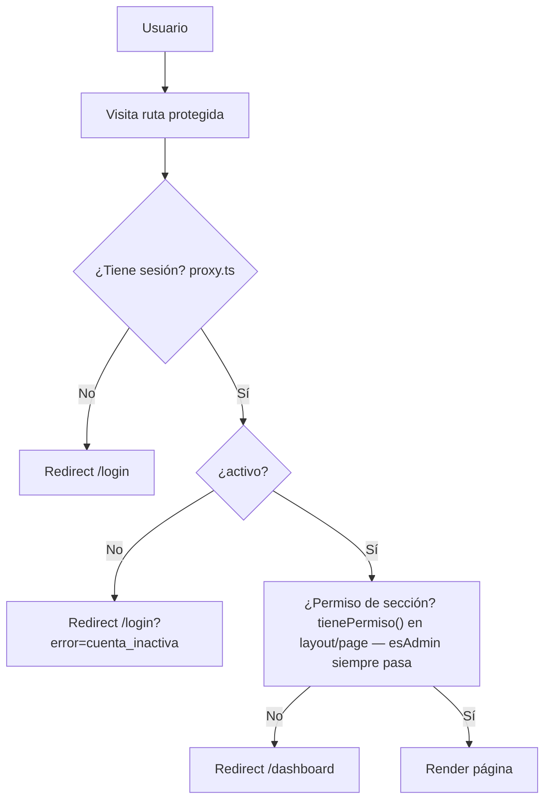

# Middleware y Flujo de Autenticación

**Propósito**: Cómo se protegen las rutas y se gestiona la autenticación.

---

`proxy.ts` (reemplazo de `middleware.ts` en Next 16 — ver `node_modules/next/dist/docs/01-app/03-api-reference/03-file-conventions/proxy.md`) **solo cubre autenticación**, no autorización: valida que exista sesión y que el usuario esté activo. No hay ningún mapeo rol→ruta centralizado.

## Tecnología
- **Better Auth** (`lib/auth.ts`) — Autenticación con email/contraseña + 2FA
- **Drizzle adapter** — Solo para las 5 tablas de auth (users, sessions, accounts, verifications, two_factors)
- **Roles** — Tabla `roles` con roles asignados vía `users.rol_id`. Columna `roles.es_admin` marca qué rol tiene acceso total (ver ADR-008) — nunca se compara el nombre del rol en código.
- **Permisos** — Sistema único y centralizado: `lib/permisos/core.ts` (`tienePermiso`/`obtenerPermisosUsuario`) sobre tablas `permisos` (por usuario) y `permisos_plantillas` (por rol), con acciones `ver|crear|editar|eliminar`. Cada módulo tiene un wrapper delgado (`lib/<modulo>/permisos.ts`) que solo fija sus `SECCIONES`. **Sin fila en `permisos` = SIN acceso a esa sección** (deny-by-default) — cada rol solo tiene fila para las secciones de su propio módulo, copiadas de `permisos_plantillas` al asignarle el rol; el deny-by-default es lo que aísla un rol de los módulos de otro. `esAdmin` es la única excepción: acceso completo sin tocar la tabla.

## Roles del sistema
| Rol | Descripción |
|-----|-------------|
| Administrador | Acceso total al sistema |
| Operador | Operación de 911/despacho |
| Oficial de Campo | Reportes en campo, infracciones |
| Monitorista | Gestión de evidencias y detenidos |
| Auxiliar | Checklist, cuestionario robo |
| Reportante | Reportes y estadísticas |
| admin_transito | Gestión de VÍA/infracciones |
| agente_fiscalia | Fiscalía |
| agente_juzgado | Juzgado cívico |
| agente_liberaciones | Liberaciones vehiculares |
| agente_infracciones | Captura de infracciones |
| Jurídico | Prevención del delito (área jurídica) |
| corralon_mw / corralon_mejia | Módulo corralón |

## Helpers
- `getUserWithRole(userId)` — Obtiene usuario con nombre de rol + `esAdmin` (JOIN a `roles`). Único lugar que resuelve "es admin".
- `tienePermiso(userId, seccion, accion)` — Verifica permiso granular; `true` automático si `esAdmin`.
- `requireAdmin()` (en `lib/permisos/core.ts`) — Redirect si `!esAdmin`.
