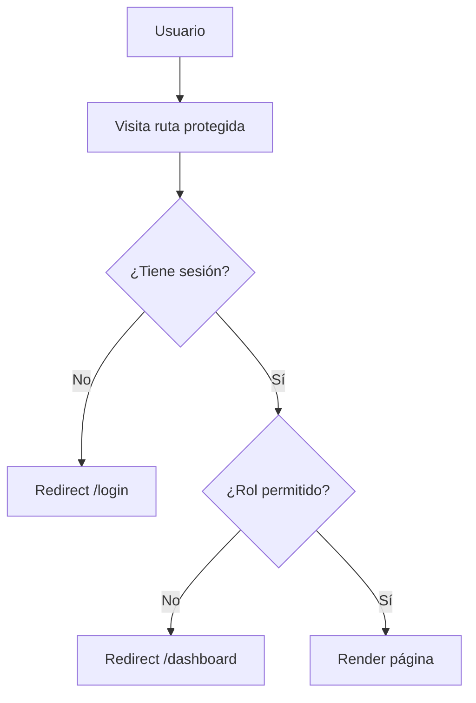

# Middleware y Flujo de Autenticación

**Propósito**: Cómo se protegen las rutas y se gestiona la autenticación.

---

## Tecnología
- **Better Auth** (`lib/auth.ts`) — Autenticación con email/contraseña + 2FA
- **Drizzle adapter** — Solo para las 5 tablas de auth (users, sessions, accounts, verifications, two_factors)
- **Roles** — Tabla `roles` con roles asignados vía `users.rol_id`
- **Permisos** — Cada módulo tiene su propio sistema de permisos basado en tablas como `permisos_rol` y `permisos_usuario`

## Roles del sistema
| Rol | Descripción |
|-----|-------------|
| Administrador | Acceso total al sistema |
| Operador | Operación de 911/despacho |
| Oficial de Campo | Reportes en campo, infracciones |
| Monitorista | Gestión de evidencias y detenidos |
| Auxiliar | Checklist, cuestionario robo |
| Reportante | Reportes y estadísticas |
| admin_transito | Gestión de VÍA/infracciones |
| agente_fiscalia | Fiscalía |
| agente_juzgado | Juzgado cívico |
| agente_liberaciones | Liberaciones vehiculares |
| agente_infracciones | Captura de infracciones |
| Jurídico | Prevención del delito (área jurídica) |
| corralon_mw / corralon_mejia | Módulo corralón |

## Helpers
- `getUserWithRole(userId)` — Obtiene usuario con nombre de rol (JOIN)
- `tienePermiso(userId, seccion, accion)` — Verifica permiso granular
- `requireAdmin()` — Redirect si no es admin
