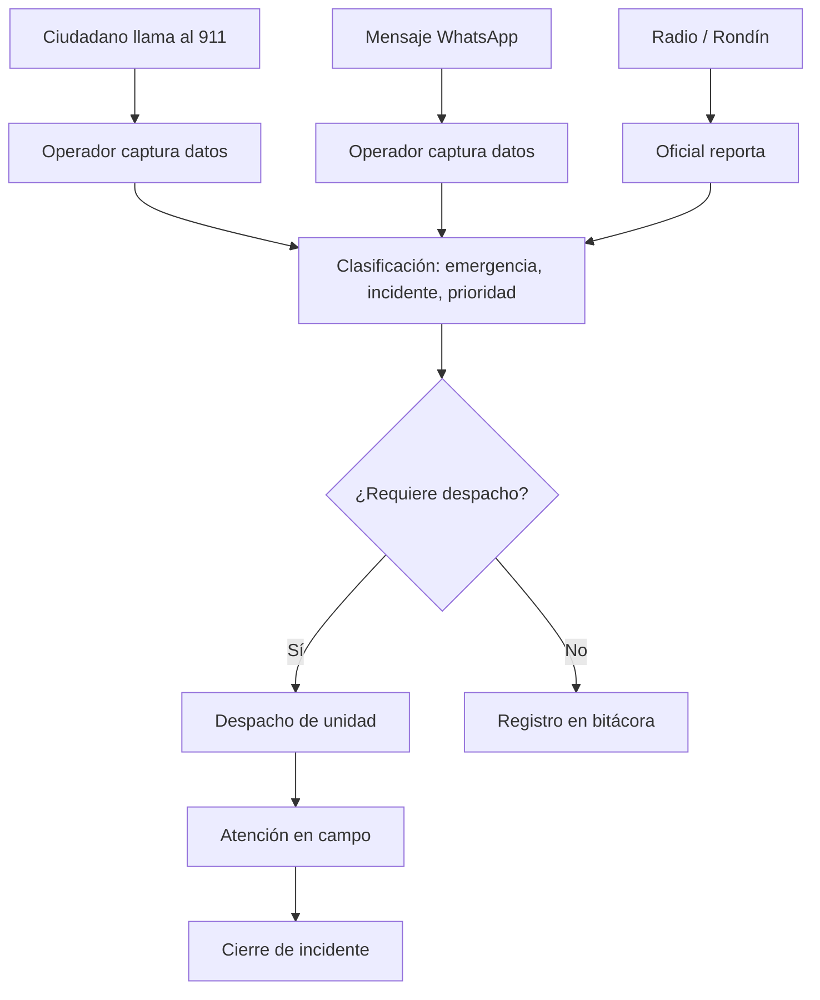

# 911 — Atención de Emergencias

**Propósito**: Captura, clasificación y despacho de incidentes reportados por diversos canales de atención ciudadana.

---

## Flujo

## Componentes involucrados

| Archivo | Rol |
|---------|-----|
| `lib/911/types.ts` | Interfaces `IncidenteDetalle`, `IncidenteStats`, `CatalogoItem` |
| `lib/911/mapper.ts` | `rowToIncidenteDetalle`, `rowToCatalogo` — convierte snake_case DB a camelCase |
| `lib/911/repository.ts` | `obtenerCatalogos`, `listarIncidentes`, `obtenerIncidente`, `obtenerStats` |
| `lib/911/service.ts` | Orquestación de consultas (pass-through) |
| `lib/911/permisos.ts` | Control de acceso a sección 911 |

## BD

| Tabla | Columnas clave | Uso |
|-------|---------------|-----|
| `incidentes` | `id`, `folio`, `canal`, `estatus`, `fecha_hora_inicio`, `tipo_incidente_id`, `prioridad_id`, `requiere_despacho` | Registro principal de cada incidente |
| `cat_tipos_emergencia` | `id`, `nombre`, `activo` | Catálogo de tipos de emergencia |
| `cat_tipos_incidente` | `id`, `nombre`, `activo` | Catálogo de tipos de incidente |
| `cat_prioridades` | `id`, `nombre`, `orden`, `activo` | Catálogo de prioridades |
| `cat_medios_canalizacion` | `id`, `nombre`, `activo` | Medio por el que se canalizó |
| `incidente_extorsion` | `incidente_id` | Datos extra para incidente de extorsión |
| `incidente_alarma_escolar` | `incidente_id` | Datos extra para alarma escolar |
| `incidente_reporte_campo` | `incidente_id` | Vinculación con reporte de campo |

## Reglas de negocio

1. Los incidentes pueden entrar por 3 canales: llamada 911, WhatsApp, o radio/rondín
2. Cada incidente se clasifica con tipo de emergencia, tipo de incidente y prioridad
3. Si `requiere_despacho = true`, se marca como `sin_despachar` hasta que se asigne unidad
4. El folio se genera automáticamente con consecutivo
5. Los catálogos solo muestran registros activos (`activo = true`)
6. Incidentes de extorsión, alarma escolar y reporte de campo tienen tablas satélite vinculadas por `incidente_id`
