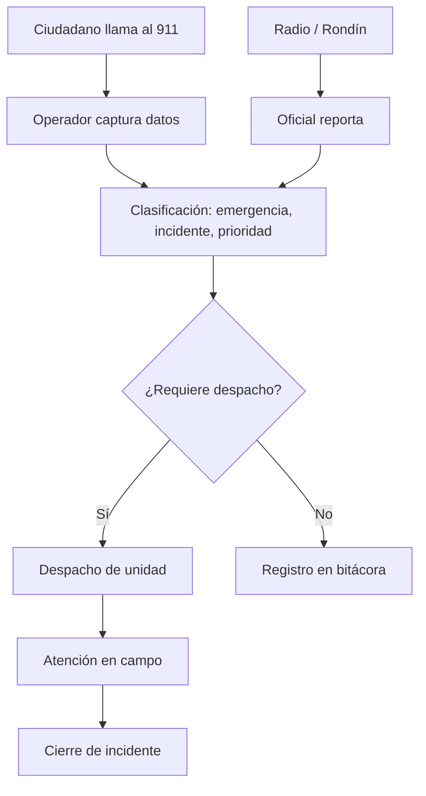

# 911 — Atención de Emergencias

**Propósito**: Captura, clasificación y despacho de incidentes reportados por 911 (ciudadano) y radio/rondín (oficial en campo).

---

## Flujo

> Canal WhatsApp **eliminado** (ver regla de negocio #16) — era exclusivamente de uso interno (oficiales reportando por WhatsApp y agente 911 transcribiendo), reemplazado por `/oficial/rondin`.

## Componentes involucrados

| Archivo | Rol |
|---------|-----|
| `lib/911/types.ts` | Interfaces `IncidenteDetalle`, `IncidenteStats`, `CatalogoItem` |
| `lib/911/mapper.ts` | `rowToIncidenteDetalle`, `rowToCatalogo` — convierte snake_case DB a camelCase |
| `lib/911/repository.ts` | `obtenerCatalogos`, `listarIncidentes`, `obtenerIncidente`, `obtenerStats`, `contarPorEstatus` |
| `lib/911/service.ts` | Orquestación de consultas (pass-through) |
| `lib/911/permisos.ts` | Control de acceso a sección 911 |
| `app/agente_911/ciudadano/Formulario911.tsx` | Formulario de captura con mapa, modal de confirmación y resumen |
| `app/agente_911/ciudadano/incidentes/ToastOnLoad.tsx` | Notificación DOM-based al crear un reporte exitosamente |
| `app/agente_911/ciudadano/incidentes/Pagination.tsx` | Paginación con preservación de query params |
| `components/911/whatsapp/RegistroIncidenteForm.tsx` | Formulario canal WhatsApp — mismo catálogo jerárquico y canalización a despacho que ciudadano (sin modal de confirmación separado, todo en una sola pantalla) |

## Formulario 911 (`Formulario911.tsx`)

- Formulario de captura de incidentes canal 911 con 6 secciones: datos del incidente, datos del reportante, personas afectadas, ubicación con Google Maps, clasificación técnica y canalización
- **Modal de confirmación**: antes de enviar, muestra resumen de todos los campos. Al confirmar, llama a `createIncidenteCliente()` (server action sin `redirect`) y redirige a la bitácora
- **Defaults**: todos los campos tienen valores precargados para pruebas rápidas
- **Toast**: al guardar exitosamente, la página de destino muestra una notificación vía DOM directo (no sonner, porque el Toaster se desmonta en la navegación cliente)
- **Extorsión / Alarma escolar**: secciones condicionales que se muestran según el tipo de reporte seleccionado

## Vista de Bitácora (`/agente_911/ciudadano/incidentes`)

- **Header**: logo SENTINEL + "BITÁCORA CENTRAL 911" + `ProfileDropdown` con "Agente 911"
- **Segment tabs**: filtro por estatus (TODOS, SIN DESPACHAR, EN DESPACHO, EN SITIO, ATENDIDO, CERRADO DET). Cada tab muestra su conteo actual vía `contarPorEstatus()`.
- **Tabla**: FOLIO, HORA (formato "13 JUL · 10:54"), INCIDENTE, COLONIA, PRIORIDAD, ESTATUS (con tooltip descriptivo), ACCIONES
- **Fila clickeable**: el primer `<td>` contiene un `<Link>` invisible que cubre toda la celda, redirigiendo al detalle del incidente
- **Badge NUEVO**: la primera fila de page 1 muestra un badge verde "NUEVO"
- **Paginación**: preserva el filtro `?estatus=` en las URLs de navegación
- **Orden**: `ORDER BY fecha_hora_inicio DESC, creado_en DESC`

## BD

| Tabla | Columnas clave | Uso |
|-------|---------------|-----|
| `incidentes` | `id`, `folio`, `canal`, `estatus`, `fecha_hora_inicio`, `tipo_incidente_id`, `prioridad_id`, `requiere_despacho` | Registro principal de cada incidente |
| `cat_tipos_emergencia` | `id`, `codigo` (1-7), `nombre`, `dependencia_sugerida_id`, `activo` | Catálogo de tipos de emergencia (nivel 1 de la jerarquía). `dependencia_sugerida_id` mapea a `cat_dependencias` según la tabla de sugerencia del estándar SEGOB-CNI (migration `0022`); hoy es solo dato — el selector del formulario sigue fijo a `SEGURIDAD_PUBLICA` |
| `cat_tipos_incidente` | `id`, `nombre`, `activo` | Catálogo de tipos de incidente |
| `cat_prioridades` | `id`, `nombre`, `orden`, `activo` | Catálogo de prioridades |
| `cat_medios_canalizacion` | `id`, `nombre`, `activo` | Medio por el que se canalizó |
| `incidente_extorsion` | `incidente_id` | Datos extra para incidente de extorsión |
| `incidente_alarma_escolar` | `incidente_id` | Datos extra para alarma escolar |
| `incidente_reporte_campo` | `incidente_id` | Vinculación con reporte de campo |
| `permisos_plantillas` | `rol_id`, `seccion` | Plantilla de permisos por rol. `agente_911` tiene `incidentes` desde 2026-07-13 |
| `permisos` | `usuario_id`, `seccion` | Permisos efectivos por usuario. Se aplican desde la plantilla del rol |

## Reglas de negocio

1. Los incidentes pueden entrar por 3 canales: llamada 911, WhatsApp, o radio/rondín
2. Cada incidente se clasifica con tipo de emergencia, tipo de incidente y prioridad
3. Si `requiere_despacho = true`, se marca como `sin_despachar` hasta que se asigne unidad
4. El folio se genera automáticamente con consecutivo
5. Los catálogos solo muestran registros activos (`activo = true`)
6. Incidentes de extorsión, alarma escolar y reporte de campo tienen tablas satélite vinculadas por `incidente_id`
7. Se notifica a Monitoristas (SVV) siempre que la prioridad sea ALTA — independiente de si el incidente requiere despacho — o cuando el operador marca el checkbox "Notificar a Monitoristas (SVV)" manualmente (`notificarMonitoristas` en `lib/incidentes/actions.ts`)
8. El selector de dependencia en el formulario está bloqueado a `SEGURIDAD_PUBLICA` (decisión de alcance: solo se despachan hechos de SSPM por ahora); `cat_tipos_emergencia.dependencia_sugerida_id` ya está poblado para cuando se habilite multi-dependencia
9. Un incidente de tipo Improcedentes (`cat_tipos_emergencia.codigo = '7'`) no se puede canalizar a despacho — se rechaza en backend (`esTipoImprocedente` en `lib/incidentes/actions.ts`) y el selector "¿Requiere Despacho?" se deshabilita en `Formulario911.tsx`. Aplica también a rondín: `createRondinEscalado` omite la creación de `incidente_despacho`/`incidente_despacho_elementos` y fuerza `requiere_despacho=false` cuando el tipo es Improcedentes — decisión de negocio: se prioriza esta regla del estándar SEGOB-CNI sobre "rondín siempre escala"
10. Cada unidad despachada (`incidente_despacho_unidades`) registra su propia `hora_salida`/`hora_llegada` — **capturadas exclusivamente por el oficial** ("VOY EN CAMINO" = `marcarEnCaminoOficial`, "MARCAR EN SITIO" = `marcarEnSitioOficial`, ambas en `lib/oficial/actions.ts`), nunca por el despachador. Decisión de negocio: sin AVL/GPS real, el despachador no tiene forma confiable de saber cuándo salió/llegó una unidad — solo podría adivinar o esperar que le avisen por radio, el mismo problema de "transcribir por otro" que se descartó para rondín. El tablón de despacho (`TablonDespacho.tsx`) solo **consulta** estas horas en modo lectura; ya no tiene botones para capturarlas. Ver [[Reporte Campo]]
11. "Despachador disponible" = usuario `activo=true`, dependencia SSPM y permiso `911_despacho` (criterio fijo, ya es el filtro de `obtenerDespachadores()`). Si la prioridad efectiva es ALTA y se selecciona un despachador inactivo, `RevisarFormulario.tsx` muestra una advertencia (no bloquea el envío)
12. El rol Supervisor (CAD-CALLE-089) del estándar SEGOB-CNI se evaluó y se descartó explícitamente para Centinela — no se usa en la operación actual de SSPM y el sistema funciona sin él
13. SLA por prioridad en el tablón de despacho: badge "SLA VENCIDO" en tabs Pendientes/En Despacho cuando el tiempo transcurrido supera el umbral (ALTA=10min, MEDIA=20min, BAJA=40min — valores genéricos iniciales, ajustables). Cálculo en cliente (`TablonDespacho.tsx`), solo visual, no bloquea ni reasigna automáticamente
14. **Solo el Oficial de Campo levanta el reporte de rondín** (`/oficial/rondin`, rol `Oficial de Campo`) — decisión de negocio: se descartó el modelo del estándar SEGOB-CNI donde el despachador transcribe por radio, porque el `nombreOficial` capturado a mano por el despachador nunca se vinculaba a un `ofi_oficiales.id` real (`createRondinEscalado` resuelve el oficial por `session.user.id`, no por el texto escrito), dejando el despacho sin `oficial_id` y el rondín invisible en "Mis Despachos" del oficial reportado. `agente_despacho` perdió el permiso `911_rondin` (plantilla y usuarios existentes); la ruta `/agente_911/rondin` sigue existiendo en código pero ya no es alcanzable por ningún rol operativo (solo Administrador, por su bypass general). El dashboard de despacho ahora enlaza a `/incidentes?canal=radio` para consultar (no crear) reportes de rondín.
15. `FormRondinEscalado.tsx` (`/oficial/rondin`) y `FormularioRecorrido.tsx` (cierre del reporte de campo) usan el mismo catálogo jerárquico completo que ciudadano (`getCatalogos()` de `lib/911/service`, no el degradado `lib/oficial/service::obtenerCatalogos()` que solo traía `id`+`nombre`) — cascada Tipo→Subtipo→Incidente con código de 5 dígitos visible y prioridad autocompletada. `ofi_reportes_campo` tiene columnas FK reales (`tipo_emergencia_id`/`tipo_incidente_id`/`prioridad_id`, migration `0024`); las columnas de texto legacy se resuelven en servidor desde el catálogo, nunca desde texto del cliente.
16. **Canal WhatsApp eliminado** — era exclusivamente de uso interno (oficiales reportando por WhatsApp, agente 911 transcribiendo), con el mismo defecto estructural que motivó eliminar la transcripción de rondín por despacho (regla #14): el agente 911 no tenía forma de vincular el reporte a la cuenta real del oficial. Como `boveda-test` (estándar SEGOB-CNI) nunca contempla WhatsApp como canal — no era un requisito de cumplimiento, era una adaptación local ya redundante con `/oficial/rondin` — se decidió eliminarlo en vez de alinearlo. `agente_911` perdió el permiso `911_whatsapp` (plantilla y usuarios existentes); las rutas `/agente_911/whatsapp/*` siguen en código pero solo alcanzables por Administrador. Los 8 incidentes históricos con `canal='whatsapp'` se conservan y su detalle sigue siendo visible desde la bitácora general (`/incidentes`) — las páginas de detalle `[id]/page.tsx` de whatsapp y rondín ahora aceptan el permiso de canal **o** el permiso general `incidentes`, para no romper esos enlaces al revocar el acceso de creación.

## Estados del incidente

| Estado | Descripción | Color badge |
|--------|-------------|-------------|
| `sin_despachar` | Reporte registrado, esperando asignación de unidad | Ámbar |
| `en_despacho` | Unidad asignada, en camino al lugar | Azul |
| `en_sitio` | Unidad en el lugar, atendiendo la emergencia | Teal |
| `atendido` | Incidente resuelto, servicio concluido | Verde |
| `cerrado_detencion` | Caso cerrado con detención realizada | Púrpura |
