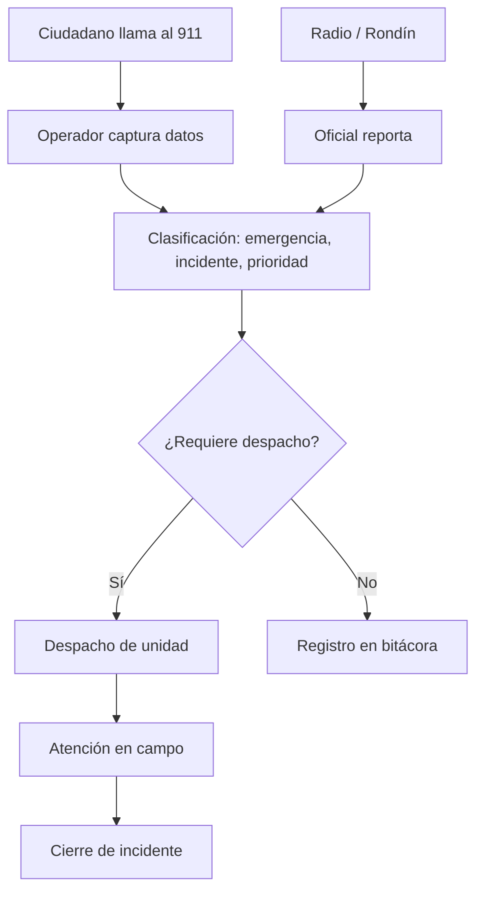

# 911 — Atención de Emergencias

**Propósito**: Captura, clasificación y despacho de incidentes reportados por 911 (ciudadano) y radio/rondín (oficial en campo).

---

## Flujo

```mermaid
flowchart TD
    A[Ciudadano llama al 911] --> B[Operador captura datos]
    A3[Radio / Rondín] --> B3[Oficial reporta]
    B --> C[Clasificación: emergencia, incidente, prioridad]
    B3 --> C
    C --> D{¿Requiere despacho?}
    D -->|Sí| E[Despacho de unidad]
    D -->|No| F[Registro en bitácora]
    E --> G[Atención en campo]
    G --> H[Cierre de incidente]
```

> Canal WhatsApp **eliminado** (ver regla de negocio #16) — era exclusivamente de uso interno (oficiales reportando por WhatsApp y agente 911 transcribiendo), reemplazado por `/oficial/rondin`.

## Componentes involucrados

| Archivo | Rol |
|---------|-----|
| `lib/911/types.ts` | Interfaces `IncidenteDetalle`, `IncidenteStats`, `CatalogoItem` |
| `lib/911/mapper.ts` | `rowToIncidenteDetalle`, `rowToCatalogo` — convierte snake_case DB a camelCase |
| `lib/911/repository.ts` | `obtenerCatalogos`, `listarIncidentes`, `obtenerIncidente`, `obtenerStats`, `contarPorEstatus` |
| `lib/911/service.ts` | Orquestación de consultas (pass-through) |
| `lib/911/permisos.ts` | Control de acceso a sección 911 |
| `app/agente_911/ciudadano/Formulario911.tsx` | Formulario de captura con mapa, modal de confirmación y resumen |
| `app/agente_911/ciudadano/incidentes/ToastOnLoad.tsx` | Notificación DOM-based al crear un reporte exitosamente |
| `app/agente_911/ciudadano/incidentes/Pagination.tsx` | Paginación con preservación de query params |
| `components/911/whatsapp/RegistroIncidenteForm.tsx` | Formulario canal WhatsApp — mismo catálogo jerárquico y canalización a despacho que ciudadano (sin modal de confirmación separado, todo en una sola pantalla) |

## Formulario 911 (`Formulario911.tsx`)

- Formulario de captura de incidentes canal 911 con 6 secciones: datos del incidente, datos del reportante, personas afectadas, ubicación con Google Maps, clasificación técnica y canalización
- **Modal de confirmación**: antes de enviar, muestra resumen de todos los campos. Al confirmar, llama a `createIncidenteCliente()` (server action sin `redirect`) y redirige a la bitácora
- **Defaults**: todos los campos tienen valores precargados para pruebas rápidas
- **Toast**: al guardar exitosamente, la página de destino muestra una notificación vía DOM directo (no sonner, porque el Toaster se desmonta en la navegación cliente)
- **Extorsión / Alarma escolar**: secciones condicionales que se muestran según el tipo de reporte seleccionado

## Vista de Bitácora (`/agente_911/ciudadano/incidentes`)

- **Header**: logo SENTINEL + "BITÁCORA CENTRAL 911" + `ProfileDropdown` con "Agente 911"
- **Segment tabs**: filtro por estatus (TODOS, SIN DESPACHAR, EN DESPACHO, EN SITIO, ATENDIDO, CERRADO DET). Cada tab muestra su conteo actual vía `contarPorEstatus()`.
- **Tabla**: FOLIO, HORA (formato "13 JUL · 10:54"), INCIDENTE, COLONIA, PRIORIDAD, ESTATUS (con tooltip descriptivo), ACCIONES
- **Fila clickeable**: el primer `<td>` contiene un `<Link>` invisible que cubre toda la celda, redirigiendo al detalle del incidente
- **Badge NUEVO**: la primera fila de page 1 muestra un badge verde "NUEVO"
- **Paginación**: preserva el filtro `?estatus=` en las URLs de navegación
- **Orden**: `ORDER BY fecha_hora_inicio DESC, creado_en DESC`

## BD

| Tabla | Columnas clave | Uso |
|-------|---------------|-----|
| `incidentes` | `id`, `folio`, `canal`, `estatus`, `fecha_hora_inicio`, `tipo_incidente_id`, `prioridad_id`, `requiere_despacho` | Registro principal de cada incidente |
| `cat_tipos_emergencia` | `id`, `codigo` (1-7), `nombre`, `dependencia_sugerida_id`, `activo` | Catálogo de tipos de emergencia (nivel 1 de la jerarquía). `dependencia_sugerida_id` mapea a `cat_dependencias` según la tabla de sugerencia del estándar SEGOB-CNI (migration `0022`); hoy es solo dato — el selector del formulario sigue fijo a `SEGURIDAD_PUBLICA` |
| `cat_tipos_incidente` | `id`, `nombre`, `activo` | Catálogo de tipos de incidente |
| `cat_prioridades` | `id`, `nombre`, `orden`, `activo` | Catálogo de prioridades |
| `cat_medios_canalizacion` | `id`, `nombre`, `activo` | Medio por el que se canalizó |
| `incidente_extorsion` | `incidente_id` | Datos extra para incidente de extorsión |
| `incidente_alarma_escolar` | `incidente_id` | Datos extra para alarma escolar |
| `incidente_reporte_campo` | `incidente_id` | Vinculación con reporte de campo |
| `permisos_plantillas` | `rol_id`, `seccion` | Plantilla de permisos por rol. `agente_911` tiene `incidentes` desde 2026-07-13 |
| `permisos` | `usuario_id`, `seccion` | Permisos efectivos por usuario. Se aplican desde la plantilla del rol |

## Reglas de negocio

1. Los incidentes pueden entrar por 3 canales: llamada 911, WhatsApp, o radio/rondín
2. Cada incidente se clasifica con tipo de emergencia, tipo de incidente y prioridad
3. Si `requiere_despacho = true`, se marca como `sin_despachar` hasta que se asigne unidad
4. El folio se genera automáticamente con consecutivo
5. Los catálogos solo muestran registros activos (`activo = true`)
6. Incidentes de extorsión, alarma escolar y reporte de campo tienen tablas satélite vinculadas por `incidente_id`
7. Se notifica a Monitoristas (SVV) siempre que la prioridad sea ALTA — independiente de si el incidente requiere despacho — o cuando el operador marca el checkbox "Notificar a Monitoristas (SVV)" manualmente (`notificarMonitoristas` en `lib/incidentes/actions.ts`)
8. El selector de dependencia en el formulario está bloqueado a `SEGURIDAD_PUBLICA` (decisión de alcance: solo se despachan hechos de SSPM por ahora); `cat_tipos_emergencia.dependencia_sugerida_id` ya está poblado para cuando se habilite multi-dependencia
9. Un incidente de tipo Improcedentes (`cat_tipos_emergencia.codigo = '7'`) no se puede canalizar a despacho — se rechaza en backend (`esTipoImprocedente` en `lib/incidentes/actions.ts`) y el selector "¿Requiere Despacho?" se deshabilita en `Formulario911.tsx`. Aplica también a rondín: `createRondinEscalado` omite la creación de `incidente_despacho`/`incidente_despacho_elementos` y fuerza `requiere_despacho=false` cuando el tipo es Improcedentes — decisión de negocio: se prioriza esta regla del estándar SEGOB-CNI sobre "rondín siempre escala"
10. Cada unidad despachada (`incidente_despacho_unidades`) registra su propia `hora_salida`/`hora_llegada` — **capturadas exclusivamente por el oficial**, nunca por el despachador. **Desde el plan de navegación en vivo (2026-07-31)** el disparo es automático: al confirmar "INICIAR NAVEGACIÓN" en `/oficial/despachos/[id]` corre `marcarEnCaminoOficial` (`lib/oficial/actions.ts`) guardando `hora_salida`, y al llegar se dispara `marcarEnSitioOficial` (geofence de 80m con Haversine, o botón manual "LLEGUÉ" de respaldo) guardando `hora_llegada` y pasando `incidentes.estatus` a `en_sitio`. Ambas acciones son idempotentes por `COALESCE` y con guarda de `estatus === 'en_despacho'`. Decisión de negocio (heredada del diseño previo): sin AVL real, el despachador no tiene forma confiable de saber cuándo salió/llegó una unidad — el tablón (`TablonDespacho.tsx`) solo **consulta** estas horas en modo lectura. Ver [[Reporte Campo]].
   - **Actualización (2026-07-24): ya existe ubicación GPS de oficiales para el momento de asignar.** `ofi_oficiales` tiene `ultima_lat`/`ultima_lng`/`ultima_ubicacion_en` (migration `0025_ubicacion_oficiales.sql`), reportadas por el propio navegador del oficial mientras tiene sesión abierta en `/oficial` (`components/oficial/OficialUbicacionTracker.tsx`, `watchPosition` + heartbeat cada 30s, montado en `app/oficial/layout.tsx`, acción `reportarUbicacionOficial`). Es tracking en **foreground únicamente** — sin PWA con background sync, si el oficial cierra la pestaña el dato deja de actualizarse; la UI muestra la antigüedad de la lectura, no un tiempo real garantizado. El modal de asignación (`DespachoForm.tsx`) ahora muestra cards de unidad (`lib/flota/service.ts::listarUnidadesParaDespacho`, agrupando `ofi_oficiales` por `patrulla_id`) ordenadas por distancia Haversine (`lib/shared/geo.ts`) al incidente, en vez de los buscadores sueltos de placa/nómina contra las APIs externas de Flota/RH (que quedan solo para sincronizar catálogo, ver [[Flota]]). Esto **no reemplaza** la regla de que `hora_salida`/`hora_llegada` las captura el oficial — sigue sin AVL de ruta/breadcrumb, solo última posición conocida.
11. "Despachador disponible" = usuario `activo=true`, dependencia SSPM y permiso `911_despacho` (criterio fijo, ya es el filtro de `obtenerDespachadores()`). Si la prioridad efectiva es ALTA y se selecciona un despachador inactivo, `RevisarFormulario.tsx` muestra una advertencia (no bloquea el envío)
12. El rol Supervisor (CAD-CALLE-089) del estándar SEGOB-CNI se evaluó y se descartó explícitamente para Centinela — no se usa en la operación actual de SSPM y el sistema funciona sin él
 13. SLA por prioridad en el tablón de despacho: badge "SLA VENCIDO" en tabs Pendientes/En Despacho cuando el tiempo transcurrido supera el umbral (ALTA=10min, MEDIA=20min, BAJA=40min — valores genéricos iniciales, ajustables). Cálculo en cliente (`TablonDespacho.tsx`), solo visual, no bloquea ni reasigna automáticamente
 13b. **Refresco del tablón de despacho (`TablonDespacho.tsx`)**: polling cada 20s, **silencioso e invisible** — no hay indicador de cuenta regresiva ni "REFRESCANDO…" en el header (se eliminó 2026-07-31). El intervalo llama `cargarTodo(true)` (modo **silencioso**: no toca `cargando`/`error` para no parpadear el estado vacío ni mostrar banner por errores transitorios de red) que refresca **las 3 tabs** (Pendientes / En Despacho / Atendidos) vía los endpoints `/api/incidentes/pendientes-despacho|en-despacho|atendidos`, con guarda `refrescandoRef` para no solapar refrescos. El primer fetch al montar y el botón "Reintentar" usan `cargarTodo()` (no silencioso). Cualquier acción de despacho (`DespachoForm`, `onCambio`) dispara `cargarTodo()` de inmediato. Antes (2026-07) el tick solo refrescaba Pendientes y mostraba una cuenta regresiva circular de 20s.
14. **Solo el Oficial de Campo levanta el reporte de rondín** (`/oficial/rondin`, rol `Oficial de Campo`) — decisión de negocio: se descartó el modelo del estándar SEGOB-CNI donde el despachador transcribe por radio, porque el `nombreOficial` capturado a mano por el despachador nunca se vinculaba a un `ofi_oficiales.id` real (`createRondinEscalado` resuelve el oficial por `session.user.id`, no por el texto escrito), dejando el despacho sin `oficial_id` y el rondín invisible en "Mis Despachos" del oficial reportado. `agente_despacho` perdió el permiso `911_rondin` (plantilla y usuarios existentes); la ruta `/agente_911/rondin` sigue existiendo en código pero ya no es alcanzable por ningún rol operativo (solo Administrador, por su bypass general). El dashboard de despacho ahora enlaza a `/incidentes?canal=radio` para consultar (no crear) reportes de rondín.
15. `FormRondinEscalado.tsx` (`/oficial/rondin`) y `FormularioRecorrido.tsx` (cierre del reporte de campo) usan el mismo catálogo jerárquico completo que ciudadano (`getCatalogos()` de `lib/911/service`, no el degradado `lib/oficial/service::obtenerCatalogos()` que solo traía `id`+`nombre`) — cascada Tipo→Subtipo→Incidente con código de 5 dígitos visible y prioridad autocompletada. `ofi_reportes_campo` tiene columnas FK reales (`tipo_emergencia_id`/`tipo_incidente_id`/`prioridad_id`, migration `0024`); las columnas de texto legacy se resuelven en servidor desde el catálogo, nunca desde texto del cliente.
16. **(2026-07-29) Fix: `createRondinEscalado` no notificaba al rol de despacho.** El catálogo de notificaciones (`lib/notificaciones/catalogo.ts`) ya definía el evento `rondin.escalado` con `rolesPorDefecto: ['agente_despacho']`, pero nunca se emitía desde el código — `createRondinEscalado` solo llamaba a `notificarMonitoristas` (rol Monitorista, y solo si prioridad ALTA). Un incidente escalado desde rondín era invisible en la campanita de despacho; solo aparecía si alguien entraba manualmente al tablón. Se agregó `emitir('rondin.escalado', ...)` justo después de `registrarAudit`, condicionado a `!esImprocedente` (los Improcedentes no generan `incidente_despacho` y no deben aparecer en el tablón).
    - **Refinamiento (2026-07-29):** Cuando el oficial o su patrulla ya están ocupados en otro incidente activo (`incidentes.estatus IN ('en_despacho', 'en_sitio')`), `createRondinEscalado` ya no inserta la fila `incidente_despacho` ni el elemento con `es_prioritario = true` — el nuevo incidente se crea en `sin_despachar` sin personal prioritario preasignado, quedando para asignación manual normal. La notificación `rondin.escalado` muestra un mensaje distinto cuando el oficial reportante estaba ocupado. El toast de confirmación del oficial (`ToastExito`) muestra un aviso adicional en ese caso. Ver `docs/notificaciones-oficial-despacho/05-fix-prioritario-oficial-ocupado.md`.
17. **Canal WhatsApp eliminado** — era exclusivamente de uso interno (oficiales reportando por WhatsApp, agente 911 transcribiendo), con el mismo defecto estructural que motivó eliminar la transcripción de rondín por despacho (regla #14): el agente 911 no tenía forma de vincular el reporte a la cuenta real del oficial. Como `boveda-test` (estándar SEGOB-CNI) nunca contempla WhatsApp como canal — no era un requisito de cumplimiento, era una adaptación local ya redundante con `/oficial/rondin` — se decidió eliminarlo en vez de alinearlo. `agente_911` perdió el permiso `911_whatsapp` (plantilla y usuarios existentes); las rutas `/agente_911/whatsapp/*` siguen en código pero solo alcanzables por Administrador. Los 8 incidentes históricos con `canal='whatsapp'` se conservan y su detalle sigue siendo visible desde la bitácora general (`/incidentes`) — las páginas de detalle `[id]/page.tsx` de whatsapp y rondín ahora aceptan el permiso de canal **o** el permiso general `incidentes`, para no romper esos enlaces al revocar el acceso de creación.
 18. **Notificación al oficial cuando despacho le asigna una unidad**: `createDespacho` (`lib/incidentes/actions.ts:610-750`) y `enviarRefuerzos` (líneas 754-863) emiten, **después del `COMMIT`**, el evento `despacho.asignado` / `despacho.refuerzos` (`lib/notificaciones/catalogo.ts`) dirigido por `usuarios: [...]` (destinatarios directos, no por rol) a los `user_id` de `ofi_oficiales` cuyo `no_nomina` matcheó al asignar el elemento. `createDespacho` pasa `dedup` (evita duplicar en reintentos); `enviarRefuerzos` no. **Colisión de nombre a tener presente**: la clave `'despacho.asignado'` también se usa en `createIncidente` (L219) y `createIncidenteCliente` (L330) para notificar al **despachador humano** (rol `agente_911`, `href` forzado a `/agente_911/despacho`) — mismo evento, audiencia distinta según el call-site; no confundir al modificar. **Gap conocido**: si el elemento asignado no tiene `oficial_id`/`user_id` resuelto (personal externo sin cuenta, o cuenta sin vincular), simplemente no entra a la lista de notificados — sin error ni aviso a nadie de que ese oficial se quedó sin notificar. **Fix (2026-07-31) — prioritario de rondín también notificado**: `createDespacho` resolvía los destinatarios solo por los `elementos` de la llamada, dejando sin notificar al oficial pre-asignado como `es_prioritario` cuando reutiliza el despacho de un rondín escalado (el badge de la card aparecía pero la campanita no). La query de `usuariosNotificar` ahora hace `UNION` implícita con el `oficial_id` del elemento `es_prioritario` del despacho reutilizado; el disparo coincide con el momento en que el incidente pasa a `en_despacho` (mismo instante en que aparece el badge). `dedup` evita duplicados. Ver `docs/notificaciones-oficial-despacho/06-fix-prioritario-notificado-al-despachar.md`. Entrega: `components/notificaciones/CampanillaNotificaciones.tsx`, polling 30s (igualado al badge de `/oficial`, 2026-07-31), solo con la pestaña visible — sin push nativo (sin service worker, sin `Notification()`, decisión de arquitectura explícita en [[Plan - Sistema de Notificaciones]] por costo en el modelo serverless). Ver [[Notificaciones]] y [[Reporte Campo]].

## Estados del incidente

| Estado | Descripción | Color badge |
|--------|-------------|-------------|
| `sin_despachar` | Reporte registrado, esperando asignación de unidad | Ámbar |
| `en_despacho` | Unidad asignada, en camino al lugar | Azul |
| `en_sitio` | Unidad en el lugar, atendiendo la emergencia | Teal |
| `atendido` | Incidente resuelto, servicio concluido | Verde |
| `cerrado_detencion` | Caso cerrado con detención realizada | Púrpura |

## Mapa de asignación de unidades (tipo Uber)

El modal "Unidades cercanas al hecho" (`SeleccionarUnidadesModal.tsx`) ahora incluye un mapa visual con la posición de cada patrulla y el lugar del incidente, para que el despachador tome decisiones más rápidas e intuitivas.

- **Split-view**: mapa a la izquierda (55%) y lista+buscador a la derecha (45%) cuando el incidente tiene coordenadas.
- **Marcador del incidente**: pin rojo con ícono de ubicación, no clickeable.
- **Marcadores de unidades**: pin con "P" (patrulla), color y opacidad según cercanía:
  - Verde `#16a34a`: la más cercana (menor `distanciaKm`).
  - Azul `#1f355a`: cercanas (top 10 por distancia).
  - Gris `#94a3b8` (opacidad 0.55): el resto.
  - Borde discontinuo si `ultimaUbicacionEn` tiene >5 min (ubicación no fresca).
  - Badge con check azul si la unidad está seleccionada.
- **fitBounds** automático: al cargar, el mapa encuadra el incidente y todas las unidades.
- **Polling**: cada 18s mientras el modal está abierto, refresca las posiciones vía `GET /api/despacho/unidades-cercanas`. El primer fetch se ejecuta de inmediato al abrir (no espera el primer tick del interval). Se detiene al cerrar.
- **Sin coordenadas**: el modal mantiene el layout original (640px, solo lista), sin polling.

**Archivos involucrados:**

| Archivo | Rol |
|---------|-----|
| `components/911/despacho/AsignacionMapa.tsx` | Componente de mapa (Google Maps, `@react-google-maps/api`), renderiza marcadores con diferenciación visual |
| `components/911/despacho/SeleccionarUnidadesModal.tsx` | Modal con split-view, polling y estado local `unidadesActuales` |
| `components/911/despacho/DespachoForm.tsx` | Pasa `incidenteLat`/`incidenteLng`/`prioritarioPatrullaId` al modal |
| `lib/flota/service.ts` | Endpoint sin truncado a top-10 (`listarUnidadesParaDespacho`) |

**Directions API (2026-07-31)**: la key de Google Maps ya tiene **Directions API habilitada y con facturación activa**, y ahora se usa en la **vista del oficial** (`/oficial/despachos/[id]`, `components/oficial/navegacion/NavegacionDespacho.tsx`) para calcular la ruta real por calles hacia el incidente. El **mapa de asignación del despachador** (`AsignacionMapa.tsx`, arriba) sigue con **Haversine (línea recta)** — esa decisión no cambió: la habilitación de Directions es exclusiva de la navegación del oficial, no reabre el mapa de asignación. No confundir ambos mapas. Ver [[Reporte Campo]].

**Modo navegación 3D del oficial**: dentro de `NavegacionDespacho.tsx`, un botón flotante ("MODO NAVEGACIÓN"/"VISTA DE ARRIBA") alterna entre una vista inclinada tipo "cámara de persecución" (`tilt=60°`, `heading`=rumbo de avance — **modo navegación es el default** al montar, la vista de arriba plana quedó como secundaria) y el mapa plano (top-down). El ícono del vehículo cambia a un estilo "3D" (sombra + perspectiva falsa vía SVG, no geometría 3D real — la API web de Google Maps no ofrece un asset volumétrico como el SDK nativo de navegación) que apunta siempre "hacia arriba", porque el `heading` del propio mapa ya rota la escena para alinear la dirección de avance con la parte superior de la pantalla. Requiere un **Map ID vectorial** (`NEXT_PUBLIC_GOOGLE_MAPS_MAP_ID`, `lib/maps/googleMapsConfig.ts`) — sin esa variable, `tilt`/`heading` se ignoran en silencio (comportamiento normal de Google Maps en un mapa raster) y el botón muestra un aviso en vez de fallar oscuro. El mapa de asignación del despachador (`AsignacionMapa.tsx`) no usa Map ID ni modo navegación — cambio exclusivo de la vista del oficial.

**Fix — rumbo inicial desde la ruta, no desde el movimiento del GPS**: el `heading` inicial arrancaba en `0` (norte) porque `calcularRumbo` solo se ejecutaba tras detectar >8m de desplazamiento real entre dos lecturas de GPS consecutivas — la cámara tardaba varios segundos en orientarse hacia el destino, sintiéndose "no activada" comparado con DiDi/Google Maps (que orientan la cámara hacia la ruta desde el primer frame). Ahora, dentro de `calcularRuta` (callback de `DirectionsService`), en cuanto la ruta se calcula se deriva un rumbo inicial del primer paso (`routes[0].legs[0].steps[0].end_location`) vía el mismo `calcularRumbo(origen, destinoPrimerPaso)` — la cámara ya apunta hacia la ruta desde que aparece el mapa, y el rumbo por GPS real lo sobreescribe naturalmente en cuanto el oficial empieza a moverse.

**HUD estilo Google Maps/DiDi**: dentro del modo navegación, pill blanco flotante con la dirección del destino (ícono de bandera, `borderRadius:999` — única excepción deliberada al `borderRadius:2` institucional, porque el objetivo es replicar esa estética específica), y un botón circular de brújula (lado derecho, arriba del botón de alternar modo) que alterna `headingUp` — heading-up (cámara rota con la ruta, default) vs north-up (norte fijo arriba, conservando el tilt 3D). El ícono de la brújula rota para seguir apuntando al norte real. Ruta dibujada en morado `#7c3aed` (mismo acento ya usado para "PRIORITARIO" en `AsignacionMapa.tsx`) en vez del azul institucional, para diferenciarse visualmente del resto de la UI y parecerse a la referencia de Google Maps. No se agregó indicador de velocidad/límite de velocidad ni botón de "buscar" (destino fijo al incidente, no aplica cambiar de destino a media navegación) — decisión de alcance explícita.

**Rediseño card + modal (2026-07-31)**: la pantalla "antes de navegar" se movió fuera del mapa a `AsignacionCard.tsx` (card blanca: folio, ubicación, badge de impacto por prioridad, botón "Iniciar navegación"), montada en `DespachoContent.tsx`. Al tocar el botón se abre `NavegacionModal.tsx` — modal a pantalla completa (`createPortal` a `document.body`, mismo patrón que `SeleccionarUnidadesModal.tsx`) que monta `NavegacionDespacho.tsx` ya en modo navegación directo. Al llegar (geofence de 80m o botón manual "YA ESTOY AQUÍ"), el mapa se reemplaza por una pantalla de confirmación ("Has llegado a destino" + ícono animado + botón "ATENDER") — `marcarEnSitioOficial` ya corrió en background al detectar la llegada, el botón "ATENDER" solo dispara el callback `onAtender` que cierra el modal y pasa a `FormularioRecorrido embedded`. Sin botón de cerrar/cancelar en el modal — el único camino de salida es completar el flujo.

## Regla de negocio: unidad ocupada en otro incidente activo

Una unidad que ya está asignada a un despacho activo (incidente en estatus `en_despacho` o `en_sitio`) no puede asignarse a otro incidente distinto. Enviar refuerzos al mismo incidente sí está permitido.

- **Derivación**: `listarIdsUnidadesOcupadas` en `repository.ts` — consulta DISTINCT via JOIN contra `incidente_despacho_unidades` → `incidente_despacho` → `incidentes.estatus`.
- **Validación en backend (defense-in-depth)**: en `createDespacho` y `enviarRefuerzos` en `lib/incidentes/actions.ts`, antes de abrir la transacción, se verifica que ninguna `unidad_ext_id` de las seleccionadas esté ocupada en otro incidente, con `ANY($2::text[])`. Si hay, lanza `ValidationError` con el folio del incidente ocupante.
- **UX en la lista**: `UnidadCard` con opacidad 0.6, `cursor: not-allowed`, badge rojo "OCUPADA", `onClick` condicional (no seleccionable).
- **UX en el mapa**: marcador rojo apagado (`#b91c1c`), sin `onClick` en el `MarkerF`.
- **UX en lógica**: `toggle(u)` en `SeleccionarUnidadesModal` retorna temprano si `u.ocupada`.
- **Liberación automática**: al cambiar `incidentes.estatus` a `atendido`/`cerrado_detencion`, la unidad deja de aparecer en el set de ocupadas en el próximo polling.

## Reporte de ubicación del oficial (heartbeat)

`OficialUbicacionTracker.tsx` — provider montado en `app/oficial/layout.tsx` que rastrea la posición del oficial vía `navigator.geolocation.watchPosition` y la envía al backend (`reportarUbicacionOficial`) cada `HEARTBEAT_SEGUNDOS = 30` mediante un `setInterval` de 1 segundo con cuenta regresiva.

- **Primer envío inmediato**: al obtener el primer fix de GPS/red, se envía la ubicación de inmediato sin esperar la cuenta regresiva (vía `primerEnvioRef` en el callback de `watchPosition`).
- **Heartbeat periódico**: después del primer envío, los siguientes ocurren cada 30s. La función `enviarUbicacion(lat, lng)` se reutiliza tanto para el envío inmediato como para el heartbeat, y resetea la cuenta a `HEARTBEAT_SEGUNDOS`.
- **Permiso denegado**: badge "Ubicación no disponible" sin envíos, idéntico al comportamiento original.
- **Cleanup**: `clearWatch` + `clearInterval` al desmontar el provider (salir de `/oficial`).

## Unidad prioritaria preseleccionada (rondín escalado)

Cuando un incidente viene de un rondín escalado, el oficial que reportó queda insertado en `incidente_despacho_elementos` con `es_prioritario = true`. La columna `atiende_caso` (agregada en migración 0026) separa "quién reportó" de "quién atiende":

- **Migración**: `ALTER TABLE incidente_despacho_elementos ADD COLUMN atiende_caso boolean NOT NULL DEFAULT true`.
- **DespachoForm**: la unidad prioritaria ya no se excluye del picker — se incluye en `unidadesDisponibles` y se preselecciona en `unidadesSeleccionadas`.
- **UnidadCard**: badge índigo `#7c3aed` "PRIORITARIO" persistente, no bloquea selección.
- **UnidadResumenCard**: badge "PRIORITARIO" y botón "Quitar" se renderizan de forma independiente (ya no mutuamente excluyentes).
- **AsignacionMapa**: overlay "P" morado en la esquina del marcador de la unidad prioritaria.
- **createDespacho**: dentro de la transacción, consulta el elemento `es_prioritario=true` y hace `UPDATE atiende_caso` según si su `patrulla_id` sigue entre las unidades seleccionadas.
- **Validación**: `unidadesSeleccionadas.length === 0` solo bloquea si no hay prioritario (`!tienePrioritario`).

## Color del marcador del incidente según prioridad

`lib/incidentes/prioridad-colores.ts` — mapeo compartido usado por `TablonDespacho.tsx` (borde + etiqueta de tarjetas) y `AsignacionMapa.tsx` (marcador del incidente):

- **CRÍTICA**: rojo `#dc2626` — máxima urgencia
- **ALTA**: naranja `#f97316`
- **MEDIA**: amarillo `#eab308`
- **BAJA**: azul `#2563eb`
- Sin prioridad: gris neutro `#94a3b8` (nunca usado para un nivel real del catálogo)
- Gradiente por urgencia: rojo → naranja → amarillo → azul (más urgente → menos urgente)
- La prioridad viaja por la cadena: `TablonDespacho → DespachoForm → SeleccionarUnidadesModal → AsignacionMapa`
- En el tablón, cada tarjeta muestra una etiqueta de texto con `background: pc.fondo`, `color: pc.oscuro`, `border: pc.principal`.
- El marcador del incidente en el mapa usa 54×54 con halo blanco y un glifo de rayo (lightning bolt polygon) en vez del signo de exclamación — mejor comunicación visual de "emergencia".
