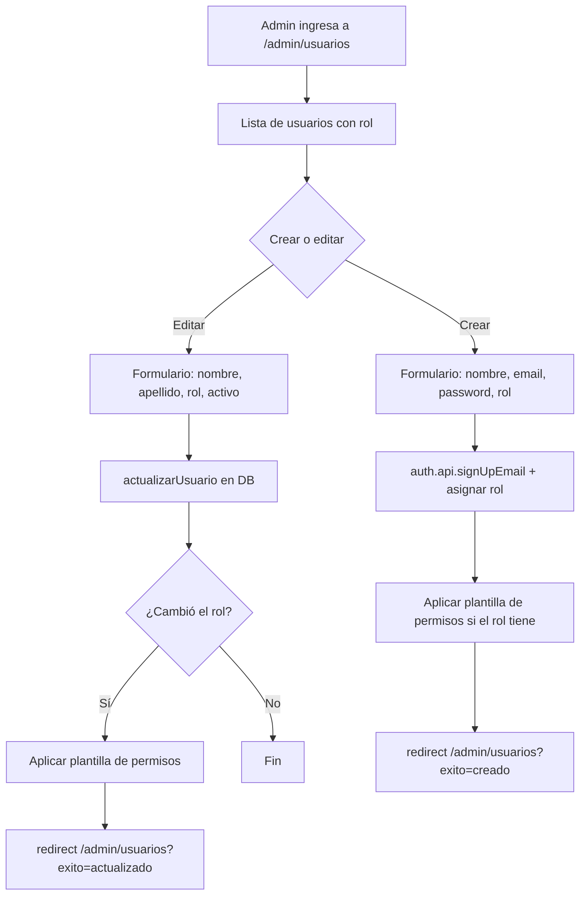

# Admin — Gestión de Usuarios y Roles

**Propósito**: CRUD de usuarios del sistema, asignación de roles, configuración de permisos finos.

---

## Flujo

## Componentes involucrados

| Archivo | Rol |
|---------|-----|
| `lib/admin/types.ts` | Interfaces `UsuarioLista`, `RolItem` |
| `lib/admin/mapper.ts` | `rowToUsuarioLista`, `rowToRol` |
| `lib/admin/repository.ts` | `listarUsuarios`, `obtenerUsuario`, `listarRoles`, `actualizarUsuario`, `asignarRolUsuario` |
| `lib/admin/actions.ts` | `createUser`, `updateUser` — server actions protegidas a Administrador |
| `lib/monitorista/permisos.ts` | `aplicarPlantillaRol` — copia permisos plantilla al usuario |

## BD

| Tabla | Columnas clave | Uso |
|-------|---------------|-----|
| `users` | `id`, `name`, `apellido`, `email`, `rol_id`, `activo`, `two_factor_enabled` | Usuarios del sistema |
| `roles` | `id`, `nombre`, `descripcion`, `activo` | Catálogo de roles |
| `permisos` | `usuario_id`, `seccion`, `puede_ver`, `puede_crear`, `puede_editar` | Permisos finos por usuario |
| `permisos_plantillas` | `rol_id`, `seccion`, `puede_ver`, `puede_crear`, `puede_editar` | Plantillas de permisos por rol |
| `sessions` | `token` | Sesiones de better-auth |

## Reglas de negocio

1. Solo usuarios con rol `Administrador` pueden acceder a `/admin/*`
2. `createUser` usa `auth.api.signUpEmail` y luego limpia la auto-sesión creada
3. `updateUser` solo aplica plantilla de permisos si el rol realmente cambió
4. Al crear usuario se revalida `/admin/usuarios` y redirige con mensaje de éxito
5. Si no hay plantilla para el rol, no se copian permisos (default = acceso total)
