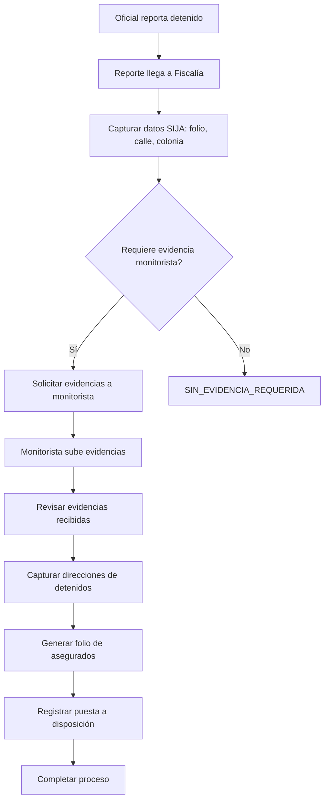

# Fiscalia — Asegurados, Solicitudes de Evidencia y Puesta a Disposición

**Propósito**: Gestión de detenidos asegurados, solicitudes de evidencia a monitorista, registro de datos SIJA y puesta a disposición.

---

## Flujo

## Componentes involucrados

| Archivo | Rol |
|---------|-----|
| `lib/fiscalia/types.ts` | Interfaces `AseguradoRow`, `DetalleAsegurado`, `SolicitudEvidencia`, `PuestaDisposicionRow`, `ViaInfraccionDetalle`, ACTAS_CHECKLIST |
| `lib/fiscalia/mapper.ts` | `rowToAsegurado`, `rowToDetalleDetenidoGuardado`, `rowToPuestaDisposicion` |
| `lib/fiscalia/repository.ts` | `obtenerSolicitudesPendientes`, `obtenerDetalleAsegurado`, `actualizarDetallesAsegurado`, `guardarDetenidosDirecciones`, `generarFolioAsegurados`, `guardarPuestaDisposicion`, `obtenerPuestaDisposicionPorReporte`, `listarLiberaciones`, `obtenerDetalleInfraccionVia` |
| `lib/fiscalia/service.ts` | Orquestación de procesos de fiscalía |
| `lib/fiscalia/actions.ts` | Server actions para captura, solicitud, puesta a disposición |
| `lib/fiscalia/expediente.ts` | Integración con expediente digital |
| `lib/fiscalia/abrirDocumento.ts` | Apertura de documentos desde el sistema |
| `lib/fiscalia/useToastStore.ts` | Store para notificaciones toast |

## BD

| Tabla | Columnas clave | Uso |
|-------|---------------|-----|
| `ofi_reportes_campo` | `id`, `folio_reporte_campo`, `folio_reporte_asegurados`, `ofi_hay_detencion`, `ofi_autoridad_recibe`, `ofi_detenidos` (JSONB) | Reportes de campo con detenidos |
| `ofi_reporte_denuncia` | `id`, `folio_denuncia`, `iph`, `folio_sija`, `folio_remision`, `estado_tramite`, `estado_evidencia`, `monitorista_fechas_requeridas` (JSONB) | Denuncias vinculadas a reportes |
| `ofi_detalles_asegurados` | `id`, `reporte_campo_id`, `nombre_detenido`, `calle`, `colonia`, `latitud`, `longitud` | Direcciones de detenidos |
| `ofi_puesta_disposicion` | `id`, `reporte_campo_id`, `gestion_interna`, `dependencia_externa`, `actas` (JSONB), `hora_inicio_traslado`, `hora_puesta_disposicion`, `completado_en` | Registro de puesta a disposición |
| `moni_evidencias_denuncia` | `id`, `ofi_reporte_denuncia_id`, `url_archivo`, `nombre_archivo` | Evidencias enviadas por monitorista |
| `via.v2_infracciones` | `id`, `folio`, `placa`, `tipo_garantia`, `estatus_dependencia`, `dependencia_receptora` | Infracciones VÍA con garantía vehículo |
| `ofi_oficiales` | `id`, `user_id`, `no_nomina`, `patrulla_id` | Datos del oficial |

## Reglas de negocio

1. Los reportes llegan a Fiscalía cuando `ofi_autoridad_recibe = 'FISCALIA'`
2. Flujo de estado de trámite: `RECIBIDA` → `EN_ANALISIS` → (cierre)
3. Flujo de estado de evidencia: `SIN_SOLICITUD` → `PENDIENTE_MONITORISTA` → `EVIDENCIA_ENVIADA` o `SIN_EVIDENCIA_REQUERIDA`
4. El folio de asegurados se genera con formato `SSPM/YYYYMMDD/FAS/######`
5. Las actas de puesta a disposición siguen un checklist de 8 elementos
6. `guardarDetenidosDirecciones` usa transacción: DELETE + INSERT + UPDATE folio
7. `guardarPuestaDisposicion` usa UPSERT (`ON CONFLICT reporte_campo_id`)
