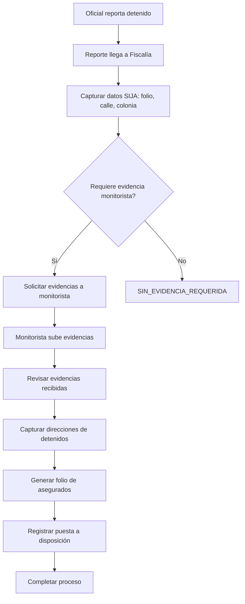

# Fiscalia — Asegurados, Solicitudes de Evidencia y Puesta a Disposición

**Propósito**: Gestión de detenidos asegurados, solicitudes de evidencia a monitorista, registro de datos SIJA y puesta a disposición.

---

## Flujo

```mermaid
flowchart TD
    A[Oficial reporta detenido] --> B[Reporte llega a Fiscalía]
    B --> C[Capturar datos SIJA: folio, calle, colonia]
    C --> D{Requiere evidencia monitorista?}
    D -->|Sí| E[Solicitar evidencias a monitorista]
    D -->|No| F[SIN_EVIDENCIA_REQUERIDA]
    E --> G[Monitorista sube evidencias]
    G --> H[Revisar evidencias recibidas]
    H --> I[Capturar direcciones de detenidos]
    I --> J[Generar folio de asegurados]
    J --> K[Registrar puesta a disposición]
    K --> L[Completar proceso]
```

## Componentes involucrados

| Archivo | Rol |
|---------|-----|
| `lib/fiscalia/types.ts` | Interfaces `AseguradoRow`, `DetalleAsegurado`, `SolicitudEvidencia`, `PuestaDisposicionRow`, `ViaInfraccionDetalle`, `AntecedenteExterno`, `ArmaAsegurada`, `ArmaAseguradaInput`, `ListaArmasAseguradas`, ACTAS_CHECKLIST |
| `lib/fiscalia/mapper.ts` | `rowToAsegurado`, `rowToDetalleDetenidoGuardado`, `rowToPuestaDisposicion`, `rowToAntecedenteExterno`, `rowToArmaAsegurada` |
| `lib/fiscalia/repository.ts` | `obtenerSolicitudesPendientes`, `obtenerSolicitudesFinalizadas`, `obtenerDetalleAsegurado`, `actualizarDetallesAsegurado`, `guardarDetenidosDirecciones`, `generarFolioAsegurados`, `guardarPuestaDisposicion`, `obtenerPuestaDisposicionPorReporte`, `listarLiberaciones`, `obtenerDetalleInfraccionVia`, `listarAntecedentesExternos`, `insertarAntecedenteExterno`, `eliminarAntecedenteExterno`, `listarArmasAseguradasFiscalia`, `insertarArmaAsegurada`, `eliminarArmaAsegurada` |
| `lib/fiscalia/service.ts` | Orquestación de procesos de fiscalía |
| `lib/fiscalia/actions.ts` | Server actions para captura, solicitud, puesta a disposición, antecedentes externos y armas aseguradas |
| `lib/fiscalia/expediente.ts` | Integración con expediente digital |
| `lib/fiscalia/abrirDocumento.ts` | Apertura de documentos desde el sistema |
| `lib/fiscalia/useToastStore.ts` | Store para notificaciones toast |
| `components/fiscalia/AntecedentesExternos.tsx` | Lista + alta/baja de antecedentes externos del detenido (en `FormularioAsegurado`) |
| `components/fiscalia/ArmasAseguradas.tsx` | Lista + alta/baja de armas de fuego aseguradas (en `FormularioAsegurado`) |

## BD

| Tabla | Columnas clave | Uso |
|-------|---------------|-----|
| `ofi_reportes_campo` | `id`, `folio_reporte_campo`, `folio_reporte_asegurados`, `ofi_hay_detencion`, `ofi_autoridad_recibe`, `ofi_detenidos` (JSONB) | Reportes de campo con detenidos |
| `ofi_reporte_denuncia` | `id`, `folio_denuncia`, `iph`, `folio_sija`, `folio_remision`, `estado_tramite`, `estado_evidencia`, `monitorista_fechas_requeridas` (JSONB) | Denuncias vinculadas a reportes |
| `ofi_detalles_asegurados` | `id`, `reporte_campo_id`, `nombre_detenido`, `calle`, `colonia`, `latitud`, `longitud` | Direcciones de detenidos |
| `ofi_puesta_disposicion` | `id`, `reporte_campo_id`, `gestion_interna`, `dependencia_externa`, `actas` (JSONB), `hora_inicio_traslado`, `hora_puesta_disposicion`, `completado_en` | Registro de puesta a disposición |
| `moni_evidencias_denuncia` | `id`, `ofi_reporte_denuncia_id`, `url_archivo`, `nombre_archivo` | Evidencias enviadas por monitorista |
| `via.v2_infracciones` | `id`, `folio`, `placa`, `tipo_garantia`, `estatus_dependencia`, `dependencia_receptora` | Infracciones VÍA con garantía vehículo |
| `ofi_oficiales` | `id`, `user_id`, `no_nomina`, `patrulla_id` | Datos del oficial |
| `antecedentes_externos_detenido` | `id`, `reporte_campo_id` (FK `ofi_reportes_campo`), `tipo` (DELITO/FALTA_ADMINISTRATIVA), `descripcion`, `fecha`, `lugar`, `capturado_por` (FK `users`), `created_at` | Antecedentes/delitos previos del detenido en otras jurisdicciones |
| `fiscalia_armas_aseguradas` | `id`, `reporte_campo_id` (FK `ofi_reportes_campo`), `tipo_arma`, `marca`, `matricula`, `calibre`, `observaciones`, `capturado_por` (FK `users`), `creado_en` | Armas de fuego aseguradas capturadas estructuradamente (varias por reporte) — fuente del paso 7 de Formato N |

## Reglas de negocio

1. Los reportes llegan a Fiscalía cuando `ofi_autoridad_recibe = 'FISCALIA'`
2. Flujo de estado de trámite: `RECIBIDA` → `EN_ANALISIS` → (cierre)
3. Flujo de estado de evidencia: `SIN_SOLICITUD` → `PENDIENTE_MONITORISTA` → `EVIDENCIA_ENVIADA` o `SIN_EVIDENCIA_REQUERIDA`
4. El folio de asegurados se genera con formato `SSPM/YYYYMMDD/FAS/######`
5. Las actas de puesta a disposición siguen un checklist de 8 elementos
6. `guardarDetenidosDirecciones` usa transacción: DELETE + INSERT + UPDATE folio
7. `guardarPuestaDisposicion` usa UPSERT (`ON CONFLICT reporte_campo_id`)
8. `ArmasAseguradas` (componente en `FormularioAsegurado`) captura tipo/marca/matrícula/calibre de armas de fuego aseguradas por `reporte_campo_id`, con alta/baja simples. `listarArmasAseguradasFiscalia` trae en la misma llamada `num_carpeta_investigacion` del D1 como sugerencia visual (el campo "Carpeta de Investigación" no se persiste en esta tabla — es de referencia). Estas filas alimentan el paso 7 de Formato N vía `sincronizarArmasDelDia` (ver `Formato N.md`, regla 12).

## REGLA de diseño

Todas las vistas cumplen la REGLA de diseño: **Header Centinela** (`DashboardHeader`, sin `backHref` cuando el regreso vive en el `PageHeader`), **PageHeader** con botón de regreso `variant="secondary"` en `actions` (regla de regreso) y **responsive** (`.pad-pagina`/`.pad-dashboard`, `.grid-2`/`.grid-3`/`.cat-cards-grid`, tablas con `.tabla-wrap` + `minWidth`). Los formularios compartidos (`FormularioAsegurado`, `FormularioPuestaDisposicion`, `CapturarDetallesForm`, `DetallesAseguradoView`) aceptan `ocultarEncabezado` para no duplicar el título cuando la página ya usa `PageHeader` (juzgado los usa sin la prop, conservando su encabezado inline).
