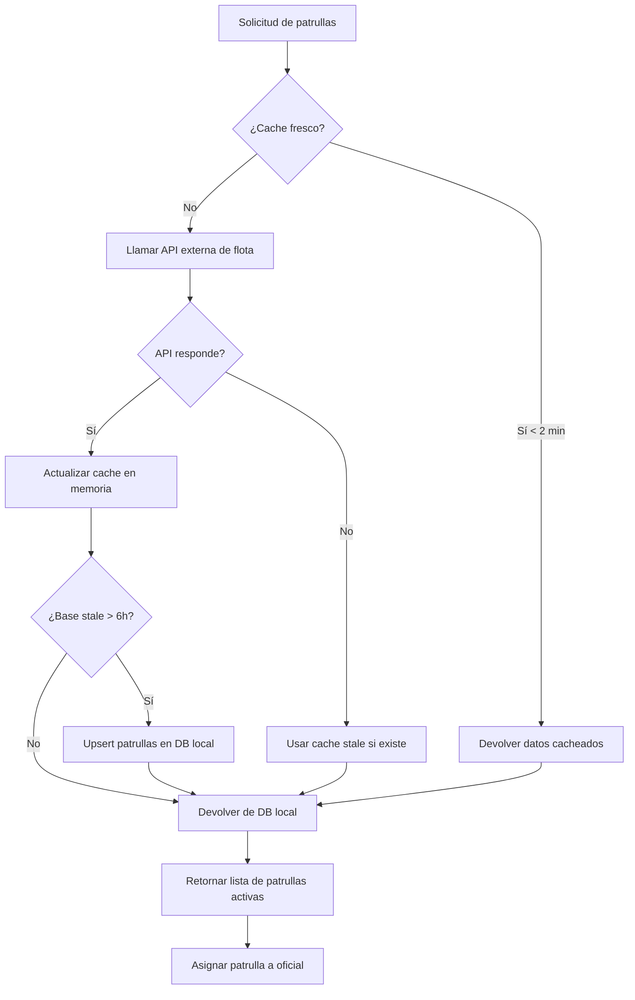

# Flota — Sincronización de Patrullas

**Propósito**: Sincronización de vehículos desde API externa de flota, caché en memoria, persistencia en base local y asignación a oficiales.

---

## Flujo

## Componentes involucrados

| Archivo | Rol |
|---------|-----|
| `lib/flota/types.ts` | Interfaces `FlotaVehiculoRaw`, `Patrulla`, `PatrullaAsignacion` |
| `lib/flota/mapper.ts` | `rowToPatrulla` |
| `lib/flota/repository.ts` | `estaStale`, `upsertPatrullas`, `listarActivas`, `obtenerPorId` |
| `lib/flota/service.ts` | `obtenerFlota` (cache + fetch externo), `listarPatrullasParaAsignacion` (stale check + sync), `invalidarCache`, `obtenerPatrullaPorId` |

## BD

| Tabla | Columnas clave | Uso |
|-------|---------------|-----|
| `via.v2_patrullas` | `id`, `numero_unidad`, `placas`, `descripcion`, `activo`, `sincronizado_en` | Catálogo local de patrullas |
| `ofi_oficiales` | `id`, `patrulla_id`, `user_id` | Asignación de patrulla a oficial |

## Reglas de negocio

1. La API externa se llama desde `http://proyecto-flota.vercel.app/api/publica?placa` con `x-api-key`
2. Cache en memoria con TTL de 120 segundos
3. La base local se considera stale si pasan 6 horas desde la última sincronización
4. `listarPatrullasParaAsignacion` sincroniza automáticamente si la base está stale
5. El upsert usa `ON CONFLICT (numero_unidad)` para evitar duplicados
6. Si la API falla, se devuelve el cache en memoria si existe (fallback)
7. Solo se listan patrullas con `activo = true`
