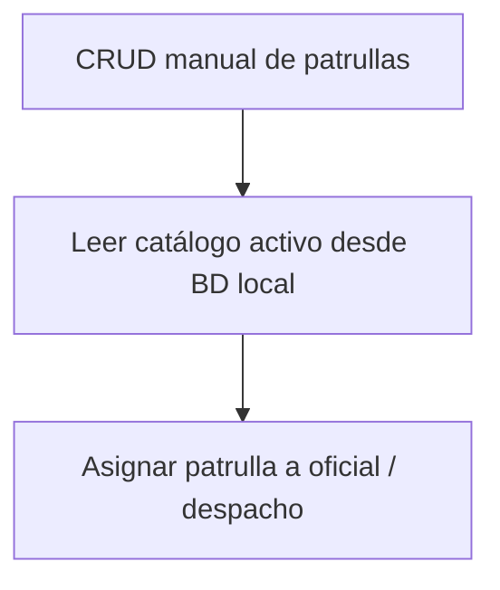

# Flota — Parque Vehicular

**Propósito**: Catálogo del parque vehicular de la corporación. Ya **no** hay sincronización con la API externa `proyecto-flota.vercel.app` (servicio retirado); el catálogo se mantiene con el CRUD de `/dashboard/catalogos/patrullas` (el importador Excel fue retirado).

---

## Flujo

```mermaid
flowchart TD
    A[CRUD manual de patrullas] --> D[Leer catálogo activo desde BD local]
    D --> E[Asignar patrulla a oficial / despacho]
```

## Componentes involucrados

| Archivo | Rol |
|---------|-----|
| `lib/flota/types.ts` | Interfaces `Patrulla`, `PatrullaAsignacion`, `UnidadParaDespacho` |
| `lib/flota/mapper.ts` | `rowToPatrulla`, `agruparUnidadesConTripulacion` + etiqueta/detalle calculados |
| `lib/flota/repository.ts` | `listarActivas`, `obtenerPorId`, `listarUnidadesConTripulacionRaw`, `listarIdsUnidadesOcupadas` |
| `lib/flota/service.ts` | `listarPatrullasParaAsignacion`, `listarUnidadesParaDespacho`, `obtenerPatrullaPorId` (solo lectura local) |

## BD

| Tabla | Columnas clave | Uso |
|-------|---------------|-----|
| `via.v2_patrullas` | `id` (PK interna), `num_serie` (UNIQUE, llave de negocio), `placa` (nullable), `departamento`, `caracteristicas`, `marca`, `modelo`, `gps`, `radio`, `camaras`, `activo`, `sincronizado_en` | Catálogo del parque vehicular |
| `ofi_oficiales` | `id`, `patrulla_id` (FK → `v2_patrullas.id`, `ON DELETE SET NULL`) | Asignación de patrulla a oficial |

## Reglas de negocio

1. `num_serie` (VIN) es la **llave de negocio única** (los VIN no se repiten); `id uuid` sigue siendo la PK interna para no romper los joins existentes.
2. `placa` es **nullable**: bicicletas y remolques sin placas (`S/P`) quedan con NULL. El mapper calcula la `etiqueta` visible (placa → si no hay, `caracteristicas — marca — modelo` sin repetir → si no, `num_serie`) y un `detalle` descriptivo.
3. En el departamento `BICICLETA`, `marca='TREK'`, `modelo='MARILN 4 GEN 3'` y `num_serie` = serial `WTU…` (el serial vive en la columna MARCA del Excel).
4. No hay caché ni llamadas externas: todo se lee de la tabla local.
5. Solo se listan patrullas con `activo = true`.
6. `ofi_oficiales.patrulla_id` apunta al `id` uuid interno (no al serial).
