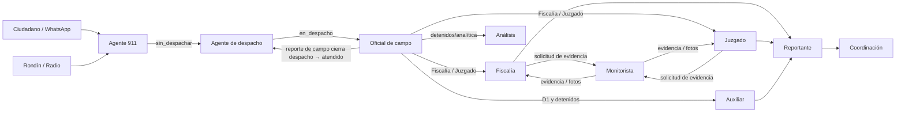

# Flujos Operativos por Rol

**Propósito**: visión integral de la operación por rol, a partir de los módulos actualmente existentes y del levantamiento operativo recibido. Sirve para validar responsabilidades, entregables y transiciones entre áreas.

**Criterio de lectura**: “Actual” describe lo que el sistema/documentación confirma; “Pendiente” identifica una necesidad del levantamiento que no está documentada como flujo completo. Los roles técnicos entre paréntesis corresponden al valor de rol actual del sistema.

## Mapa general

**Nota**: todo incidente (incluido rondín) nace `sin_despachar` y escala a despacho. El rondín SIEMPRE genera solicitud de despacho — ya no se auto-cierra. El oficial cierra la solicitud al capturar su reporte de campo (`estatus → atendido`). Ver [[Plan Flujo Despacho]].

## 1. Agente 911 (`agente_911`)

**Objetivo**: registrar y clasificar incidencias de ciudadanía, WhatsApp, 911 y radio/rondín.

**Flujo actual**

1. Selecciona el canal: ciudadano/911, WhatsApp o rondín-radio.
2. Captura reportante —o marca anónimo—, ubicación, referencias, descripción, tipo de emergencia, tipo de incidente, prioridad, horarios y observaciones.
3. Para WhatsApp, registra el grupo; este dato solo aplica a dicho canal.
4. Para 911 puede registrar folio CAD, personas afectadas, usuario frecuente, migrante/paisano y medio de canalización.
5. El sistema genera el folio y deja el incidente en `sin_despachar` — todos los canales, incluido rondín, escalan a despacho.
6. Si es extorsión o alarma escolar, se completa su registro especializado asociado al incidente.
7. El incidente pasa al tablero de despacho cuando requiere unidad.

**Pendiente / decisiones**

- Confirmar catálogo controlado para “tipo de incidente”; el levantamiento plantea si será select u abierto. Debe ser catálogo con opción “otro + descripción” para conservar análisis consistente.
- Definir regla de cierre por tipo de incidente y responsable del cierre; hoy el levantamiento lo menciona, pero no establece matriz de reglas.

## 2. Agente de despacho (`agente_despacho`)

**Objetivo**: convertir una incidencia pendiente en un servicio atendible por una unidad.

**Flujo actual**

1. Consulta incidentes `sin_despachar` que requieren despacho, ordenados por prioridad y hora de inicio.
2. Revisa ubicación, referencia, descripción y clasificación del incidente.
3. Asigna una o más unidades y, cuando aplica, elementos policiales.
4. El sistema registra quién despachó y la fecha/hora, y cambia el incidente a `en_despacho`.
5. Da seguimiento a la lista de incidentes en despacho hasta que el reporte de campo lo marque atendido.

**Pendiente / mejora**

- Incorporar confirmación operativa de arribo, inicio y término de atención como hitos de despacho, no solo como campos de captura posterior.
- Agregar alerta de SLA por prioridad y reasignación/escala cuando una unidad no confirme.

## 3. Oficial de campo (`Oficial de Campo`)

**Objetivo**: documentar la atención en campo, sus resultados y las personas/objetos involucrados.

**Flujo actual**

1. Recibe un servicio despachado o realiza un recorrido/rondín.
2. Llena el reporte paso a paso: datos generales y mapa, incidente/emergencia, narrativa y acciones, detenidos/vehículos/cateo, y bienes especiales (armas, drogas, hidrocarburos u órdenes).
3. Registra positivos/negativos, resultado, autoridad receptora, delito o falta, objetos/vehículos recuperados y, si aplica, detención o cateo.
4. Decide si requiere denuncia D1. Si sí, se crea una denuncia vinculada; si hay detenidos, se generan solicitudes de fotos frontal, derecha e izquierda.
5. El reporte queda `registrado`. El trámite avanza vía `ofi_reporte_denuncia.estado_tramite`: `RECIBIDA → EN_ANALISIS → EN_REVISION_JUZGADO → CERRADO`, según autoridad receptora (Fiscalía o Juzgado).

**Pendiente / mejora**

- Normalizar los campos del formato D1 del levantamiento (horas de confirmación, llegada, toma de denuncia, CU, tablet, sector y firma) como un único formulario versionado; hoy están repartidos entre reporte, denuncia y procesos posteriores.
- Validar cronología: inicio ≤ despacho ≤ arribo ≤ confirmación ≤ cierre, e impedir guardar inconsistencias.

## 4. Auxiliar de novedades (`Auxiliar`)

**Objetivo**: controlar calidad y seguimiento de pares reporte de campo–D1, y generar el Cuestionario Único de robos.

**Flujo actual**

1. Consulta los reportes de campo que ya tienen una D1 vinculada.
2. Por cada par, captura o actualiza el checklist: CU-D1 y duración, detenidos FGE/FGR/Juzgado, convenios, trabajo comunitario, coincidencia GPS, visualización por cámara, TI/PI y observaciones.
3. Para reportes cuyo incidente o delito contiene “robo”, consulta y exporta los datos del cuestionario de robo.

**Pendiente / mejora**

- Implementar el alta completa de Cuestionario Único (folio de incidente/reporte/cuestionario, fecha/hora y responsable). Consulta/exportación existe como página y endpoint, pero **falta formulario de captura** persistente.
- Sustituir la detección textual de “robo” por un tipo de incidente/delito catalogado para evitar falsos positivos y omisiones.

## 5. Agente Bitacorista (`agente_bitacorista`)

**Objetivo esperado**: consolidar la bitácora operativa de turno.

**Estado actual**

- El rol existe y dirige a su panel propio.
- No hay flujo, campos, tablas ni documentación funcional que describa el “Formulario bitácora” solicitado.

**Flujo propuesto para validación**

1. Abre o crea la bitácora de turno (fecha, turno, responsable).
2. Recibe automáticamente eventos de 911, despacho y reportes de campo; puede añadir entradas manuales.
3. Para cada entrada registra hora, fuente, folio vinculado, resumen, responsable y resultado.
4. Marca relevancia, deja observaciones y cierra/entrega la bitácora al finalizar el turno.

**Mejora prioritaria**: definir este flujo y su modelo de datos antes de construir la pantalla; debe usar referencias a incidentes/reportes, nunca copiar sus datos como texto sin vínculo.

## 6. Monitorista (`Monitorista`)

**Objetivo**: atender evidencia audiovisual, fotos de detenidos e incidentes detectados por cámara.

**Flujo actual**

1. Recibe solicitudes de evidencia originadas desde Fiscalía o Juzgado, con el incidente/denuncia asociado.
2. Busca y adjunta imágenes o video al expediente digital; completa o cancela la solicitud y queda historial de la acción.
3. Gestiona solicitudes de fotos de detenidos: revisa, envía o rechaza, y puede generar ficha de inteligencia y presentación de detenidos.
4. Registra por turno incidentes de cámara: personas, vehículos, persecuciones, aseguramientos, recuperaciones, incendios, tránsito y motos revisadas.
5. Da seguimiento a denuncias D1 que requieren evidencia.

**Pendiente / mejora**

- Establecer tiempos objetivo y motivo obligatorio al rechazar/cancelar evidencia; la trazabilidad existe, pero el levantamiento no define escalamiento.
- Estandarizar la presentación de detenidos (diaria/semanal/mensual) y asegurar que use una misma ficha con fotos, evento, delito/falta y modus operandi.
- Separar “observación sin novedad” de “persona con antecedente” con clasificación, fuente y periodo de retención definidos.

## 7. Fiscalía (`agente_fiscalia`)

**Objetivo**: procesar asegurados y puesta a disposición ante Fiscalía.

**Flujo actual**

1. Recibe reportes de campo cuya autoridad receptora es `FISCALIA`.
2. Revisa el reporte y captura/complementa SIJA, datos de asegurados y domicilios.
3. Define si requiere evidencia. Si la requiere, solicita al Monitorista y espera el estado `EVIDENCIA_ENVIADA`; si no, registra `SIN_EVIDENCIA_REQUERIDA`.
4. Genera folio de asegurados y registra la puesta a disposición, con checklist de actas y horarios de traslado/llegada/puesta a disposición.
5. Completa/cierra el trámite y deja los documentos disponibles para consulta.

**Pendiente / mejora**

- Convertir el checklist del levantamiento (inspecciones, lectura de derechos, embalaje, custodia, preservación, entrevistas y otros actos) en evidencia verificable con responsable, hora y archivo, no solo marcación.
- Acordar una máquina de estados de cierre explícita para `RECIBIDA` → `EN_ANALISIS` → cierre, incluyendo causa de devolución o incompletitud.

## 8. Juzgado Cívico (`agente_juzgado`)

**Objetivo**: tramitar asegurados turnados a Juzgado y resolver liberaciones asociadas.

**Flujo actual**

1. Recibe reportes con autoridad `JUZGADO CIVICO` y sin folio de asegurados.
2. Revisa evidencias enviadas por Monitorista.
3. Inicia el proceso, complementa datos del infractor, oficio y carpeta cuando corresponde, y lo envía a mesa de control.
4. Finaliza el proceso; para infracciones, el subestado puede pasar a `LIBERADA_POR_JUZGADO`.
5. Consulta y gestiona liberaciones vinculadas al Juzgado.

**Pendiente / mejora**

- Alinear el nombre de la operación “Gestión de asegurados” con los criterios de entrada y estados para evitar que Fiscalía y Juzgado procesen el mismo caso.
- Añadir una lista de requisitos de liberación y notificación al solicitante cuando falte evidencia/documentación.

## 9. Reportante / Reportes (`Reportante`)

**Objetivo**: concentrar reportes operativos, estadísticos y de coordinación.

**Flujo actual**

1. Consulta reportes operativos, telefónicos, de D1, sin D1, sin novedad e incidentes; puede filtrar y exportar según el reporte.
2. Captura los siete formatos de coordinación: Eventos, FGE, FGR, RND, Medios Alternativos, Atención a Víctimas y Armas Aseguradas.
3. Guarda cada formato independientemente y consulta el consolidado.

**Pendiente / mejora**

- El “envío de formatos” hoy solo guarda información; faltan generación de archivo, destinatario, acuse, fecha de envío y reenvío.
- Diseñar el reporte diario y el registro por turno como productos con definición de corte, fuente, responsable y versión, para que no dependan de exportaciones manuales.

## 10. Área de Análisis (`Analisis`)

**Objetivo esperado**: enriquecer información de detenidos y producir análisis/inteligencia.

**Estado actual**

- Tiene permisos y pantallas de pendientes, formulario de ingreso, IPH y generación de presentación.
- **No tiene redirect en dashboard** — usuario con rol `Analisis` cae en dashboard genérico con ModuleCards, no en `/analisis`.
- El levantamiento solicita un Excel/datos complementarios del detenido (domicilio, nacimiento, edad, género, alias, origen, falta y Registro Nacional de Detenidos), pero no existe documentación de dominio equivalente en la bóveda.

**Flujo propuesto para validación**

1. Recibe reportes con detenido y evidencia disponible.
2. Revisa el prellenado, completa los datos analíticos y valida fuente/fecha de cada dato.
3. Clasifica evento, delito/falta y modus operandi; relaciona IPH/RND cuando aplique.
4. Genera ficha o presentación y exportación controlada; marca el registro como analizado.

**Mejora prioritaria**: documentar modelo de datos, roles de consulta/edición y reglas de protección de datos personales antes de ampliar el módulo.

## 11. Infracciones, liberaciones y corralón

Estos roles se separan del flujo de incidentes, aunque comparten oficiales y, en algunos casos, Juzgado/Fiscalía.

| Rol | Flujo actual | Mejora principal |
|---|---|---|
| Agente de infracciones (`agente_infracciones`) | Recibe infracción VÍA `REGISTRADA`, captura infractor/titular, genera orden SA7 y registra pago o garantía. | Clarificar transición hacia corralón y responsable de cada cambio de estatus. |
| Agente de liberaciones (`agente_liberaciones`) | Revisa documentos, aprueba/rechaza cada uno, finaliza revisión y genera orden SA7 para liberar. | Notificar faltantes y mostrar una lista de requisitos por tipo de liberación. |
| Corralón MW / Mejía (`corralon_mw`, `corralon_mejia`) | Accede al módulo de solicitudes de liberación. | Documentar el flujo específico de recepción, custodia y entrega/cierre de vehículo; no existe en la bóveda. |

## 12. Administración (`Administrador`)

**Flujo actual**: crea/edita usuarios, asigna roles y aplica plantillas de permisos finos. Los usuarios ingresan con autenticación y 2FA; el rol y los permisos determinan módulo y acciones disponibles.

**Mejora**: el acceso por defecto cuando no existe fila de permisos es total. Para roles con información sensible (Fiscalía, Monitorista, Análisis), conviene migrar a “denegar por defecto” y otorgar permisos explícitos.

## Puntos transversales de mejora (prioridad sugerida)

1. **P0 — Máquina de estados única**: formalizar estados, dueños, transiciones permitidas y motivo de cierre/devolución para incidente, reporte de campo, denuncia y evidencia. Evita expedientes huérfanos y dobles capturas.
2. **P0 — Folio y trazabilidad**: cada interacción debe vincular `folio_incidente`, `folio_CAD`, `folio_reporte_campo`, D1, SIJA/IPH y folio de asegurados cuando existan; mostrar esa cadena en una vista de expediente.
3. **P1 — Bitácora y Análisis**: aprobar su modelo de datos y flujos antes de implementar formularios; hoy hay pantallas/rol pero falta definición operativa completa.
4. **P1 — Calidad de datos**: catálogos con “otro”, validación de cronología, ubicación estructurada y campos condicionales por canal/tipo de incidente.
5. **P1 — Medición operativa**: SLA por prioridad, tiempos de despacho/arribo/cierre, evidencias vencidas y carga por rol/turno.
6. **P2 — Entregables externos**: automatizar envío de Formato N, Excel y presentaciones con versión, acuse y control de acceso.
7. **P2 — Seguridad y auditoría**: permisos mínimos, motivo de acceso a evidencia sensible, retención de archivos y bitácora inmutable de acciones relevantes.

> **Info — cat_estatus_evento**: Existe en BD una máquina de 11 estados con `area_responsable` (NUEVO→VALIDADO→DESPACHADO→EN_ATENCION→ATENDIDO→EN_BITACORA→EN_NOVEDADES→CLASIFICADO→INVESTIGADO→GEOREFERENCIADO→CERRADO). No está integrada al flujo principal de incidentes/reportes. Considerar si unificarla con la máquina del P0.

## Decisiones necesarias con operación

- Catálogo y regla de cierre por tipo de incidente.
- Qué eventos requieren despacho y quién puede cerrar/reabrirlos.
- Fuente oficial y obligatoriedad de cada folio (CAD, D1, SIJA, IPH, CU, RND).
- SLA por prioridad, evidencia y puesta a disposición.
- Campos obligatorios y responsables de Bitácora y Análisis.
- Política de evidencia: tipos de archivo, vencimiento, acceso, conservación y cadena de custodia.

## Fuentes consultadas

- Levantamiento operativo adjunto: “CESAR: 1 DIA PARA MIGRAR…”
- `911.md`, `Reporte Campo.md`, `Monitorista.md`, `Fiscalia.md`, `Juzgado.md`, `Infracciones.md`, `Liberaciones.md`, `Formato N.md`, `Middleware y Auth.md` y el código de rutas/roles actual.
