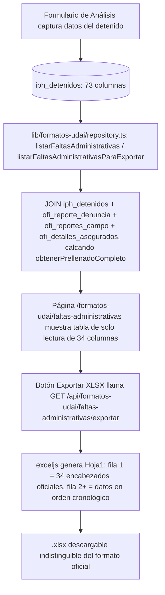

# Formatos UDAI — Formato Faltas Administrativas (bitácora exportable a Excel)

**Propósito**: Generar el Excel oficial UDAI **"Formato Faltas Administrativas"** (`FORMATO FALTAS ADMINISTRATIVAS.xlsx`, 34 columnas) a partir de los registros que **ya existen** en `iph_detenidos` (alimentada hoy por el formulario de Análisis, `components/analisis/formAnalisis.tsx` → `registrarIphDetenido()`). No captura nada nuevo: es una bitácora de solo lectura con exportación `.xlsx` que replica el archivo oficial carácter por carácter (typos incluidos).

---

## Flujo



## Quién lo usa

- Hub `/agente_reportes` → sección "Formatos UDAI" → card "Formatos UDAI" → `/formatos-udai` → card "Formato Faltas Administrativas" → `/formatos-udai/faltas-administrativas`.
- Dos roles distintos aterrizan en este mismo hub (`HUB_POR_ROL` en `lib/auth/helpers.ts`): el rol legacy **`Reportante`** (id 35) y el rol real en uso hoy **`agente_reportes`** (id 47). Ambos están registrados en `lib/permisos/registro.ts` con la sección `formatos_udai` en su plantilla, para que se puedan gestionar desde `/admin/roles/[id]/plantilla-permisos`.
- Permiso: sección `formatos_udai` (registrada en `lib/permisos/registro.ts` para ambos roles, y en `lib/permisos/mapa-secciones.ts` para el gate del proxy en `/formatos-udai` y `/api/formatos-udai`).

## Componentes involucrados

| Archivo | Rol |
|---------|-----|
| `lib/formatos-udai/types.ts` | Interfaz `FaltaAdministrativaRow` con los 34 campos del mapa oficial (los 3 GAP quedan `null` explícitos) |
| `lib/formatos-udai/repository.ts` | `listarFaltasAdministrativas()` (tabla, DESC), `listarFaltasAdministrativasParaExportar()` (Excel, ASC) — JOIN de 4 tablas calcando `obtenerPrellenadoCompleto()`; fechas con `::text` (la capa entrega `YYYY-MM-DD`/`HH:MM:SS`, no objetos `Date`) |
| `lib/formatos-udai/permisos.ts` | Wrapper tipado sobre `lib/permisos/core` (sección `formatos_udai`) |
| `app/formatos-udai/page.tsx` | Hub intermedio (la "carpeta") con la card "Formato Faltas Administrativas" |
| `app/formatos-udai/faltas-administrativas/page.tsx` | Tabla de solo lectura, 34 columnas en orden oficial, GAP como `—` |
| `app/api/formatos-udai/faltas-administrativas/exportar/route.ts` | GET → valida sesión/permiso → `exceljs` escribe Hoja1 (fila 1 = encabezados exactos, fila 2+ = datos) |
| `components/formatos-udai/BotonExportarExcel.tsx` | Client component: GET y descarga del blob `.xlsx` |

## BD

| Tabla | Columnas clave | Uso |
|-------|---------------|-----|
| `iph_detenidos` | `fecha_reporte`, `hora_reporte`, `rt_responsable`, `folio_iph`, `fecha_nacimiento`, `edad`, `genero`, `alias`, `ciudad_origen`, `calle_detenido`, `numero_detenido`, `colonia_detenido`, `articulo`, `tipo_falta`, `rnd`, `calle_arresto`, `colonia_arresto`, `agente_aprehensor`, `sector_arresto`, `agrupamiento_arresto`, `latitud_arresto`, `longitud_arresto`, `presencia`, `verbalizacion`, `control_contacto`, `control_fisico`, `tecnicas_no_letales`, `fuerza_letal`, `reporte_denuncia_id` | **Tabla base** del reporte; la mayoría de las 34 columnas oficiales |
| `ofi_reporte_denuncia` | `id`, `reporte_campo_id`, `iph`, `sector`, `fecha_reporte`, `hora_reporte` | Fallback de fecha/hora/IPH y fuente del sector (`COALESCE(iph.sector_arresto, rd.sector)`) |
| `ofi_reportes_campo` | `id` | Eslabón del JOIN (`rd.reporte_campo_id → rc.id`) |
| `ofi_detalles_asegurados` | `reporte_campo_id`, `ap_paterno_detenido`, `ap_materno_detenido`, `nombre_detenido` | Nombre/apellidos del detenido (no viven en `iph_detenidos`) |

## Vistas (UI)

| Ruta | Vista | Patrón |
|------|-------|-------|
| `/agente_reportes` | Card "Formatos UDAI" en la sección "Formatos UDAI" | `OptionSquare` en grilla `cat-cards-grid` |
| `/formatos-udai` | Hub con la card "Formato Faltas Administrativas" | `DashboardHeader` (`backHref="/agente_reportes"`) + `PageHeader` + `OptionSquare` |
| `/formatos-udai/faltas-administrativas` | Tabla de 34 columnas en orden oficial, solo lectura, scroll horizontal (`overflow: auto`) | `DashboardHeader` + `PageHeader` (`← Formatos UDAI` + `EXPORTAR XLSX`) + `.pad-pagina` |

## Mapa columna Excel → BD

| # | Columna Excel | Fuente |
|---|---|---|
| 1 | FECHA | `iph.fecha_reporte` (fallback `rd.fecha_reporte`) |
| 2 | HORA | `iph.hora_reporte` (fallback `rd.hora_reporte`) |
| 3 | RESPONSABLE DE TURNO | `iph.rt_responsable` |
| 4 | HORA DE SALIDA | **GAP** — sin columna directa |
| 5 | IPH | `rd.iph` (fallback `iph.folio_iph`) |
| 6 | FOLIO TABLET | **GAP** — solo existen booleanos, ningún folio |
| 7-9 | APELLIDO PATERNO / MATERNO / NOMBRE | `da.ap_paterno_detenido` / `da.ap_materno_detenido` / `da.nombre_detenido` |
| 10 | FECHA DE NACIMIENTO | `iph.fecha_nacimiento` |
| 11 | EDAD | `iph.edad` (ya capturado, no se recalcula) |
| 12 | GÉNERO | `iph.genero` |
| 13 | ALIAS | `iph.alias` |
| 14 | CIUDAD DE ORIGEN DET | `iph.ciudad_origen` |
| 15-17 | CALLE / NUMERO / COLONIA DET | `iph.calle_detenido` / `iph.numero_detenido` / `iph.colonia_detenido` |
| 18-19 | ARTICULO / TIPO DE FALTA ADMINISTRATIVA | `iph.articulo` / `iph.tipo_falta` |
| 20 | REGISTRO NACIONAL DE DETENIDOS | `iph.rnd` |
| 21-22 | LUGAR DE ARRESTO / COLONIA | `iph.calle_arresto` / `iph.colonia_arresto` |
| 23 | OFICIAL QUE REMITE (col W) | `iph.agente_aprehensor` |
| 24 | OFICIAL QUE REMITE (col X, duplicada) | **GAP** — no hay segundo oficial |
| 25 | SECTOR | `COALESCE(iph.sector_arresto, rd.sector)` |
| 26 | AGRUPAMIENTO | `iph.agrupamiento_arresto` |
| 27-28 | COORDENADAS LATITUD / LONGITUD | `iph.latitud_arresto` / `iph.longitud_arresto` |
| 29-34 | PRESENCIA / VERBALIZACION / CONTROL DE CONTACTO / CONTROL FISICO / TECNICAS DEFENSIVA NO LETALES / FUERZA PONTENCIAL LETAL | `iph.presencia` / `iph.verbalizacion` / `iph.control_contacto` / `iph.control_fisico` / `iph.tecnicas_no_letales` / `iph.fuerza_letal` |

## Reglas de negocio

1. **Universo de filas**: todos los registros de `iph_detenidos` (a diferencia de `/reporte-detenidos`, no depende de las 3 fotos — es una bitácora administrativa).
2. **Orden**: tabla en pantalla DESC (más reciente primero); Excel exportado en ASC (cronológico, como se espera de una bitácora entregable).
3. **Escala de uso de la fuerza (cols. 29-34)**: se renderiza `SI` cuando el booleano es `true`, celda vacía cuando es `false` — nunca `TRUE`/`FALSE` crudo.
4. **Excel sin banner institucional**: la fila 1 son los 34 encabezados del formato oficial (textos literales, **incluido el typo `FUERZA PONTENCIAL LETAL`** y el espacio final en `TECNICAS DEFENSIVA NO LETALES `), la fila 2 en adelante son datos. Deliberadamente NO se usa `crearHoja()` de `app/api/reportes-operativos/exportar-excel/route.ts` (ese agrega 3 filas de banner que el formato UDAI no lleva).
5. **Fechas en Excel**: `fecha`/`fechaNacimiento` como `dd/mm/yyyy`, `hora` como `HH:MM` (los `::text` de la capa de datos entregan `YYYY-MM-DD`/`HH:MM:SS`).
6. **Gaps**: cols. 4, 6, 24 se exportan como celda vacía (`''`), no `"null"`/`"undefined"`; en la tabla se muestran como `—`.

## Limitaciones conocidas (aceptadas, no bugs)

- **HORA DE SALIDA** (col. 4): no hay columna directa en `iph_detenidos`. Capturar la hora real vía `incidente_despacho_unidades` queda como mejora futura opcional.
- **FOLIO TABLET** (col. 6): solo existen booleanos (`requirio_tablet/funcionaba_tablet/registro_tableta`), ningún folio capturado.
- **Segundo OFICIAL QUE REMITE** (col. 24, duplicada en el formato oficial): solo se llena la col. W con `agente_aprehensor`; no hay segundo oficial/testigo capturado en ningún módulo.
- `articulo`, `tipo_falta`, `agrupamiento_arresto`, `sector_arresto` son **texto libre** en producción (capturados por `formAnalisis.tsx`, que este módulo no toca) — el reporte solo los lee y reporta tal cual fueron capturados.

---

# Formatos UDAI — Formato Reportes de Incidencias (bitácora + captura manual + exportable a Excel)

**Propósito**: Generar el Excel oficial UDAI **"Formato Incidencia"** (`FORMATO INCIDENCIA.xlsx`, 2 hojas: `PUESTAS A DISPOSICION` con 52 columnas e `INCIDENCIA` con 38) a partir del flujo real **911 → reporte de campo del oficial (`ofi_reportes_campo`) → reporte de denuncia (`ofi_reporte_denuncia`)**, acotado a incidentes **ya resueltos** (`incidentes.estatus IN ('atendido', 'cerrado_detencion')`).

**NO usa `iph_detenidos`**: tras 3 revisiones del plan se verificó que los 10 registros de esa tabla (y el módulo Análisis) están completamente desconectados de los incidentes reales. El dato del detenido/vehículo vive en el **JSON sin esquema fijo** que el oficial captura en su reporte de campo (`ofi_reportes_campo.ofi_detenidos`/`ofi_vehiculos`).

A diferencia de Faltas Administrativas (solo lectura), este formato tiene un **paso explícito de captura manual**: las columnas sin fuente automática (`RT`, `TURNO`, `ARTICULOS U OBJETOS`, `AP/NUC`, `FOLIO RND`, `AGRUPAMIENTO`, domicilios del afectado, y varios datos del detenido si Análisis no los capturó) se resuelven con un formulario por registro que, al guardarse marcando "completa" (`completado_en`), habilita ese registro para exportar. El Excel **solo exporta registros "Completas"**.

---

## Flujo

```mermaid
flowchart TD
    A[incidentes con estatus atendido / cerrado_detencion] --> B[lib/formatos-udai/repository.ts: listarReportesIncidencia]
    B --> C[JOIN 911 → ofi_reportes_campo → ofi_reporte_denuncia + JSON ofi_detenidos / ofi_vehiculos]
    C --> D[Página /formatos-udai/reportes-incidencias: SegmentPage Pendientes / Completas]
    D --> E[CompletarDatosModal: formulario solo con lo que no tiene fuente automática]
    E --> F[guardarComplementoIncidencia: UPSERT a formato_incidencia_complemento]
    F --> G[completado_en NO nulo = registro "Completa"]
    G --> H[Botón Exportar XLSX llama GET /api/formatos-udai/reportes-incidencias/exportar]
    H --> I[listarReportesIncidenciaParaExportar filtra comp.completado_en IS NOT NULL]
    I --> J[exceljs: 2 hojas PUESTAS A DISPOSICION + INCIDENCIA, solo registros Completas]
```

Los incidentes **en curso** (`sin_despachar` / `en_despacho` / `en_sitio`) **nunca entran al reporte** — ni como Pendientes ni como Completas (decisión explícita del usuario, para no mostrar algo que todavía puede cambiar).

## Quién lo usa

- Mismo hub que Faltas Administrativas: `/agente_reportes` → "Formatos UDAI" → `/formatos-udai` → card "Formato Reportes de Incidencias" → `/formatos-udai/reportes-incidencias`.
- Mismos roles (`Reportante` id 35, `Analisis` id 36, `agente_reportes` id 47), misma sección de permisos `formatos_udai`.
- Permiso: acción `ver` para listar y exportar; acción **`editar`** para guardar el complemento (`guardarComplementoIncidencia`). Verificado en BD real el 2026-08-05: los 3 roles tienen `puede_ver = true` y `puede_editar = true` en su plantilla (`permisos_plantillas`), y los usuarios activos con permiso `formatos_udai` también. No requiere ajuste en `lib/permisos/registro.ts`.

## Componentes involucrados

| Archivo | Rol |
|---------|-----|
| `lib/formatos-udai/types.ts` | Interfaz `ReporteIncidenciaCompleto` (un solo tipo para ambas hojas) + `EstadoCompletitudIncidencia` (`'pendiente' | 'completa'`) |
| `lib/formatos-udai/repository.ts` | `listarReportesIncidencia()` (todos, DESC), `listarReportesIncidenciaParaExportar()` (solo completos, ASC) — **ancladas en `incidentes`** (NO `iph_detenidos`); calcula `diaEvento`, `horaPromedio` y `fuero` (de `grupo_adscripcion`) en código; lee el JSON de vehículo/detenido con **variantes de llave** (`v.placas ?? v.placa`) |
| `lib/formatos-udai/actions.ts` | `guardarComplementoIncidencia()` (única mutación): **un solo UPSERT** a `formato_incidencia_complemento` con llave `incidente_id` — ya no hay `UPDATE` a `iph_detenidos` (esa tabla salió de la cadena) |
| `lib/formatos-udai/permisos.ts` | Wrapper tipado (sección `formatos_udai`) |
| `app/formatos-udai/page.tsx` | Hub con la card "Formato Reportes de Incidencias" |
| `app/formatos-udai/reportes-incidencias/page.tsx` | Tabla segmentada `SegmentPage` Pendientes/Completas, filtrada en memoria desde un solo query |
| `app/api/formatos-udai/reportes-incidencias/exportar/route.ts` | GET → valida sesión/permiso `ver` → 2 worksheets en 1 workbook |
| `components/formatos-udai/CompletarDatosModal.tsx` | Formulario de captura manual (2 secciones: Hoja Incidencia + Hoja Puestas a Disposición, esta última solo si hubo detención), precarga valores resueltos, botones "Guardar progreso" / "Guardar y marcar como completa" |
| `components/formatos-udai/DetalleReporteIncidenciaModal.tsx` | Detalle de solo lectura, badge Pendiente/Completa, todos los campos resueltos agrupados por sección |
| `components/formatos-udai/BotonExportarExcel.tsx` | Generalizado con props `href`/`nombreArchivo` (defaults mantienen al caller de Faltas Administrativas intacto) |
| `lib/db/manual-migrations/0040_formato_incidencia_complemento.sql` | Tabla de complemento manual (reemplaza el esquema `0039` descartado, que usaba llave `iph_detenido_id`) |

## BD

| Tabla | Columnas clave | Uso |
|-------|---------------|-----|
| `incidentes` | `id`, `folio`, `estatus`, `municipio`, `latitud`, `longitud`, `fecha_hora_inicio`, `fecha_hora_fin`, `telefono_reportante` | **Ancla del reporte** (filtro `estatus IN ('atendido','cerrado_detencion')`); fuente automática de `FOLIO 911`, coordenadas, `MUNICIPIO`, horas de evento, `TELEFONO AFEC` |
| `ofi_reportes_campo` | `id`, `incidente_id`, `ofi_oficial_id`, `modus_operandi`, `ofi_calle`, `ofi_referencia`, `ofi_colonia`, `ofi_latitud`, `ofi_longitud`, `ofi_detenidos` (JSON), `ofi_vehiculos` (JSON) | Reporte de campo del oficial — fuente de `MODUS`, `CALLE`, `NÚMERO O REFERENCIA`, `COLONIA`, coordenadas (fallback) y del **JSON** de detenido/vehículo |
| `ofi_reporte_denuncia` | `id`, `incidente_id`, `iph`, `sector`, `crp`, `grupo_adscripcion`, `delito`, `fecha_reporte`, `hora_reporte`, `latitud`, `longitud` | Reporte de denuncia (solo si hubo D1) — fuente de `IPH`, `SECTOR`, `CRP`, `FUERO` (derivado), `DELITO`, `FECHA/HORA REPORTE` |
| `ofi_detalles_asegurados` | `reporte_campo_id`, `nombre_detenido`, `ap_paterno_detenido`, `ap_materno_detenido`, `apodo`, `fecha_nacimiento`, `genero`, `calle`, `numero`, `colonia`, `originario`, `curp` | Datos ricos del detenido **si Análisis los capturó** (si no, se piden en el complemento manual); `curp` como sugerencia precargada de `NUC / CU` |
| `ofi_oficiales` + `users` | `ofi_oficiales.id`, `user_id` → `users.name` / `users.apellido` | `AGENTE_APREHENSOR` = `CONCAT_WS(' ', name, apellido)` |
| `ofi_puesta_disposicion` | `reporte_campo_id`, `hora_llegada_sede`, `hora_inicio_traslado` | Candidato automático para `FECHA DE INGRESO`/`FECHA DE SALIDA` (muy escaso hoy: 1 fila en toda la BD) |
| `incidente_personas_afectadas` | `incidente_id`, `nombre` | `AFECTADO` (hoy 1 sola fila en toda la BD) |
| `formato_incidencia_complemento` | `id`, `incidente_id` (UNIQUE), `rt`, `turno`, `articulos_objetos`, `ap_nuc`, `calle_afec`, `numero_afec`, `colonia_afec`, `fuero_override`, `agrupamiento`, `folio_rnd`, `originario`, `nuc_cu`, `edad`, `fecha_nacimiento`, `sexo`, `calle_det`, `numero_det`, `colonia_det`, `marca`...`modelo`, `fecha_ingreso`, `fecha_salida`, `otro_delito`, `masc`, `umecas`, `completado_en`, `completado_por`, `creado_en`, `actualizado_en` | **Tabla nueva (migración 0040)**, llave `incidente_id` (no `iph_detenido_id` — no todo incidente tiene detenido); solo lo que no tiene fuente automática; `completado_en` = criterio único Pendiente/Completa |

## Vistas (UI)

| Ruta | Vista | Patrón |
|------|-------|-------|
| `/formatos-udai` | Hub con la card "Formato Reportes de Incidencias" (junto a Faltas Administrativas) | `OptionSquare` en `cat-cards-grid` |
| `/formatos-udai/reportes-incidencias` | Tabla única segmentada `SegmentPage` **Pendientes/Completas** (no hay tab por hoja del Excel), columnas: Fecha Evento, Folio 911, Detenido, Delito, Sector, Acciones | `DashboardHeader` + `PageHeader` (`← Formatos UDAI` + `EXPORTAR XLSX`) + `SegmentPage` + `.tabla-wrap` + `.pad-pagina` |
| `/api/formatos-udai/reportes-incidencias/exportar` | Descarga `.xlsx` con 2 hojas (solo registros Completas) | `exceljs` 2 `worksheet`s en 1 `workbook` |

## Mapa columna Excel → fuente final

`inc` = `incidentes`, `rc` = `ofi_reportes_campo`, `rd` = `ofi_reporte_denuncia`, `da` = `ofi_detalles_asegurados`, `pd` = `ofi_puesta_disposicion`, `afe` = `incidente_personas_afectadas`, `u` = `users` (vía `ofi_oficiales`), `comp` = `formato_incidencia_complemento`.

### Hoja `INCIDENCIA` (38 columnas)

| # | Columna Excel | Fuente final | Estado |
|---|---|---|---|
| 1 | IPH | `rd.iph` | OK si hubo denuncia |
| 2 | FOLIO 911 | `inc.folio` | **100% automático** (siempre poblado) |
| 3 | FECHA EVENTO | `inc.fecha_hora_inicio::date` | Automático |
| 4 | FECHA REPORTE2 | `rd.fecha_reporte` | OK si hubo denuncia |
| 5 | DIA EVENTO | Calculado en código desde FECHA EVENTO | Automático |
| 6 | HORA REPORTE | `rd.hora_reporte` | OK si hubo denuncia |
| 7 | HORA INICIO EVENTO | `inc.fecha_hora_inicio::time` | Automático |
| 8 | HORA FINAL EVENTO | `inc.fecha_hora_fin::time` | Automático, casi siempre vacío |
| 9 | HORA PROMEDIO | Calculado desde 7 y 8 | Automático |
| 10 | DELITO | `COALESCE(rd.delito, rc.delito)` | Automático |
| 11 | ARTICULOS U OBJETOS | `comp.articulos_objetos` | **Manual** |
| 12 | MODUS | `rc.modus_operandi` | Automático |
| 13 | CALLE | `rc.ofi_calle` | Automático |
| 14 | NUMERO O REFERENCIA | `rc.ofi_referencia` | Automático |
| 15 | COLONIA | `rc.ofi_colonia` | Automático |
| 16 | SECTOR | `rd.sector` | OK si hubo denuncia |
| 17 | RT | `comp.rt` | **Manual** |
| 18 | TURNO | `comp.turno` | **Manual** |
| 19 | CRP | `rd.crp` | OK si hubo denuncia |
| 20 | AFECTADO | `afe.nombre` | Automático si se capturó |
| 21-23 | CALLE / NUMERO / COLONIA AFEC | `comp.calle_afec` / `numero_afec` / `colonia_afec` | **Manual** |
| 24 | TELEFONO AFEC | `inc.telefono_reportante` | Best-fit (quien llamó al 911, no necesariamente el afectado) |
| 25-33 | MARCA...MODELO | `comp.*` (override) ?? primer elemento de `rc.ofi_vehiculos` (variantes de llave) | Automático JSON + **manual de respaldo** |
| 34 | AP/NUC | `comp.ap_nuc` | **Manual** |
| 35 | FUERO | Derivado de `rd.grupo_adscripcion` (contiene `FEDERAL` → `FEDERAL`, si no → `COMÚN`), con `comp.fuero_override` | Automático + override manual |
| 36 | LATITUD | `COALESCE(rc.ofi_latitud, rd.latitud, inc.latitud)` | Automático |
| 37 | LONGITUD | `COALESCE(rc.ofi_longitud, rd.longitud, inc.longitud)` | Automático |
| 38 | AGENTE_APREHENSOR | `CONCAT_WS(' ', u.name, u.apellido)` vía `rc.ofi_oficial_id → ofi_oficiales → users` | Automático si el reporte tiene oficial |

### Hoja `PUESTAS A DISPOSICION` (52 columnas)

Solo tiene sentido para incidentes con `rc.ofi_hay_detencion = true` (`estatus = 'cerrado_detencion'`) — en los demás, las columnas de detenido/vehículo salen vacías (correcto: no hubo detenido).

| # | Columna Excel | Fuente final | Estado |
|---|---|---|---|
| 1-15 | IPH...CRP | Igual que hoja `INCIDENCIA` (mismo incidente) | — |
| 16 | AGRUPAMIENTO | `comp.agrupamiento` | **Manual** |
| 17-20 | AFECTADO...COLONIA AFEC | Igual que hoja `INCIDENCIA` | — |
| 21-29 | MARCA...MODELO | Igual que hoja `INCIDENCIA` (vehículo) | — |
| 30 | DETENIDO | `CONCAT_WS(' ', da.nombre, da.ap_paterno, da.ap_materno)` si Análisis lo capturó; si no, primer elemento de `rc.ofi_detenidos` (JSON) | Automático (doble fuente) |
| 31 | ALIAS | `da.apodo` | Automático si Análisis lo capturó; si no, vacío |
| 32 | FECHA DE NAC | `da.fecha_nacimiento` ?? `comp.fecha_nacimiento` | Automático si Análisis; si no, **manual** |
| 33 | EDAD | `comp.edad` | **Manual** (ni `da` ni el JSON traen edad) |
| 34 | SEXO | `da.genero` ?? `comp.sexo` | Automático si Análisis; si no, **manual** |
| 35-37 | CALLE / NUMERO / COLONIA DET | `da.calle/numero/colonia` ?? `comp.calle_det/numero_det/colonia_det` | Automático si Análisis; si no, **manual** |
| 38-39 | LATITUD / LONGITUD | Igual que hoja `INCIDENCIA` cols. 36-37 | — |
| 40 | MUNICIPIO | `inc.municipio` | **100% automático** (NOT NULL en `incidentes`) |
| 41 | ORIGINARIO | `da.originario` ?? `comp.originario` | Automático si Análisis; si no, **manual** |
| 42 | NUC / CU | `comp.nuc_cu` ?? `da.curp` | Sugerencia automática, editable (incertidumbre del usuario) |
| 43 | FUERO | Igual que hoja `INCIDENCIA` col. 35 | — |
| 44 | FOLIO RND | `comp.folio_rnd` | **Manual** |
| 45 | LATITUD2 | Mismo valor que `LATITUD` | **Duplicado deliberado** (limitación conocida) |
| 46 | LONGITUD3 | Mismo valor que `LONGITUD` | **Duplicado deliberado** |
| 47 | AGENTE_APREHENSOR | Igual que hoja `INCIDENCIA` col. 38 | — |
| 48 | FECHA DE INGRESO | `comp.fecha_ingreso` ?? (fecha_evento + `pd.hora_llegada_sede`) | Automático pero escaso; **manual** de respaldo |
| 49 | FECHA DE SALIDA | `comp.fecha_salida` ?? (fecha_evento + `pd.hora_inicio_traslado`) | Igual que arriba |
| 50 | OTRO DELITO | `comp.otro_delito` | **Manual**, sin fuente automática |
| 51 | MASC | `comp.masc` (texto libre) | **Manual** |
| 52 | UMECAS | `comp.umecas` (texto libre) | **Manual** |

## Modelo de completitud

`formato_incidencia_complemento.completado_en` es el **único** criterio de "Pendiente" vs "Completa" (decisión explícita del usuario). No se exige que cada columna individual tenga valor — varias pueden legítimamente no aplicar a un caso. El humano que revisa y guarda el formulario decide cuándo el registro está listo. Si el guardado es con `marcarCompleto: false` ("Guardar progreso"), `completado_en` se conserva si ya estaba completo (no hay acción de "des-marcar" — no se pidió).

## Reglas de negocio

1. **Universo de filas**: `incidentes.estatus IN ('atendido', 'cerrado_detencion')` — los incidentes en curso no aparecen bajo ninguna pestaña. La página filtra en memoria para las 2 pestañas; el export filtra `comp.completado_en IS NOT NULL`.
2. **Ancla**: `incidentes`, **no `iph_detenidos`** — cada fila del reporte es un incidente 911; el detenido/vehículo son columnas adicionales que solo se llenan si hubo detención.
3. **Segmentación**: `SegmentPage` Pendientes (`#b45309`) / Completas (`#15803d`), no un tab por hoja del Excel — ambas hojas siempre se generan juntas para cada registro.
4. **Export**: 2 hojas (`PUESTAS A DISPOSICION` primero, `INCIDENCIA` después — igual que el oficial) llenadas con el **mismo** arreglo de registros completos; encabezados copiados carácter por carácter del oficial (acentos y `NÚMERO O REFERENCIA` incluidos). `LATITUD2`/`LONGITUD3` llevan el mismo valor resuelto que `LATITUD`/`LONGITUD`.
5. **JSON sin esquema fijo**: `ofi_reportes_campo.ofi_vehiculos`/`ofi_detenidos` se leen con variantes de llave (`v.placas ?? v.placa`), nunca asumiendo que todas las llaves están presentes. Verificado con 2 muestras reales: un oficial usó `placas`/`serie` sin `marca`/`modelo`; otro usó `placa`/`marca`/`modelo`. Columnas como `SUBMARCA`/`NIV`/`MOTOR`/`ESTADO` casi siempre salen vacías del JSON → se ofrecen en el complemento manual.
6. `MASC`/`UMECAS` son **texto libre editable** (no catálogo) por decisión del usuario hasta que se confirme su significado real.
7. **Fechas en Excel**: `dd/mm/yyyy`, horas `HH:MM`, `fechaHora` `dd/mm/yyyy HH:MM`.

## Limitaciones conocidas (aceptadas, no bugs)

- **`OTRO DELITO` / `MASC` / `UMECAS`**: sin fuente automática, texto libre (no catálogo, decisión del usuario).
- **`RT` / `TURNO` / `ARTICULOS U OBJETOS` / `AP/NUC` / `FOLIO RND` / `AGRUPAMIENTO`**: sin fuente automática desde que se sacó `iph_detenidos` de la cadena (antes las resolvía esa tabla) — dependen de captura manual. Existe catálogo `cat_turnos`, pero ninguna tabla del flujo 911 lo referencia hoy.
- **`FECHA DE INGRESO` / `FECHA DE SALIDA`**: fuente automática real pero muy escasa hoy (`ofi_puesta_disposicion` tiene 1 sola fila en toda la BD) — en la práctica casi siempre dependen de captura manual.
- **`HORA FINAL EVENTO`**: fuente automática (`incidentes.fecha_hora_fin`) que en la práctica casi siempre está vacía porque los incidentes no se cierran en ese campo.
- **`LATITUD2` / `LONGITUD3`**: duplicado deliberado de `LATITUD`/`LONGITUD` — sin `iph_detenidos` no hay una segunda coordenada distinta (antes existía la distinción hecho/arresto vía `iph.latitud_hecho` vs `iph.latitud_arresto`).
- **`NUC / CU`**: la sugerencia precargada viene de `ofi_detalles_asegurados.curp`, que no está confirmado como el campo correcto — el usuario decide al guardar.
- **`TELEFONO AFEC`**: `incidentes.telefono_reportante` es el teléfono de quien llamó al 911, no necesariamente el del afectado.
- **JSON de `ofi_vehiculos`/`ofi_detenidos`**: sin esquema fijo, llaves inconsistentes entre reportes — se lee de forma defensiva, no se corrige en origen.
- **Cardinalidad 1:1 asumida**: se asume 1 reporte de campo y 1 detenido por incidente (verificado en datos actuales, no garantizado a futuro). El JOIN a `incidente_personas_afectadas` podría duplicar la fila si un incidente tuviera más de una persona afectada (hoy hay 1 sola fila en toda la tabla).
- `iph_detenidos` y el módulo Análisis quedaron **fuera de la cadena** de este reporte deliberadamente (ver revisión 3 de `00-contexto.md`).
