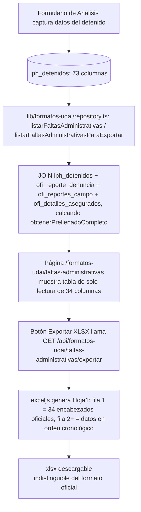

# Formatos UDAI — Formato Faltas Administrativas (bitácora exportable a Excel)

**Propósito**: Generar el Excel oficial UDAI **"Formato Faltas Administrativas"** (`FORMATO FALTAS ADMINISTRATIVAS.xlsx`, 34 columnas) a partir de los registros que **ya existen** en `iph_detenidos` (alimentada hoy por el formulario de Análisis, `components/analisis/formAnalisis.tsx` → `registrarIphDetenido()`). No captura nada nuevo: es una bitácora de solo lectura con exportación `.xlsx` que replica el archivo oficial carácter por carácter (typos incluidos).

---

## Flujo

## Quién lo usa

- Hub `/agente_reportes` → sección "Formatos UDAI" → card "Formatos UDAI" → `/formatos-udai` → card "Formato Faltas Administrativas" → `/formatos-udai/faltas-administrativas`.
- Dos roles distintos aterrizan en este mismo hub (`HUB_POR_ROL` en `lib/auth/helpers.ts`): el rol legacy **`Reportante`** (id 35) y el rol real en uso hoy **`agente_reportes`** (id 47). Ambos están registrados en `lib/permisos/registro.ts` con la sección `formatos_udai` en su plantilla, para que se puedan gestionar desde `/admin/roles/[id]/plantilla-permisos`.
- Permiso: sección `formatos_udai` (registrada en `lib/permisos/registro.ts` para ambos roles, y en `lib/permisos/mapa-secciones.ts` para el gate del proxy en `/formatos-udai` y `/api/formatos-udai`).

## Componentes involucrados

| Archivo | Rol |
|---------|-----|
| `lib/formatos-udai/types.ts` | Interfaz `FaltaAdministrativaRow` con los 34 campos del mapa oficial (los 3 GAP quedan `null` explícitos) |
| `lib/formatos-udai/repository.ts` | `listarFaltasAdministrativas()` (tabla, DESC), `listarFaltasAdministrativasParaExportar()` (Excel, ASC) — JOIN de 4 tablas calcando `obtenerPrellenadoCompleto()`; fechas con `::text` (la capa entrega `YYYY-MM-DD`/`HH:MM:SS`, no objetos `Date`) |
| `lib/formatos-udai/permisos.ts` | Wrapper tipado sobre `lib/permisos/core` (sección `formatos_udai`) |
| `app/formatos-udai/page.tsx` | Hub intermedio (la "carpeta") con la card "Formato Faltas Administrativas" |
| `app/formatos-udai/faltas-administrativas/page.tsx` | Tabla de solo lectura, 34 columnas en orden oficial, GAP como `—` |
| `app/api/formatos-udai/faltas-administrativas/exportar/route.ts` | GET → valida sesión/permiso → `exceljs` escribe Hoja1 (fila 1 = encabezados exactos, fila 2+ = datos) |
| `components/formatos-udai/BotonExportarExcel.tsx` | Client component: GET y descarga del blob `.xlsx` |

## BD

| Tabla | Columnas clave | Uso |
|-------|---------------|-----|
| `iph_detenidos` | `fecha_reporte`, `hora_reporte`, `rt_responsable`, `folio_iph`, `fecha_nacimiento`, `edad`, `genero`, `alias`, `ciudad_origen`, `calle_detenido`, `numero_detenido`, `colonia_detenido`, `articulo`, `tipo_falta`, `rnd`, `calle_arresto`, `colonia_arresto`, `agente_aprehensor`, `sector_arresto`, `agrupamiento_arresto`, `latitud_arresto`, `longitud_arresto`, `presencia`, `verbalizacion`, `control_contacto`, `control_fisico`, `tecnicas_no_letales`, `fuerza_letal`, `reporte_denuncia_id` | **Tabla base** del reporte; la mayoría de las 34 columnas oficiales |
| `ofi_reporte_denuncia` | `id`, `reporte_campo_id`, `iph`, `sector`, `fecha_reporte`, `hora_reporte` | Fallback de fecha/hora/IPH y fuente del sector (`COALESCE(iph.sector_arresto, rd.sector)`) |
| `ofi_reportes_campo` | `id` | Eslabón del JOIN (`rd.reporte_campo_id → rc.id`) |
| `ofi_detalles_asegurados` | `reporte_campo_id`, `ap_paterno_detenido`, `ap_materno_detenido`, `nombre_detenido` | Nombre/apellidos del detenido (no viven en `iph_detenidos`) |

## Vistas (UI)

| Ruta | Vista | Patrón |
|------|-------|-------|
| `/agente_reportes` | Card "Formatos UDAI" en la sección "Formatos UDAI" | `OptionSquare` en grilla `cat-cards-grid` |
| `/formatos-udai` | Hub con la card "Formato Faltas Administrativas" | `DashboardHeader` (`backHref="/agente_reportes"`) + `PageHeader` + `OptionSquare` |
| `/formatos-udai/faltas-administrativas` | Tabla de 34 columnas en orden oficial, solo lectura, scroll horizontal (`overflow: auto`) | `DashboardHeader` + `PageHeader` (`← Formatos UDAI` + `EXPORTAR XLSX`) + `.pad-pagina` |

## Mapa columna Excel → BD

| # | Columna Excel | Fuente |
|---|---|---|
| 1 | FECHA | `iph.fecha_reporte` (fallback `rd.fecha_reporte`) |
| 2 | HORA | `iph.hora_reporte` (fallback `rd.hora_reporte`) |
| 3 | RESPONSABLE DE TURNO | `iph.rt_responsable` |
| 4 | HORA DE SALIDA | **GAP** — sin columna directa |
| 5 | IPH | `rd.iph` (fallback `iph.folio_iph`) |
| 6 | FOLIO TABLET | **GAP** — solo existen booleanos, ningún folio |
| 7-9 | APELLIDO PATERNO / MATERNO / NOMBRE | `da.ap_paterno_detenido` / `da.ap_materno_detenido` / `da.nombre_detenido` |
| 10 | FECHA DE NACIMIENTO | `iph.fecha_nacimiento` |
| 11 | EDAD | `iph.edad` (ya capturado, no se recalcula) |
| 12 | GÉNERO | `iph.genero` |
| 13 | ALIAS | `iph.alias` |
| 14 | CIUDAD DE ORIGEN DET | `iph.ciudad_origen` |
| 15-17 | CALLE / NUMERO / COLONIA DET | `iph.calle_detenido` / `iph.numero_detenido` / `iph.colonia_detenido` |
| 18-19 | ARTICULO / TIPO DE FALTA ADMINISTRATIVA | `iph.articulo` / `iph.tipo_falta` |
| 20 | REGISTRO NACIONAL DE DETENIDOS | `iph.rnd` |
| 21-22 | LUGAR DE ARRESTO / COLONIA | `iph.calle_arresto` / `iph.colonia_arresto` |
| 23 | OFICIAL QUE REMITE (col W) | `iph.agente_aprehensor` |
| 24 | OFICIAL QUE REMITE (col X, duplicada) | **GAP** — no hay segundo oficial |
| 25 | SECTOR | `COALESCE(iph.sector_arresto, rd.sector)` |
| 26 | AGRUPAMIENTO | `iph.agrupamiento_arresto` |
| 27-28 | COORDENADAS LATITUD / LONGITUD | `iph.latitud_arresto` / `iph.longitud_arresto` |
| 29-34 | PRESENCIA / VERBALIZACION / CONTROL DE CONTACTO / CONTROL FISICO / TECNICAS DEFENSIVA NO LETALES / FUERZA PONTENCIAL LETAL | `iph.presencia` / `iph.verbalizacion` / `iph.control_contacto` / `iph.control_fisico` / `iph.tecnicas_no_letales` / `iph.fuerza_letal` |

## Reglas de negocio

1. **Universo de filas**: todos los registros de `iph_detenidos` (a diferencia de `/reporte-detenidos`, no depende de las 3 fotos — es una bitácora administrativa).
2. **Orden**: tabla en pantalla DESC (más reciente primero); Excel exportado en ASC (cronológico, como se espera de una bitácora entregable).
3. **Escala de uso de la fuerza (cols. 29-34)**: se renderiza `SI` cuando el booleano es `true`, celda vacía cuando es `false` — nunca `TRUE`/`FALSE` crudo.
4. **Excel sin banner institucional**: la fila 1 son los 34 encabezados del formato oficial (textos literales, **incluido el typo `FUERZA PONTENCIAL LETAL`** y el espacio final en `TECNICAS DEFENSIVA NO LETALES `), la fila 2 en adelante son datos. Deliberadamente NO se usa `crearHoja()` de `app/api/reportes-operativos/exportar-excel/route.ts` (ese agrega 3 filas de banner que el formato UDAI no lleva).
5. **Fechas en Excel**: `fecha`/`fechaNacimiento` como `dd/mm/yyyy`, `hora` como `HH:MM` (los `::text` de la capa de datos entregan `YYYY-MM-DD`/`HH:MM:SS`).
6. **Gaps**: cols. 4, 6, 24 se exportan como celda vacía (`''`), no `"null"`/`"undefined"`; en la tabla se muestran como `—`.

## Limitaciones conocidas (aceptadas, no bugs)

- **HORA DE SALIDA** (col. 4): no hay columna directa en `iph_detenidos`. Capturar la hora real vía `incidente_despacho_unidades` queda como mejora futura opcional.
- **FOLIO TABLET** (col. 6): solo existen booleanos (`requirio_tablet/funcionaba_tablet/registro_tableta`), ningún folio capturado.
- **Segundo OFICIAL QUE REMITE** (col. 24, duplicada en el formato oficial): solo se llena la col. W con `agente_aprehensor`; no hay segundo oficial/testigo capturado en ningún módulo.
- `articulo`, `tipo_falta`, `agrupamiento_arresto`, `sector_arresto` son **texto libre** en producción (capturados por `formAnalisis.tsx`, que este módulo no toca) — el reporte solo los lee y reporta tal cual fueron capturados.
