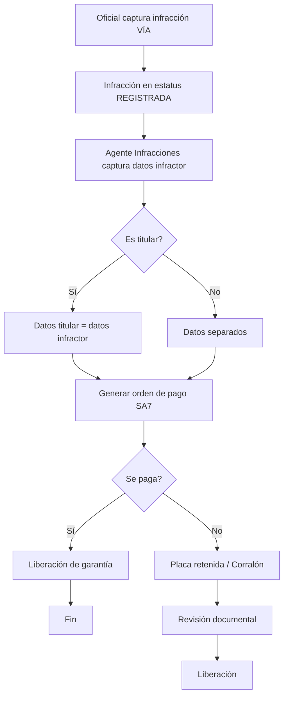

# Infracciones — Captura, Garantías y Corralón

**Propósito**: Captura de datos del infractor, proceso de pago/garantía, liberación de vehículos retenidos y gestión con corralón.

---

## Flujo

## Componentes involucrados

| Archivo | Rol |
|---------|-----|
| `lib/agente_infracciones/types.ts` | Interfaces `LiberacionRow`, `CapturaInfractorInput`, `CapturaInfractorResult` |
| `lib/agente_infracciones/mapper.ts` | `inputToDbParams` |
| `lib/agente_infracciones/repository.ts` | `obtenerLiberaciones`, `actualizarDatosInfractor`, `obtenerConceptoId`, `liberarGarantia`, `insertarOrdenPagoSa7`, `marcarOrdenPagoPagada` |
| `lib/agente_infracciones/service.ts` | Lógica de negocio para proceso de infracción |
| `lib/agente_infracciones/actions.ts` | Server actions para captura, pago, liberación |
| `lib/agente_infracciones/storeCapturaInfractor.ts` | Store local para formulario multi-paso |

## BD (schema `via`)

| Tabla | Columnas clave | Uso |
|-------|---------------|-----|
| `via.v2_infracciones` | `id`, `folio`, `estatus`, `estatus_dependencia`, `placa`, `fraccion_id`, `es_titular`, `nombre_infractor`, `correo_infractor`, `motivo_retencion`, `garantia_entregada`, `url_orden_salida_liberaciones` | Registro principal de infracciones |
| `via.v2_ordenes_pago_sa7` | `id`, `infraccion_id`, `orden_pago_id`, `estatus`, `url_pago`, `folio_orden` | Órdenes de pago generadas |
| `via.v2_fracciones_ley` | `id`, `clasificacion`, `numero`, `descripcion` | Fracciones de la ley aplicables |
| `via.v2_articulos_ley` | `id`, `numero`, `descripcion` | Artículos de ley |
| `via.v2_solicitudes_liberacion` | `id`, `infraccion_id`, `tipo_liberacion`, `es_empresa`, `estatus` | Solicitudes de liberación |
| `via.v2_documentos_liberacion` | `id`, `solicitud_id`, `tipo_documento`, `url_documento`, `estatus_revision` | Documentos adjuntos para liberación |
| `via.v2_gruas` | `id`, `nombre` | Catálogo de grúas |
| `via.v2_catalogo_conceptos_sa7` | `id`, `concept_id`, `clasificacion_type` | Conceptos SA7 para órdenes de pago |

## Reglas de negocio

1. Las infracciones fluyen por estatus: `REGISTRADA` → `PENDIENTE_PAGO` → `PAGADA` → `FINALIZADA` / `CERRADA`
2. El estatus de dependencia controla sub-estados: `PENDIENTE_DATOS_INFRACTOR`, `PENDIENTE_PAGO_INFRACCION`, `PLACA_RETENIDA_EN_TRANSITO`, `LIBERADO_POR_INFRACCIONES`
3. Al capturar datos del infractor se actualiza la infracción a `PENDIENTE_PAGO`
4. La orden de pago se genera contra SA7 y se guarda el payload de request
5. Si el infractor es el titular, los datos del titular se copian automáticamente
6. `liberarGarantia` cambia estatus a `CERRADA`/`LIBERADO_POR_INFRACCIONES`
7. `marcarGarantiaEntregada` cambia a `FINALIZADA`/`GARANTIA_ENTREGADA`

## Sub-flujo: búsqueda por voz del motivo (paso 4 — Oficial)

**Propósito**: en el paso "Infracción" del wizard de captura
(`app/infracciones/captura` → `FormularioInfraccion.tsx` → `PasoInfraccion.tsx`
→ `SeccionMotivo.tsx`), el oficial ya no necesita conocer de memoria el
número de artículo/fracción del reglamento de tránsito. Toca un micrófono,
describe en voz alta lo que pasó (ej. "por exceso de velocidad y se saltó
la luz roja") y el sistema sugiere las fracciones aplicables tomadas del
catálogo real en BD.

**Componentes**:

| Archivo | Rol |
|---------|-----|
| `features/via/infracciones/hooks/useReconocimientoVoz.ts` | Encapsula la Web Speech API del navegador (`webkitSpeechRecognition`, `lang: es-MX`); expone `soportado`, `escuchando`, `transcripcion`, `error`. Si el navegador no soporta reconocimiento de voz, `soportado` es `false` y la UI cae al flujo manual. |
| `features/via/infracciones/components/steps/SeccionMotivo.tsx` | Botón de micrófono + tarjetas de resultados de voz, arriba de los `<select>` manuales de Artículo/Fracción (que se conservan intactos como respaldo). |
| `features/via/legalidad/service.ts` (`ArticulosService.buscarPorDescripcion`) | Arma el catálogo completo (11 artículos / 148 fracciones — cabe entero en el prompt) + la frase transcrita, llama al LLM configurado, y **revalida cada `fraccionId` devuelto contra el catálogo real** antes de construir la respuesta — cualquier id inventado se descarta en silencio. |
| `features/via/legalidad/actions.ts` (`buscarFraccionesPorDescripcionAction`) | Server action que expone el service al cliente. |
| `lib/ai/client.ts` | Cliente LLM (SDK de `openai`, compatible con endpoints tipo DeepSeek vía `LLM_BASE_URL`). Si `LLM_API_KEY` no está definida, `iaDisponible = false` y la búsqueda por voz retorna `[]` sin romper el flujo. |

**Regla de diseño (anti-alucinación legal)**: el LLM nunca es la fuente de
verdad de un fundamento legal. Solo señala IDs; el servidor descarta
cualquier ID que no exista en `via.v2_articulos_ley` / `via.v2_fracciones_ley`,
y los datos mostrados (descripción, clasificación, monto UMAS) siempre se
leen de BD, no del texto que devolvió el modelo.

**Degradación**: si el navegador no soporta reconocimiento de voz, si el
oficial no da permiso de micrófono, o si la llamada al LLM falla/no hay API
key configurada, el flujo manual con los `<select>` de Artículo/Fracción
sigue funcionando sin cambios — la búsqueda por voz es aditiva, nunca
bloqueante.
