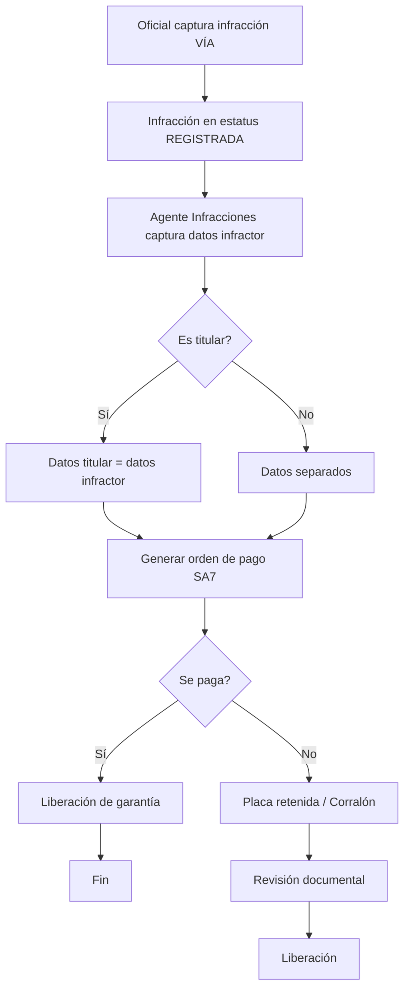

# Infracciones — Captura, Garantías y Corralón

**Propósito**: Captura de datos del infractor, proceso de pago/garantía, liberación de vehículos retenidos y gestión con corralón.

---

## Flujo

## Componentes involucrados

| Archivo | Rol |
|---------|-----|
| `lib/agente_infracciones/types.ts` | Interfaces `LiberacionRow`, `CapturaInfractorInput`, `CapturaInfractorResult` |
| `lib/agente_infracciones/mapper.ts` | `inputToDbParams` |
| `lib/agente_infracciones/repository.ts` | `obtenerLiberaciones`, `actualizarDatosInfractor`, `obtenerConceptoId`, `liberarGarantia`, `insertarOrdenPagoSa7`, `marcarOrdenPagoPagada` |
| `lib/agente_infracciones/service.ts` | Lógica de negocio para proceso de infracción |
| `lib/agente_infracciones/actions.ts` | Server actions para captura, pago, liberación |
| `lib/agente_infracciones/storeCapturaInfractor.ts` | Store local para formulario multi-paso |

## BD (schema `via`)

| Tabla | Columnas clave | Uso |
|-------|---------------|-----|
| `via.v2_infracciones` | `id`, `folio`, `estatus`, `estatus_dependencia`, `placa`, `fraccion_id`, `es_titular`, `nombre_infractor`, `correo_infractor`, `motivo_retencion`, `garantia_entregada`, `url_orden_salida_liberaciones` | Registro principal de infracciones |
| `via.v2_ordenes_pago_sa7` | `id`, `infraccion_id`, `orden_pago_id`, `estatus`, `url_pago`, `folio_orden` | Órdenes de pago generadas |
| `via.v2_fracciones_ley` | `id`, `clasificacion`, `numero`, `descripcion` | Fracciones de la ley aplicables |
| `via.v2_articulos_ley` | `id`, `numero`, `descripcion` | Artículos de ley |
| `via.v2_solicitudes_liberacion` | `id`, `infraccion_id`, `tipo_liberacion`, `es_empresa`, `estatus` | Solicitudes de liberación |
| `via.v2_documentos_liberacion` | `id`, `solicitud_id`, `tipo_documento`, `url_documento`, `estatus_revision` | Documentos adjuntos para liberación |
| `via.v2_gruas` | `id`, `nombre` | Catálogo de grúas |
| `via.v2_catalogo_conceptos_sa7` | `id`, `concept_id`, `clasificacion_type` | Conceptos SA7 para órdenes de pago |

## Reglas de negocio

1. Las infracciones fluyen por estatus: `REGISTRADA` → `PENDIENTE_PAGO` → `PAGADA` → `FINALIZADA` / `CERRADA`
2. El estatus de dependencia controla sub-estados: `PENDIENTE_DATOS_INFRACTOR`, `PENDIENTE_PAGO_INFRACCION`, `PLACA_RETENIDA_EN_TRANSITO`, `LIBERADO_POR_INFRACCIONES`
3. Al capturar datos del infractor se actualiza la infracción a `PENDIENTE_PAGO`
4. La orden de pago se genera contra SA7 y se guarda el payload de request
5. Si el infractor es el titular, los datos del titular se copian automáticamente
6. `liberarGarantia` cambia estatus a `CERRADA`/`LIBERADO_POR_INFRACCIONES`
7. `marcarGarantiaEntregada` cambia a `FINALIZADA`/`GARANTIA_ENTREGADA`
