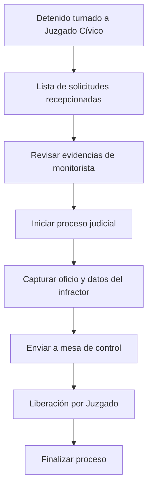

# Juzgado — Procesos Judiciales y Liberaciones

**Propósito**: Recepción de detenidos turnados, revisión de evidencias, inicio de proceso judicial y liberación de vehículos.

---

## Flujo

## Componentes involucrados

| Archivo | Rol |
|---------|-----|
| `lib/agente_juzgado/types.ts` | Interfaces `DetalleAsegurado`, `SolicitudEvidencia`, `LiberacionRow`, `ViaInfraccionDetalle` |
| `lib/agente_juzgado/mapper.ts` | Mappers de row a tipos |
| `lib/agente_juzgado/repository.ts` | `obtenerSolicitudesRecepcionadas`, `obtenerDetalleAsegurado`, `actualizarDetallesAsegurado`, `actualizarSolicitudConEvidencias`, `iniciarProcesoJuzgado`, `finalizarProcesoJuzgado`, `actualizarOficioJuzgado`, `listarAseguradosJuzgado`, `listarLiberacionesJuzgado`, `obtenerDetalleInfraccionViaJuzgado` |
| `lib/agente_juzgado/service.ts` | Orquestación de procesos |
| `lib/agente_juzgado/actions.ts` | Server actions para proceso judicial |

## BD

| Tabla | Columnas clave | Uso |
|-------|---------------|-----|
| `ofi_reporte_denuncia` | `id`, `folio_denuncia`, `estado_tramite`, `estado_evidencia`, `folio_sija`, `folio_remision`, `documentos` (JSONB) | Denuncias recepcionadas por Juzgado |
| `ofi_reportes_campo` | `id`, `folio_reporte_campo`, `ofi_autoridad_recibe`, `ofi_detenidos` (JSONB) | Reportes de campo |
| `ofi_detalles_asegurados` | `id`, `reporte_campo_id`, `nombre_detenido`, `calle`, `colonia`, `numero` | Datos de detenidos asegurados |
| `via.v2_infracciones` | `id`, `folio`, `placa`, `estatus_dependencia`, `dependencia_receptora`, `no_oficio_fiscalia`, `url_oficio_fiscalia`, `no_carpeta_investigacion` | Infracciones VÍA con proceso judicial |
| `via.v2_ordenes_pago_sa7` | `id`, `infraccion_id`, `estatus`, `total_umas`, `total_pesos` | Órdenes de pago asociadas |
| `moni_evidencias_denuncia` | `id`, `ofi_reporte_denuncia_id`, `url_archivo` | Evidencias de monitorista |

## Reglas de negocio

1. Los reportes llegan a Juzgado cuando `ofi_autoridad_recibe = 'JUZGADO CIVICO'` y `folio_reporte_asegurados IS NULL`
2. Flujo de trámite: `EN_ANALISIS` (con evidencias) → `EN_REVISION_JUZGADO` → `CERRADO`
3. `iniciarProcesoJuzgado` cambia estatus_dependencia a `EN_PROCESO_JUZGADO`
4. `actualizarOficioJuzgado` usa transacción para actualizar oficio, carpeta y datos del infractor
5. `finalizarProcesoJuzgado` cambia estatus_dependencia a `LIBERADA_POR_JUZGADO`
6. Las liberaciones de juzgado filtran por `dependencia_receptora = 'JUZGADO'`
7. Solicitudes recepcionadas: `estado_tramite = 'EN_ANALISIS'` y `estado_evidencia = 'EVIDENCIA_ENVIADA'`
