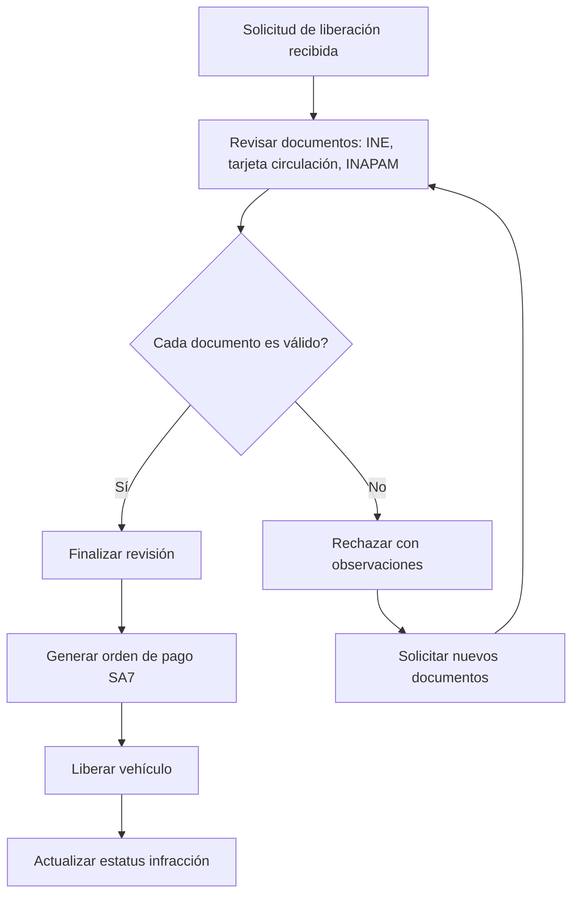

# Liberaciones — Revisión Documental y Órdenes de Pago

**Propósito**: Revisión de documentos de liberación, validación de infracciones, emisión de órdenes de pago y liberación final de vehículos.

---

## Flujo

## Componentes involucrados

| Archivo | Rol |
|---------|-----|
| `lib/agente_liberaciones/types.ts` | Interfaces `LiberacionRow`, `ViaInfraccionDetalle` |
| `lib/agente_liberaciones/mapper.ts` | Mappers de row a tipos |
| `lib/agente_liberaciones/repository.ts` | `obtenerLiberaciones`, `actualizarInfractor`, `obtenerConceptoPorFraccion`, `obtenerSolicitudPorInfraccion`, `obtenerDocumentosPorSolicitud`, `actualizarRevisionDocumento`, `actualizarInfraccionEstatus`, `insertarOrdenPago` |
| `lib/agente_liberaciones/service.ts` | Orquestación de flujo de liberación |
| `lib/agente_liberaciones/actions.ts` | Server actions: capturar infractor, revisar documento, finalizar revisión, generar orden de pago |

## BD (schema `via`)

| Tabla | Columnas clave | Uso |
|-------|---------------|-----|
| `via.v2_infracciones` | `id`, `folio`, `estatus`, `estatus_dependencia`, `placa`, `es_titular`, `nombre_infractor`, `correo_infractor`, `nombre_titular_liberacion`, `descuento_aplicado`, `fraccion_id`, `url_orden_salida_liberaciones` | Infracciones en proceso de liberación |
| `via.v2_solicitudes_liberacion` | `id`, `infraccion_id`, `tipo_liberacion`, `es_empresa`, `nombre_empresa`, `rfc_empresa`, `estatus` | Solicitudes de liberación |
| `via.v2_documentos_liberacion` | `id`, `solicitud_id`, `tipo_documento`, `url_documento`, `estatus_revision`, `observaciones`, `fecha_revision` | Documentos para revisión |
| `via.v2_ordenes_pago_sa7` | `id`, `infraccion_id`, `folio_infraccion`, `concepto_id`, `orden_pago_id`, `estatus`, `url_pago`, `total_pesos`, `total_umas`, `request_payload` | Órdenes de pago |
| `via.v2_fracciones_ley` | `id`, `clasificacion` | Fracciones para mapeo de concepto SA7 |
| `via.v2_catalogo_conceptos_sa7` | `id`, `concept_id`, `clasificacion_type` | Conceptos SA7 |

## Reglas de negocio

1. Las infracciones elegibles para liberación tienen `estatus_dependencia` en: `ESPERA_REVISION`, `EN_PROCESO_LIBERACIONES`, `MESA_DE_CONTROL_REVISION`, `MESA_DE_CONTROL_PENDIENTE_DOCS`
2. Los documentos se revisan individualmente: cada `tipo_documento` tiene su propio `estatus_revision` (ENVIADO → APROBADO/RECHAZADO)
3. `finalizarRevisionAction` verifica que todos los documentos estén aprobados antes de continuar
4. `actualizarInfractor` actualiza datos del infractor y cambia estatus a `MESA_DE_CONTROL_PENDIENTE_DOCS`
5. La orden de pago se genera contra SA7 y almacena el payload completo
6. Los documentos se obtienen con `DISTINCT ON (tipo_documento)` para traer solo el último
