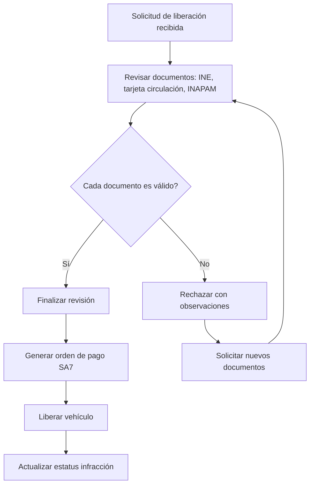

# Liberaciones — Revisión Documental y Órdenes de Pago

**Propósito**: Revisión de documentos de liberación, validación de infracciones, emisión de órdenes de pago y liberación final de vehículos.

---

## Flujo

```mermaid
flowchart TD
    A[Solicitud de liberación recibida] --> B[Revisar documentos: INE, tarjeta circulación, INAPAM]
    B --> C{Cada documento es válido?}
    C -->|Sí| D[Finalizar revisión]
    C -->|No| E[Rechazar con observaciones]
    D --> F[Generar orden de pago SA7]
    F --> G[Liberar vehículo]
    G --> H[Actualizar estatus infracción]
    E --> I[Solicitar nuevos documentos]
    I --> B
```

## Componentes involucrados

| Archivo | Rol |
|---------|-----|
| `lib/agente_liberaciones/types.ts` | Interfaces `LiberacionRow`, `ViaInfraccionDetalle` |
| `lib/agente_liberaciones/mapper.ts` | Mappers de row a tipos |
| `lib/agente_liberaciones/repository.ts` | `obtenerLiberaciones`, `actualizarInfractor`, `obtenerConceptoPorFraccion`, `obtenerSolicitudPorInfraccion`, `obtenerDocumentosPorSolicitud`, `actualizarRevisionDocumento`, `actualizarInfraccionEstatus`, `insertarOrdenPago` |
| `lib/agente_liberaciones/service.ts` | Orquestación de flujo de liberación |
| `lib/agente_liberaciones/actions.ts` | Server actions: capturar infractor, revisar documento, finalizar revisión, generar orden de pago |
| `app/api/via/descargar-orden/[infraccionId]/route.ts` | Endpoint público (ciudadano) que sirve/genera la orden de salida PDF con auth de ciudadano |

## BD (schema `via`)

| Tabla | Columnas clave | Uso |
|-------|---------------|-----|
| `via.v2_infracciones` | `id`, `folio`, `estatus`, `estatus_dependencia`, `placa`, `es_titular`, `nombre_infractor`, `correo_infractor`, `nombre_titular_liberacion`, `descuento_aplicado`, `fraccion_id`, `url_orden_salida_liberaciones` | Infracciones en proceso de liberación |
| `via.v2_solicitudes_liberacion` | `id`, `infraccion_id`, `tipo_liberacion`, `es_empresa`, `nombre_empresa`, `rfc_empresa`, `estatus` | Solicitudes de liberación |
| `via.v2_documentos_liberacion` | `id`, `solicitud_id`, `tipo_documento`, `url_documento`, `estatus_revision`, `observaciones`, `fecha_revision` | Documentos para revisión |
| `via.v2_ordenes_pago_sa7` | `id`, `infraccion_id`, `folio_infraccion`, `concepto_id`, `orden_pago_id`, `estatus`, `url_pago`, `total_pesos`, `total_umas`, `request_payload` | Órdenes de pago |
| `via.v2_fracciones_ley` | `id`, `clasificacion` | Fracciones para mapeo de concepto SA7 |
| `via.v2_catalogo_conceptos_sa7` | `id`, `concept_id`, `clasificacion_type` | Conceptos SA7 |

## Dashboard de 5 tabs

El dashboard del agente organiza las infracciones en 5 tabs según `estatus_dependencia`:

| Tab | Clave UI | `estatus_dependencia` incluidos | `estatus` requerido |
|---|---|---|---|
| Captura de datos | `VEHICULO_EN_CORRALON` | `VEHICULO_EN_CORRALON` | `REGISTRADA` |
| En espera de documentos | `MESA_DE_CONTROL_PENDIENTE_DOCS` | `MESA_DE_CONTROL_PENDIENTE_DOCS`, `MESA_DE_CONTROL_RECHAZADA` | `REGISTRADA` |
| Revisión documentos | `MESA_DE_CONTROL_REVISION` | `MESA_DE_CONTROL_REVISION` | `REGISTRADA` |
| Pendiente pago | `PENDIENTE_PAGO` | `PENDIENTE_PAGO_LIBERACION`, `LIBERACION_EN_PROCESO`, `LIBERACION_PENDIENTE_DOCUMENTOS` | `PENDIENTE_PAGO` |
| Liberadas | `LIBERADA_POR_INFRACCION` | estados finales (LIBERADA_*, FINALIZADA_*) | `CERRADA`, `FINALIZADA` |

El mapa centralizado `TAB_ESTATUS` en `LiberacionesDashboard.tsx` es la fuente única de verdad para esta asignación.

## Reglas de negocio

1. Las infracciones elegibles para liberación tienen `estatus_dependencia` en: `VEHICULO_EN_CORRALON`, `MESA_DE_CONTROL_PENDIENTE_DOCS`, `MESA_DE_CONTROL_REVISION`, `MESA_DE_CONTROL_RECHAZADA`, `PENDIENTE_PAGO_LIBERACION`, `LIBERACION_EN_PROCESO`, `LIBERACION_PENDIENTE_DOCUMENTOS`
2. Los documentos se revisan individualmente: cada `tipo_documento` tiene su propio `estatus_revision` (ENVIADO → APROBADO/RECHAZADO)
3. `finalizarRevisionAction` verifica que todos los documentos estén aprobados antes de continuar
4. `actualizarInfractor` actualiza datos del infractor y cambia estatus a `MESA_DE_CONTROL_PENDIENTE_DOCS`
5. La orden de pago solo se genera desde `RevisionDocumentosSection` tras aprobar todos los documentos. `generarOrdenPagoAction` tiene guard server-side que exige `PENDIENTE_PAGO_LIBERACION`.
6. `confirmar-liberacion/route.ts` tiene guard server-side que exige `PENDIENTE_PAGO_LIBERACION`, `LIBERACION_EN_PROCESO` o `LIBERACION_PENDIENTE_DOCUMENTOS` antes de mutar.
7. El dashboard de agente (`obtenerLiberaciones`) filtra por `tipo_garantia = 'VEHICULO'`. Infracciones con otro tipo de garantía (PLACA, TARJETA, LICENCIA) no aparecen en las tabs de liberación — el flujo de liberación es exclusivo para vehículos.
8. `capturarInfractorAction` valida `tipo_garantia = 'VEHICULO'` antes de cambiar el estatus. Si no es vehículo, devuelve error.
9. La orden de salida (PDF) se genera en `confirmar-liberacion/route.ts` tras el pago. Si por alguna razón no se guardó (error de Expediente, flujo alternativo), el endpoint `GET /api/via/descargar-orden/[infraccionId]` la regenera on-demand y la guarda en Expediente. Está protegido con `verificarAccesoCiudadano`.
10. En la vista pública (`SeccionLiberacion.tsx`), cuando `esLiberada === true` aparece una sección principal destacada con un botón para descargar la orden de salida — sin depender de `url_orden_salida_liberaciones`.
11. Los documentos se obtienen con `DISTINCT ON (tipo_documento)` para traer solo el último
