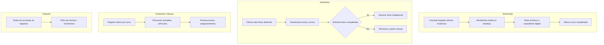

# Monitorista — Solicitudes de Evidencia, Detenidos e Incidentes Cámara

**Propósito**: Gestión de solicitudes de evidencia (D1 + generales), fotos de detenidos, registro de incidentes de cámara y bitácora de acciones.

---

## Flujo

## Componentes involucrados

| Archivo | Rol |
|---------|-----|
| `lib/monitorista/types.ts` | Interfaces `SolicitudEvidencia`, `ReporteDetenido`, `IncidenteCamara`, `HistorialEntry`, `PrellenadoCompleto` |
| `lib/monitorista/mapper.ts` | Mappers + `parseSolicitudesJson` |
| `lib/monitorista/repository.ts` | `listarSolicitudesEvidencia`, `listarEvidencias`, `listarHistorial`, `listarReportesConDetenidosRaw`, `registrarIphDetenido`, `registrarFichaInteligencia` |
| `lib/monitorista/service.ts` | Orquestación de consultas |
| `lib/monitorista/actions.ts` | `solicitarEvidencia`, `subirEvidencia`, `completarSolicitud`, `cancelarSolicitud` |
| `lib/monitorista/permisos.ts` | Permisos finos por sección (`solicitudes`, `detenidos`, `incidentes_camara`, `historial`) |
| `lib/monitorista/detenido-service.ts` | Lógica de detenidos y fotos |
| `lib/monitorista/incidentes-camara-service.ts` | Lógica de incidentes de cámara |
| `lib/monitorista/denuncia-service.ts` | Lógica de denuncias D1 pendientes/atendidas |
| `lib/monitorista/ppt-service.ts` | Generación de PPT para detenidos |
| `lib/monitorista/expediente.ts` | Integración con expediente digital |

## BD

| Tabla | Columnas clave | Uso |
|-------|---------------|-----|
| `solicitudes_evidencia` | `id`, `incidente_id`, `folio_incidente`, `solicitado_por`, `status`, `creado_en`, `completado_en` | Solicitudes de evidencia |
| `evidencias` | `id`, `solicitud_id`, `tipo`, `url_expediente`, `subido_por` | Archivos subidos como evidencia |
| `monitorista_historial` | `id`, `monitorista_id`, `accion`, `incidente_id`, `solicitud_id`, `creado_en` | Bitácora de acciones |
| `ofi_reportes_campo` | `id`, `ofi_detenidos` (JSONB), `folio_reporte_campo` | Reportes con detenidos |
| `evidencias_detenido` | `id`, `reporte_campo_id`, `tipo_foto`, `url_archivo` | Fotos de detenidos |
| `solicitud_fotos` | `id`, `reporte_campo_id`, `tipo_foto`, `estado`, `enviado_a` | Solicitudes de foto a oficiales |
| `incidentes_camara` | `id`, `fecha`, `turno`, `total_personas_revisadas`, `vehiculos_revisar` | Reporte diario de cámara |
| `iph_detenidos` | `id`, `folio_iph`, `alias`, `delito` | Registro IPH de detenidos |
| `fichas_inteligencia_detenidos` | `id`, `nombre_detenido`, `folio`, `foto_frontal_url`, `iph` | Fichas de inteligencia |
| `ofi_reporte_denuncia` | `id`, `folio_denuncia`, `monitorista_fechas_requeridas` (JSONB), `estado_evidencia` | Denuncias con estado de evidencia |
| `moni_evidencias_denuncia` | `id`, `ofi_reporte_denuncia_id`, `url_archivo` | Evidencias de denuncia para monitorista |
| `permisos` | `usuario_id`, `seccion`, `puede_ver`, `puede_crear`, `puede_editar` | Control de acceso fino |
| `permisos_plantillas` | `rol_id`, `seccion`, `puede_ver`, `puede_crear`, `puede_editar` | Plantillas por rol |

## Reglas de negocio

1. El layout de monitorista exige rol `Monitorista` o `Administrador`
2. Encima del gate de rol, los permisos finos controlan ver/crear/editar por sección
3. Default seguro: si no hay fila en `permisos`, el usuario tiene acceso total
4. Las plantillas por rol se copian automáticamente al asignar rol a un usuario
5. Las 4 secciones controladas: `solicitudes`, `detenidos`, `incidentes_camara`, `historial`
6. Los tiles en el hub solo aparecen si `puede_ver` es true para esa sección
7. API routes validan: GET → `ver`, POST → `crear`, PATCH → `editar`
8. Al completar solicitud de evidencia se escribe en el historial
9. Las fotos de detenidos tienen solicitudes con estados: `pendiente` → `enviado` → `completado`/`rechazado`
