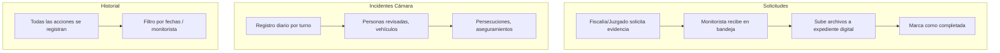

# Monitorista — Solicitudes de Evidencia e Incidentes Cámara

**Propósito**: Gestión de solicitudes de evidencia (D1 + generales), registro de incidentes de cámara y bitácora de acciones.

> **Eliminado (2026-08-07)**: el flujo de "Fotos de Detenidos" quedó descartado y se removió completo — card del hub, páginas `/monitorista/detenidos*`, componentes, APIs (`subir-foto`/`enviar-foto`/`editar-campo`), `lib/monitorista/detenido-service.ts`, y el lado receptor en Oficial (`/oficial/reportes/[id]/fotos`) y Fiscalía/Juzgado (`/fiscalia/detenidos*`, `/agente_juzgado/detenidos*`, `/api/expediente/subir-foto-detenido`). Se eliminó la sección de permiso `detenidos`; las APIs de Análisis (IPH/ficha) se re-gatearon a `analisis`. Las tablas `solicitud_fotos`/`evidencias_detenido` quedan sin escritores (datos conservados; el módulo `reporte-detenidos` y el expediente de Fiscalía aún las leen).

---

## Flujo

```mermaid
flowchart TD
    subgraph Solicitudes
    A[Fiscalía/Juzgado solicita evidencia] --> B[Monitorista recibe en bandeja]
    B --> C[Sube archivos a expediente digital]
    C --> D[Marca como completada]
    end

    subgraph Incidentes Cámara
    J[Registro diario por turno] --> K[Personas revisadas, vehículos]
    K --> L[Persecuciones, aseguramientos]
    end

    subgraph Historial
    M[Todas las acciones se registran] --> N[Filtro por fechas / monitorista]
    end
```

## Componentes involucrados

| Archivo | Rol |
|---------|-----|
| `lib/monitorista/types.ts` | Interfaces `SolicitudEvidencia`, `IncidenteCamara`, `HistorialEntry`, `IphDetenido`, `PrellenadoCompleto` |
| `lib/monitorista/mapper.ts` | Mappers + `parseSolicitudesJson` |
| `lib/monitorista/repository.ts` | `listarSolicitudesEvidencia`, `listarEvidencias`, `listarHistorial`, IPH/ficha (`registrarIphDetenido`, `registrarFichaInteligencia`, `obtenerPrellenadoCompleto`), denuncias D1, incidentes cámara |
| `lib/monitorista/service.ts` | Orquestación de consultas |
| `lib/monitorista/actions.ts` | `solicitarEvidencia`, `subirEvidencia`, `completarSolicitud`, `cancelarSolicitud` |
| `lib/monitorista/permisos.ts` | Permisos finos por sección (`solicitudes`, `incidentes_camara`, `historial`) |
| `lib/monitorista/incidentes-camara-service.ts` | Lógica de incidentes de cámara |
| `lib/monitorista/denuncia-service.ts` | Lógica de denuncias D1 pendientes/atendidas |
| `lib/monitorista/expediente.ts` | Integración con expediente digital |

> **Nota**: La generación del PPT de detenidos no vive en este módulo — es `lib/reporte-detenidos/` (módulo de solo lectura del rol Reportante, ver `Reporte de Detenidos.md`), que sigue leyendo `evidencias_detenido`.

## BD

| Tabla | Columnas clave | Uso |
|-------|---------------|-----|
| `solicitudes_evidencia` | `id`, `incidente_id`, `folio_incidente`, `solicitado_por`, `status`, `creado_en`, `completado_en` | Solicitudes de evidencia |
| `evidencias` | `id`, `solicitud_id`, `tipo`, `url_expediente`, `subido_por` | Archivos subidos como evidencia |
| `monitorista_historial` | `id`, `monitorista_id`, `accion`, `incidente_id`, `solicitud_id`, `creado_en` | Bitácora de acciones |
| `incidentes_camara` | `id`, `fecha`, `turno`, `total_personas_revisadas`, `vehiculos_revisar` | Reporte diario de cámara — **`fecha` = fecha de INICIO del turno** (Etapa 0.6 del Parte de Novedades; el NOCTURNO cruza la medianoche 22:00→07:00, capturado de madrugada guarda AYER) |
| `iph_detenidos` | `id`, `folio_iph`, `alias`, `delito` | Registro IPH de detenidos (módulo Análisis) |
| `fichas_inteligencia_detenidos` | `id`, `nombre_detenido`, `folio`, `foto_frontal_url`, `iph` | Fichas de inteligencia (módulo Análisis) |
| `ofi_reporte_denuncia` | `id`, `folio_denuncia`, `monitorista_fechas_requeridas` (JSONB), `estado_evidencia` | Denuncias con estado de evidencia |
| `moni_evidencias_denuncia` | `id`, `ofi_reporte_denuncia_id`, `url_archivo` | Evidencias de denuncia para monitorista |
| `permisos` | `usuario_id`, `seccion`, `puede_ver`, `puede_crear`, `puede_editar` | Control de acceso fino |

> Las tablas `solicitud_fotos` y `evidencias_detenido` ya no tienen código que las escriba (flujo descartado); el módulo `reporte-detenidos` (PPT) y el expediente de Fiscalía aún las leen.

## Vistas (UI)

| Ruta | Vista | Patrón |
|------|-------|-------|
| `/monitorista` | Hub | `DashboardHeader` + `PageHeader` (sin botón de regreso) + `.pad-dashboard` + `.cat-cards-grid` |
| `/monitorista/solicitudes` | Bandeja | `DashboardHeader` + `PageHeader` (regreso vía `backHref`) + `.pad-pagina` |
| `/monitorista/solicitudes/[id]` | Detalle solicitud | `DashboardHeader` + `PageHeader` + `.pad-pagina` |
| `/monitorista/denuncias/[id]` | Detalle denuncia D1 | `DashboardHeader` + `PageHeader` + `.pad-pagina` + `.grid-2`/`.grid-3` |
| `/monitorista/incidentes-camara` | Registros por turno | `DashboardHeader` + `PageHeader` (+ `+ Nuevo registro`) + `.pad-pagina` + `.tabla-wrap` |
| `/monitorista/incidentes-camara/nuevo` | Nuevo registro | `DashboardHeader` + `PageHeader` + `.pad-pagina` + `.grid-2` |
| `/monitorista/incidentes-camara/[id]` | Editar registro | `DashboardHeader` + `PageHeader` + `.pad-pagina` + `.grid-2` |
| `/monitorista/historial` | Bitácora | `DashboardHeader` + `PageHeader` + `.pad-pagina` + `.tabla-wrap` |

Todas las vistas cumplen la REGLA de diseño: **Header Centinela** (`DashboardHeader`, `backHref` cuando hay regreso), **PageHeader** y responsive (`.pad-pagina`/`.pad-dashboard`, `.grid-2`/`.grid-3`/`.cat-cards-grid`, tablas con `.tabla-wrap` + `minWidth`).

## Reglas de negocio

1. El layout de monitorista exige rol `Monitorista` o `Administrador`
2. Encima del gate de rol, los permisos finos controlan ver/crear/editar por sección
3. Default seguro: si no hay fila en `permisos`, el usuario tiene acceso total
4. Las plantillas por rol se copian automáticamente al asignar rol a un usuario
5. Las 3 secciones controladas: `solicitudes`, `incidentes_camara`, `historial`
6. Los tiles en el hub solo aparecen si `puede_ver` es true para esa sección
7. API routes validan: GET → `ver`, POST → `crear`, PATCH → `editar`
8. Al completar solicitud de evidencia se escribe en el historial
