# Prevencion — Medidas de Protección, Búsquedas y Jurídico

**Propósito**: Gestión de medidas de protección a víctimas, fichas de búsqueda (Alba/Ámbar), solicitudes jurídicas y seguimientos.

---

## Flujo

```mermaid
flowchart TD
    subgraph Medidas
    A[Capturar medida de protección] --> B[Asignar autoridad, víctima, delitos]
    B --> C[Agregar visitas domiciliarias]
    C --> D[Prorrogar medida]
    D --> E[Cerrar o actualizar status]
    end

    subgraph Búsquedas
    F[Crear ficha Alba / Ámbar] --> G[Agregar seguimientos]
    G --> H[Cancelar ficha cuando se localiza]
    end

    subgraph Jurídico
    I[Solicitud de información] --> J[Solicitar evidencias a C4]
    J --> K[Recibir contestación]
    K --> L[Completar y entregar]
    end
```

## Componentes involucrados

| Archivo | Rol |
|---------|-----|
| `lib/prevencion/types.ts` | Interfaces `MedidaDetalle`, `FichaBusquedaDetalle`, `SolicitudInformacion`, `VisitaDomiciliaria`, `SeguimientoBusqueda` |
| `lib/prevencion/mapper.ts` | Mappers para cada tipo |
| `lib/prevencion/repository.ts` | `getMedidas`, `getFichasBusqueda`, `listarSolicitudesJuridico`, `obtenerSolicitud`, `listarSolicitudesC4`, `obtenerContestacion` |
| `lib/prevencion/actions.ts` | `createMedida`, `createVisita`, `createProrroga`, `createFicha`, `createSeguimiento`, `cancelarFicha`, `createSolicitud`, `createContestacion` |
| `lib/prevencion/service.ts` | Pass-through (opcional) |
| `lib/prevencion/permisos.ts` | Control de acceso: `medidas`, `busquedas`, `solicitudes` |
| `lib/prevencion/semaforo.ts` | Lógica de semáforo de vencimientos |
| `lib/prevencion/timeline.ts` | Línea de tiempo de seguimientos |

## BD

| Tabla | Columnas clave | Uso |
|-------|---------------|-----|
| `medidas_proteccion` | `id`, `expediente`, `victima`, `autoridad`, `domicilio_proteccion`, `fecha_vencimiento`, `prorrogada`, `status` | Medidas de protección |
| `visitas_domiciliarias` | `id`, `medida_id`, `fecha_visita`, `resultado`, `apercibimiento_aplicado` | Visitas de verificación |
| `medida_autoridades_adicionales` | `id`, `medida_id`, `autoridad`, `n_oficio` | Autoridades notificadas adicionales |
| `fichas_busqueda` | `id`, `tipo` (Alba/Ámbar), `folio`, `nombre_desaparecida`, `status`, `fecha_activacion` | Fichas de búsqueda |
| `seguimientos_busqueda` | `id`, `ficha_id`, `tipo`, `fecha_hora_envio`, `archivo_url` | Seguimientos de cada ficha |
| `solicitudes_informacion` | `id`, `oficio`, `autoridad`, `status` | Solicitudes de información jurídica |
| `solicitudes_c4_internas` | `id`, `solicitud_id`, `descripcion_evidencias`, `status` | Solicitudes de evidencia a C4 |
| `contestaciones` | `id`, `solicitud_id`, `fecha_contestacion`, `archivo_pdf_url` | Respuestas recibidas |

## Reglas de negocio

1. Las medidas de protección tienen fecha de vencimiento y pueden prorrogarse (días o meses)
2. Al prorrogar se recalcula fecha desde hoy o desde vencimiento actual (lo que sea mayor)
3. Las fichas de búsqueda pueden ser tipo Alba o Ámbar y pasar por activa → cancelada
4. Las solicitudes jurídicas fluyen: `en_juridico` → (C4 interna) → `completado`
5. Cada sección (`medidas`, `busquedas`, `solicitudes`) tiene su propio control de permisos CRUD
6. Los seguimientos de búsqueda pueden incluir archivos adjuntos PDF
