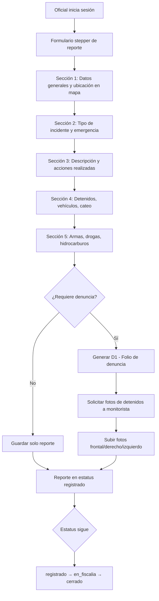

# Reporte Campo — Reportes de Oficiales en Campo

**Propósito**: Oficial de campo crea reporte de recorrido, captura incidentes, vincula con D1, sube fotos de detenidos y gestiona el estatus.

---

## Flujo

## Componentes involucrados

| Archivo | Rol |
|---------|-----|
| `lib/oficial/types.ts` | Interfaces `OfiReporteCampo`, `CrearReporteCampoInput`, `OfiReporteDetalle`, `OfiD1Vinculada`, `OfiDetenido`, `OfiVehiculo`, `OfiCateo`, `OfiOrdenAprehension`, `OfiHidrocarburo`, `OfiArmaFuego`, `OfiDroga` |
| `lib/oficial/mapper.ts` | `rowToOficial`, `rowToReporteResumen`, `rowToReporteDetalle` |
| `lib/oficial/repository.ts` | `obtenerOficialPorUserId`, `insertarReporteCampo`, `obtenerReportesOficial`, `obtenerReporteDetalle`, `verificarFolioExiste`, `actualizarPatrullaOficial`, `obtenerPrellenado` |
| `lib/oficial/service.ts` | Orquestación de reportes de campo |
| `lib/oficial/actions.ts` | Server actions para crear reporte, vincular D1, subir evidencias |
| `lib/oficial/store.ts` | Store Zustand para formulario stepper |

## BD

| Tabla | Columnas clave | Uso |
|-------|---------------|-----|
| `ofi_reportes_campo` | `id`, `folio_reporte_campo`, `ofi_folio_cad`, `ofi_tipo_incidente`, `ofi_descripcion`, `ofi_contenido_reporte`, `ofi_calle`, `ofi_colonia`, `ofi_latitud`, `ofi_longitud`, `ofi_hay_detencion`, `ofi_detenidos` (JSONB), `ofi_hay_vehiculo`, `ofi_vehiculos` (JSONB), `ofi_hay_cateo`, `ofi_cateo` (JSONB), `ofi_estatus`, `quiere_denuncia` | Reporte principal de campo |
| `ofi_reporte_denuncia` | `id`, `reporte_campo_id`, `folio_denuncia`, `iph`, `delito`, `fecha_reporte`, `hora_reporte`, `estado_tramite` | Denuncia D1 vinculada |
| `ofi_oficiales` | `id`, `user_id`, `no_nomina`, `numero_empleado`, `patrulla_id`, `ofi_estatus` | Perfil del oficial |
| `ofi_detalles_asegurados` | `id`, `reporte_campo_id`, `nombre_detenido`, `calle`, `colonia`, `latitud`, `longitud` | Detalles de detenidos |
| `solicitud_fotos` | `id`, `reporte_campo_id`, `tipo_foto`, `estado`, `enviado_a` | Solicitudes de foto a monitorista |
| `cat_tipos_incidente` | `id`, `nombre`, `activo` | Catálogo de tipos de incidente |
| `cat_tipos_emergencia` | `id`, `nombre`, `activo` | Catálogo de tipos de emergencia |

## Reglas de negocio

1. El formulario es un stepper con múltiples secciones manejado por store Zustand
2. El reporte puede incluir detenidos (JSONB), vehículos (JSONB), cateo (JSONB), armas, drogas, hidrocarburos, órdenes de aprehensión
3. Si `quiere_denuncia = true`, se genera un D1 vinculado al reporte
4. Si hay detenidos, se solicita automáticamente foto frontal, derecho e izquierdo
5. El folio del reporte se verifica para evitar duplicados
6. Estatus del reporte: `registrado` → `en_fiscalia` → `cerrado`
7. La ubicación se captura desde un mapa (latitud/longitud + calle/colonia)
8. `ofi_detenidos` y `ofi_vehiculos` son arrays JSONB flexibles
9. `ofi_cateo` es un objeto JSONB con ubicación
