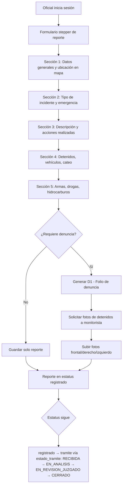

# Reporte Campo — Reportes de Oficiales en Campo

**Propósito**: Oficial de campo crea reporte de recorrido, captura incidentes, vincula con D1, sube fotos de detenidos y gestiona el estatus. Desde el flujo de despacho, **también cierra solicitudes de despacho** — es la única tabla de reporte de campo (`incidente_reporte_campo` quedó legacy, solo lectura histórica). Ver [[Plan Flujo Despacho]].

**Código muerto eliminado**: la cadena de escritura vieja hacia `incidente_reporte_campo` (`ReporteRecorridoZen` en `components/911/radio/FormSection.tsx` — sin rutas que lo importaran —, `createRecorridoCompleto`/`createReporteCampo`/`insertarIncidente` en `lib/incidentes/actions.ts`, `crearReporteCampo` en `lib/incidentes/service.ts`, `insertarReporteCampo`/`verificarReporteCampo` en `lib/incidentes/repository.ts`) se eliminó por completo — era el flujo de "auto-cierre" de rondín reemplazado hace varias fases por `createRondinEscalado` + `ofi_reportes_campo`, y nadie lo había retirado. La **lectura** histórica de `incidente_reporte_campo` (`rowToReporteCampo` en `lib/incidentes/mapper.ts`, usada por `obtenerIncidenteCompleto`) se conserva intacta.

---

## Cierre de solicitud de despacho

Cuando el reporte se crea con `incidente_id` (desde `/oficial/despachos/[id]`), `insertarReporteCampo` (`lib/oficial/repository.ts`) valida en transacción que el incidente esté `en_despacho` **o** `en_sitio` y que no exista ya un cierre (índice único parcial `uq_ofi_rc_incidente`), inserta el reporte y hace `UPDATE incidentes SET estatus = 'cerrado_detencion' | 'atendido'` según `ofi_hay_detencion`. El incidente aparece entonces en el tab "Atendidos" del despacho. El oficial se resuelve de `ofi_oficiales` por sesión (`user_id`), nunca a mano.

**Seguimiento por unidad (form-003 SEGOB-CNI)**: al marcar "en sitio" (`marcarEnSitioOficial`, `lib/oficial/actions.ts`) se rellena por `COALESCE` `hora_salida`/`hora_llegada` en `incidente_despacho_unidades` para todas las unidades del despacho, sin pisar lo que el despachador ya haya registrado a mano en el tablón. En el cierre del reporte (`insertarReporteCampo`), un backfill de seguridad garantiza `hora_salida` incluso si el oficial cerró directo desde `en_despacho` sin pasar por "Marcar en Sitio" — nunca bloquea el cierre por falta de este dato.

**Clasificación por catálogo, no texto libre** (regla: sin datos genéricos, la fuente de verdad para catálogos es el estándar SEGOB-CNI): `ofi_reportes_campo` tiene columnas FK `tipo_emergencia_id`, `tipo_incidente_id`, `prioridad_id` (migration `0024`) además de las columnas de texto legacy `ofi_tipo_incidente`/`ofi_tipo_emergencia`/`ofi_prioridad`. El formulario (`FormularioRecorrido.tsx`) captura los IDs vía la misma cascada jerárquica Tipo→Subtipo→Incidente que 911/WhatsApp/rondín (catálogo completo de `lib/911/service::getCatalogos()`, no el degradado de `lib/oficial/service`). `insertarReporteCampo` **nunca confía en texto del cliente**: resuelve los nombres desde el catálogo real en el servidor y los guarda en las columnas de texto legacy solo para no romper las pantallas que aún las leen. Al abrir el cierre de un despacho, el formulario se prellena con la clasificación exacta (`tipoEmergenciaId`/`tipoIncidenteId`/`prioridadId`) del incidente original vía `obtenerDespachosAsignados`, no con el nombre de texto.

- `obtenerDespachosAsignados(userId)` — asignaciones activas del oficial (JOIN `incidente_despacho_elementos.oficial_id` → `ofi_oficiales.user_id`).
- Bandera calculada "D1 pendiente": `ofi_hay_detencion = true` sin `ofi_reporte_denuncia` vinculada. Al crear la D1 se hereda `incidente_id` y la bandera se limpia.

**Voy en Camino / Marcar en Sitio** (`components/oficial/MarcarEnCaminoButton.tsx` + `MarcarEnSitioButton.tsx`): el oficial captura sus propios `hora_salida`/`hora_llegada` en dos momentos reales que él vive — el despachador ya no tiene botones para esto en `TablonDespacho.tsx` (solo lectura). Decisión de negocio: sin AVL/GPS real, el despachador no puede saber esas horas de forma confiable — mismo criterio que "solo el oficial levanta rondín" (ver [[911]] regla 14).

**Campos "quién" del D1** (`ofi_reporte_denuncia`): además de `oficial_id` (quien abre el reporte), existen 5 columnas de personal — `policia_a_cargo`, `nomina_mando`, `policia_denuncia`, `policia_firma_d1`, `policia_ingresa_cu` — que estaban en el esquema desde hace tiempo pero **ningún formulario las llenaba** (siempre `NULL`). Se agregaron a `FormularioD1.tsx` (sección "Personal y Equipamiento"), al mapeo de `app/api/reportes-d1/route.ts` y al INSERT de `lib/d1/repository.ts::insertarReporteDenuncia`. Por defecto se prellenan con la nómina del oficial en sesión (mismo criterio que "cargo"/"denuncia"/"firma"/"CU" suelen ser la misma persona), excepto `nomina_mando` que siempre queda vacío por ser una persona distinta (el mando responsable). `policia_a_cargo` y `nomina_mando` ya se mostraban en el reporte de consulta (`lib/d1/repository.ts::obtenerReportesD1`) pero salían vacíos por falta de este fix; `policia_denuncia`/`policia_firma_d1`/`policia_ingresa_cu` solo se capturan, no se muestran todavía en ningún reporte.

---

## Flujo

## Componentes involucrados

| Archivo | Rol |
|---------|-----|
| `lib/oficial/types.ts` | Interfaces `OfiReporteCampo`, `CrearReporteCampoInput`, `OfiReporteDetalle`, `OfiD1Vinculada`, `OfiDetenido`, `OfiVehiculo`, `OfiCateo`, `OfiOrdenAprehension`, `OfiHidrocarburo`, `OfiArmaFuego`, `OfiDroga` |
| `lib/oficial/mapper.ts` | `rowToOficial`, `rowToReporteResumen`, `rowToReporteDetalle` |
| `lib/oficial/repository.ts` | `obtenerOficialPorUserId`, `insertarReporteCampo` (cierra despacho si trae `incidenteId`), `obtenerReportesOficial`, `obtenerReporteDetalle`, `verificarFolioExiste`, `actualizarPatrullaOficial`, `obtenerPrellenado`, `obtenerDespachosAsignados`, `contarDespachosAsignados`, `obtenerCierrePorIncidente` |
| `app/oficial/despachos/page.tsx`, `[id]/page.tsx` | Vista "Mis Despachos" — asignaciones activas y cierre con historial |
| `components/incidentes/HistorialIncidente.tsx` | Timeline generativo 911/rondín → despacho → campo → D1 |
| `lib/oficial/service.ts` | Orquestación de reportes de campo |
| `lib/oficial/actions.ts` | Server actions para crear reporte, vincular D1, subir evidencias |
| `lib/oficial/store.ts` | Store Zustand para formulario stepper |

## BD

| Tabla | Columnas clave | Uso |
|-------|---------------|-----|
| `ofi_reportes_campo` | `id`, `incidente_id` (FK cierre despacho), `folio_reporte_campo`, `ofi_folio_cad`, `tipo_emergencia_id`/`tipo_incidente_id`/`prioridad_id` (FK catálogo real), `ofi_tipo_incidente`/`ofi_tipo_emergencia`/`ofi_prioridad` (texto legacy, resuelto server-side desde el catálogo), `ofi_descripcion`, `ofi_contenido_reporte`, `ofi_calle`, `ofi_colonia`, `ofi_entre_calles`, `ofi_referencia`, `ofi_latitud`, `ofi_longitud`, `ofi_hay_detencion`, `ofi_detenidos` (JSONB), `expediente_ci`, `personal_ingreso_ci`, `ofi_hay_vehiculo`, `ofi_vehiculos` (JSONB), `ofi_hay_cateo`, `ofi_cateo` (JSONB), `ofi_estatus`, `quiere_denuncia` | Reporte principal de campo (también cierra despacho) |
| `incidente_despacho_elementos` | `id`, `despacho_id`, `elemento_nomina`, `elemento_nombre`, `oficial_id` (FK → `ofi_oficiales`) | Elementos despachados; `oficial_id` liga al oficial con cuenta |
| `ofi_reporte_denuncia` | `id`, `reporte_campo_id`, `folio_denuncia`, `iph`, `delito`, `fecha_reporte`, `hora_reporte`, `estado_tramite` | Denuncia D1 vinculada |
| `ofi_oficiales` | `id`, `user_id`, `no_nomina`, `numero_empleado`, `patrulla_id`, `ofi_estatus` | Perfil del oficial |
| `ofi_detalles_asegurados` | `id`, `reporte_campo_id`, `nombre_detenido`, `ap_paterno_detenido`, `ap_materno_detenido`, `calle`, `colonia`, `latitud`, `longitud` | Detalles de detenidos — se llena automáticamente al crear el reporte |
| `solicitud_fotos` | `id`, `reporte_campo_id`, `tipo_foto`, `estado`, `enviado_a` | Solicitudes de foto a monitorista |
| `cat_tipos_incidente` | `id`, `nombre`, `activo` | Catálogo de tipos de incidente |
| `cat_tipos_emergencia` | `id`, `nombre`, `activo` | Catálogo de tipos de emergencia |

## Reglas de negocio

1. El formulario es un stepper con múltiples secciones manejado por store Zustand
2. El reporte puede incluir detenidos (JSONB), vehículos (JSONB), cateo (JSONB), armas, drogas, hidrocarburos, órdenes de aprehensión
3. Si `quiere_denuncia = true`, se genera un D1 vinculado al reporte
4. Si hay detenidos, se solicita automáticamente foto frontal, derecho e izquierdo
5. El folio del reporte se verifica para evitar duplicados
6. Estatus del reporte: `ofi_reportes_campo.ofi_estatus` default `registrado`. Avance real vía `ofi_reporte_denuncia.estado_tramite`: `RECIBIDA` → `EN_ANALISIS` → `EN_REVISION_JUZGADO` → `CERRADO`
7. La ubicación se captura desde un mapa (latitud/longitud + calle/colonia)
8. `ofi_detenidos` es un array JSONB con objetos `{ nombre, apellidoPaterno, apellidoMaterno }` (antes solo `{ nombre }`)
9. Al crear el reporte se insertan automáticamente registros en `ofi_detalles_asegurados` con los nombres completos
10. `ofi_cateo` es un objeto JSONB con ubicación
