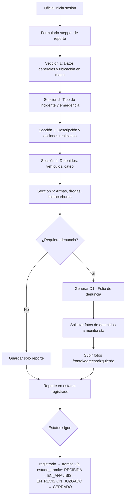

# Reporte Campo — Reportes de Oficiales en Campo

**Propósito**: Oficial de campo crea reporte de recorrido, captura incidentes, vincula con D1, sube fotos de detenidos y gestiona el estatus. Desde el flujo de despacho, **también cierra solicitudes de despacho** — es la única tabla de reporte de campo (`incidente_reporte_campo` quedó legacy, solo lectura histórica). Ver [[Plan Flujo Despacho]].

**Código muerto eliminado**: la cadena de escritura vieja hacia `incidente_reporte_campo` (`ReporteRecorridoZen` en `components/911/radio/FormSection.tsx` — sin rutas que lo importaran —, `createRecorridoCompleto`/`createReporteCampo`/`insertarIncidente` en `lib/incidentes/actions.ts`, `crearReporteCampo` en `lib/incidentes/service.ts`, `insertarReporteCampo`/`verificarReporteCampo` en `lib/incidentes/repository.ts`) se eliminó por completo — era el flujo de "auto-cierre" de rondín reemplazado hace varias fases por `createRondinEscalado` + `ofi_reportes_campo`, y nadie lo había retirado. La **lectura** histórica de `incidente_reporte_campo` (`rowToReporteCampo` en `lib/incidentes/mapper.ts`, usada por `obtenerIncidenteCompleto`) se conserva intacta.

---

## Cierre de solicitud de despacho

Cuando el reporte se crea con `incidente_id` (desde `/oficial/despachos/[id]`), `insertarReporteCampo` (`lib/oficial/repository.ts`) valida en transacción que el incidente esté `en_despacho` **o** `en_sitio` y que no exista ya un cierre (índice único parcial `uq_ofi_rc_incidente`), inserta el reporte y hace `UPDATE incidentes SET estatus = 'cerrado_detencion' | 'atendido'` según `ofi_hay_detencion`. El incidente aparece entonces en el tab "Atendidos" del despacho. El oficial se resuelve de `ofi_oficiales` por sesión (`user_id`), nunca a mano.

**Seguimiento por unidad (form-003 SEGOB-CNI)**: al marcar "en sitio" (`marcarEnSitioOficial`, `lib/oficial/actions.ts`) se rellena por `COALESCE` `hora_salida`/`hora_llegada` en `incidente_despacho_unidades` para todas las unidades del despacho, sin pisar lo que el despachador ya haya registrado a mano en el tablón. En el cierre del reporte (`insertarReporteCampo`), un backfill de seguridad garantiza `hora_salida` (desde `fecha_hora_despacho` como aproximación) y `hora_llegada` (desde `NOW()`, el momento del cierre) si el oficial cerró directo desde `en_despacho` sin pasar por "Marcar en Sitio" — nunca bloquea el cierre por falta de estos datos.

**Clasificación por catálogo, no texto libre** (regla: sin datos genéricos, la fuente de verdad para catálogos es el estándar SEGOB-CNI): `ofi_reportes_campo` tiene columnas FK `tipo_emergencia_id`, `tipo_incidente_id`, `prioridad_id` (migration `0024`) además de las columnas de texto legacy `ofi_tipo_incidente`/`ofi_tipo_emergencia`/`ofi_prioridad`. El formulario (`FormularioRecorrido.tsx`) captura los IDs vía la misma cascada jerárquica Tipo→Subtipo→Incidente que 911/WhatsApp/rondín (catálogo completo de `lib/911/service::getCatalogos()`, no el degradado de `lib/oficial/service`). `insertarReporteCampo` **nunca confía en texto del cliente**: resuelve los nombres desde el catálogo real en el servidor y los guarda en las columnas de texto legacy solo para no romper las pantallas que aún las leen. Al abrir el cierre de un despacho, el formulario se prellena con la clasificación exacta (`tipoEmergenciaId`/`tipoIncidenteId`/`prioridadId`) del incidente original vía `obtenerDespachosAsignados`, no con el nombre de texto.

- `obtenerDespachosAsignados(userId)` — asignaciones activas del oficial (JOIN `incidente_despacho_elementos.oficial_id` → `ofi_oficiales.user_id`).
- Bandera calculada "D1 pendiente": `ofi_hay_detencion = true` sin `ofi_reporte_denuncia` vinculada. Al crear la D1 se hereda `incidente_id` y la bandera se limpia.

**Cómo se entera el oficial de una asignación**: al ejecutar `createDespacho`/`enviarRefuerzos` (`lib/incidentes/actions.ts`), justo después del `COMMIT` se emite `despacho.asignado`/`despacho.refuerzos` (`lib/notificaciones/catalogo.ts`) dirigido por `usuarios` a los `user_id` de `ofi_oficiales` de los elementos asignados con cuenta activa. La entrega es 100% in-app vía `CampanillaNotificaciones.tsx` (polling cada 30s, solo con la pestaña visible, sonido + badge) — no hay push nativo del navegador ni del sistema operativo (sin service worker, sin `Notification()`), decisión de arquitectura documentada en [[Plan - Sistema de Notificaciones]] por costo en el modelo serverless. Clic en la notificación lleva a `/oficial/despachos/{incidenteId}`. Elementos sin `oficial_id`/`user_id` resuelto (personal externo sin cuenta) no reciben nada — gap silencioso, sin aviso a nadie. Ver [[911]] regla 18, [[Notificaciones]].

**Badge de asignaciones activas en el dashboard del oficial (`/oficial`) con polling (2026-07-31)**: la card "Reportes y Despachos" muestra el contador "N ASIGNACIÓN(ES) ACTIVA(S)" vía `components/oficial/ContadorAsignaciones.tsx`, componente cliente que consulta el endpoint ligero `app/api/oficial/contador/route.ts` (`{ asignados }`, una query indexada `contarDespachosAsignados`, auth + `verificarRolOficial`) con `usePolling` cada 30s, pausado cuando la pestaña no está visible (`document.visibilityState`), mismo patrón que la campanita. El server component `app/oficial/page.tsx` ya no cuenta despachos en render — solo monta el badge. Complementa (no reemplaza) la notificación: la campanita avisa con sonido, el badge es el estado persistente visible del panel.

**Navegación en vivo estilo DiDi (card → modal → llegada → Atender, 2026-07-31)**: al abrir `/oficial/despachos/[id]` el oficial ve una **card blanca** (`components/oficial/navegacion/AsignacionCard.tsx`, folio grande, ubicación con ícono, badge "Impacto" coloreado por prioridad vía `colorPorPrioridad`, botón "🚓 INICIAR NAVEGACIÓN") a altura completa del body — no hay mapa todavía. Al tocar el botón se abre `components/oficial/navegacion/NavegacionModal.tsx`: modal **a pantalla completa** (`position: fixed, inset: 0, zIndex: 1000` vía `createPortal` a `document.body`, mismo patrón que `SeleccionarUnidadesModal.tsx`), con scroll del body bloqueado y **sin botón de cierre** — el único camino de salida es completar el flujo. Al montarse, `NavegacionDespacho` dispara `marcarEnCaminoOficial` automáticamente (idempotente, guarda `hora_salida` por `COALESCE`) en un `useEffect` de montaje protegido por ref (no hay pantalla "no_iniciado" interna, se mudó a la card) y arranca **directo en modo navegación 3D** (tilt 60°, ícono de patrulla 3D, "VISTA DE ARRIBA" como opción secundaria). El mapa calcula la ruta real por calles con **Google Directions API** desde la posición GPS del oficial (watchPosition propio de alta precisión, independiente del heartbeat de `OficialUbicacionTracker.tsx`) y la redibuja solo si el oficial se desvía >150m del trazo y pasó ≥60s del último recálculo (control de costo de Directions). La llegada se detecta por **geofence de 80m** (Haversine contra el destino) y dispara `marcarEnSitioOficial` (cambia `incidentes.estatus` a `en_sitio`, puebla `hora_salida`/`hora_llegada`); hay un botón manual "YA ESTOY AQUÍ" siempre visible como respaldo (protegido contra doble disparo por ref). Al llegar (geofence o botón manual), el mapa desaparece de inmediato —sin esperar al servidor— y `NavegacionDespacho` muestra la pantalla de confirmación "HAS LLEGADO A DESTINO" (ícono verde animado + folio); solo el botón **"ATENDER"** dispara la prop `onAtender` al padre (`DespachoContent.tsx`), que cierra el modal y transiciona al `FormularioRecorrido` embebido. `marcarEnSitioOficial` corre en background (`startTransition`), así `hora_llegada` queda precisa sin bloquear la confirmación visual. `emitir('despacho.en_camino'/'despacho.en_sitio')` avisa al despachador (ver [[Notificaciones]]). Si el incidente ya está `en_sitio` al entrar, se va directo al formulario de cierre sin card ni modal. **Los botones manuales originales (`MarcarEnCaminoButton.tsx` + `MarcarEnSitioButton.tsx`) fueron eliminados (2026-07-31)**: todo incidente tiene `latitud`/`longitud`, no existe el caso "sin coordenadas". Decisión de negocio: el oficial reporta sus propios `hora_salida`/`hora_llegada` — el despachador no tiene botones para esto en `TablonDespacho.tsx` (solo lectura). Con GPS real, esos momentos se capturan solos en el instante correcto en vez de depender de que el oficial toque un botón.

**Campos "quién" del D1** (`ofi_reporte_denuncia`): además de `oficial_id` (quien abre el reporte), existen 5 columnas de personal — `policia_a_cargo`, `nomina_mando`, `policia_denuncia`, `policia_firma_d1`, `policia_ingresa_cu` — que estaban en el esquema desde hace tiempo pero **ningún formulario las llenaba** (siempre `NULL`). Se agregaron a `FormularioD1.tsx` (sección "Personal y Equipamiento"), al mapeo de `app/api/reportes-d1/route.ts` y al INSERT de `lib/d1/repository.ts::insertarReporteDenuncia`. Por defecto se prellenan con la nómina del oficial en sesión (mismo criterio que "cargo"/"denuncia"/"firma"/"CU" suelen ser la misma persona), excepto `nomina_mando` que siempre queda vacío por ser una persona distinta (el mando responsable). `policia_a_cargo` y `nomina_mando` ya se mostraban en el reporte de consulta (`lib/d1/repository.ts::obtenerReportesD1`) pero salían vacíos por falta de este fix; `policia_denuncia`/`policia_firma_d1`/`policia_ingresa_cu` solo se capturan, no se muestran todavía en ningún reporte.

---

## Flujo

```mermaid
flowchart TD
    A[Oficial inicia sesión] --> B[Formulario stepper de reporte]
    B --> C[Sección 1: Datos generales y ubicación en mapa]
    C --> D[Sección 2: Tipo de incidente y emergencia]
    D --> E[Sección 3: Descripción y acciones realizadas]
    E --> F[Sección 4: Detenidos, vehículos, cateo]
    F --> G[Sección 5: Armas, drogas, hidrocarburos]
    G --> H{¿Requiere denuncia?}
    H -->|Sí| I[Generar D1 - Folio de denuncia]
    H -->|No| J[Guardar solo reporte]
    I --> K[Solicitar fotos de detenidos a monitorista]
    J --> L[Reporte en estatus registrado]
    K --> M[Subir fotos frontal/derecho/izquierdo]
    M --> L
    L --> N{Estatus sigue}
    N --> O[registrado → tramite vía estado_tramite: RECIBIDA → EN_ANALISIS → EN_REVISION_JUZGADO → CERRADO]
```

## Componentes involucrados

| Archivo | Rol |
|---------|-----|
| `lib/oficial/types.ts` | Interfaces `OfiReporteCampo`, `CrearReporteCampoInput`, `OfiReporteDetalle`, `OfiD1Vinculada`, `OfiDetenido`, `OfiVehiculo`, `OfiCateo`, `OfiOrdenAprehension`, `OfiHidrocarburo`, `OfiArmaFuego`, `OfiDroga` |
| `lib/oficial/mapper.ts` | `rowToOficial`, `rowToReporteResumen`, `rowToReporteDetalle` |
| `lib/oficial/repository.ts` | `obtenerOficialPorUserId`, `insertarReporteCampo` (cierra despacho si trae `incidenteId`), `obtenerReportesOficial`, `obtenerReporteDetalle`, `verificarFolioExiste`, `actualizarPatrullaOficial`, `obtenerPrellenado`, `obtenerDespachosAsignados`, `contarDespachosAsignados`, `obtenerCierrePorIncidente` |
| `app/oficial/despachos/page.tsx`, `[id]/page.tsx` | Vista "Mis Despachos" — asignaciones activas; `[id]` arma Header + Body y dentro del body la card `AsignacionCard` a altura completa (transición card → modal → formulario al completar el flujo) |
| `components/oficial/DespachoContent.tsx` | Orquestador cliente de `/oficial/despachos/[id]`: rama `en_sitio` → `FormularioRecorrido` embebido; caso normal → `AsignacionCard` + estado `modalAbierto` que monta `NavegacionModal`; `onAtender` cierra el modal y avanza a `en_sitio` |
| `components/oficial/navegacion/AsignacionCard.tsx` | Card blanca previa a navegar: folio, ubicación, badge "Impacto", botón "INICIAR NAVEGACIÓN" → `onIniciar()` abre el modal |
| `components/oficial/navegacion/NavegacionModal.tsx` | Modal full-screen vía `createPortal` (zIndex 1000, scroll del body bloqueado), envuelve `NavegacionDespacho` pasando `onAtender` directo; sin botón de cierre |
| `components/oficial/navegacion/NavegacionDespacho.tsx` | Navegación en vivo (mapa + ruta Directions API + watchPosition + geofence de llegada). Auto-dispara `marcarEnCaminoOficial` al montar, entra en modo navegación por defecto, pantalla "HAS LLEGADO A DESTINO" + botón "ATENDER" (`onAtender`) |
| `components/incidentes/HistorialIncidente.tsx` | Timeline generativo 911/rondín → despacho → campo → D1 — **ya no se usa en la vista de despacho** (solo en vistas de consulta) |
| `lib/oficial/service.ts` | Orquestación de reportes de campo |
| `lib/oficial/actions.ts` | Server actions para crear reporte, vincular D1, subir evidencias |
| `lib/oficial/store.ts` | Store Zustand para formulario stepper |

## BD

| Tabla | Columnas clave | Uso |
|-------|---------------|-----|
| `ofi_reportes_campo` | `id`, `incidente_id` (FK cierre despacho), `folio_reporte_campo`, `ofi_folio_cad`, `tipo_emergencia_id`/`tipo_incidente_id`/`prioridad_id` (FK catálogo real), `ofi_tipo_incidente`/`ofi_tipo_emergencia`/`ofi_prioridad` (texto legacy, resuelto server-side desde el catálogo), `ofi_descripcion`, `ofi_contenido_reporte`, `ofi_calle`, `ofi_colonia`, `ofi_entre_calles`, `ofi_referencia`, `ofi_latitud`, `ofi_longitud`, `ofi_hay_detencion`, `ofi_detenidos` (JSONB), `expediente_ci`, `personal_ingreso_ci`, `ofi_hay_vehiculo`, `ofi_vehiculos` (JSONB), `ofi_hay_cateo`, `ofi_cateo` (JSONB), `ofi_estatus`, `quiere_denuncia` | Reporte principal de campo (también cierra despacho) |
| `incidente_despacho_elementos` | `id`, `despacho_id`, `elemento_nomina`, `elemento_nombre`, `oficial_id` (FK → `ofi_oficiales`) | Elementos despachados; `oficial_id` liga al oficial con cuenta |
| `ofi_reporte_denuncia` | `id`, `reporte_campo_id`, `folio_denuncia`, `iph`, `delito`, `fecha_reporte`, `hora_reporte`, `estado_tramite` | Denuncia D1 vinculada |
| `ofi_oficiales` | `id`, `user_id`, `no_nomina`, `numero_empleado`, `patrulla_id`, `ofi_estatus` | Perfil del oficial |
| `ofi_detalles_asegurados` | `id`, `reporte_campo_id`, `nombre_detenido`, `ap_paterno_detenido`, `ap_materno_detenido`, `calle`, `colonia`, `latitud`, `longitud` | Detalles de detenidos — se llena automáticamente al crear el reporte |
| `solicitud_fotos` | `id`, `reporte_campo_id`, `tipo_foto`, `estado`, `enviado_a` | Solicitudes de foto a monitorista |
| `cat_tipos_incidente` | `id`, `nombre`, `activo` | Catálogo de tipos de incidente |
| `cat_tipos_emergencia` | `id`, `nombre`, `activo` | Catálogo de tipos de emergencia |

## Reglas de negocio

1. El formulario es un stepper con múltiples secciones manejado por store Zustand
2. El reporte puede incluir detenidos (JSONB), vehículos (JSONB), cateo (JSONB), armas, drogas, hidrocarburos, órdenes de aprehensión
3. Si `quiere_denuncia = true`, se genera un D1 vinculado al reporte
4. Si hay detenidos, se solicita automáticamente foto frontal, derecho e izquierdo
5. El folio del reporte se verifica para evitar duplicados
6. Estatus del reporte: `ofi_reportes_campo.ofi_estatus` default `registrado`. Avance real vía `ofi_reporte_denuncia.estado_tramite`: `RECIBIDA` → `EN_ANALISIS` → `EN_REVISION_JUZGADO` → `CERRADO`
7. La ubicación se captura desde un mapa (latitud/longitud + calle/colonia)
8. `ofi_detenidos` es un array JSONB con objetos `{ nombre, apellidoPaterno, apellidoMaterno }` (antes solo `{ nombre }`)
9. Al crear el reporte se insertan automáticamente registros en `ofi_detalles_asegurados` con los nombres completos
10. `ofi_cateo` es un objeto JSONB con ubicación
