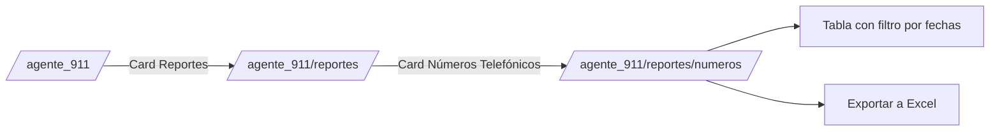

# Reporte de Números Telefónicos (911)

**Propósito**: Concentrado de números telefónicos de **todos los reportes levantados por el canal 911** (ciudadano), con filtro por rango de fechas y exportación a Excel. Se accede desde el panel del Agente 911 → card "Reportes" → card "Reporte de Números Telefónicos".

---

## Flujo de acceso

## Origen de datos

| Columna del reporte | Fuente BD |
|---------------------|-----------|
| Folio | `incidentes.folio` |
| Número de teléfono reportado | `incidentes.telefono_reportante` (ANI) |
| Fecha de reporte | `incidentes.fecha_hora_inicio` (fecha) |
| Tipo de incidencia | `cat_tipos_incidente.nombre` (fallback `tipo_reporte`) |

- Consulta `incidentes` donde `canal = '911'` con `telefono_reportante` no vacío, filtrada por `fecha_hora_inicio::date BETWEEN $1 AND $2`.
- Incluye **todos** los reportes 911 (tipo `normal`, `extorsion`, `alarma_escolar`), no solo extorsión — cada reporte 911 es una incidencia.
- Se reutiliza la capa `lib/reportes-operativos/service.obtenerDatosNumeros911(from, to)` para que tabla y export siempre coincidan. `obtenerDatosExtorsion` (extorsión pura, 9 columnas formato C4) es un reporte hermano independiente en `/agente_911/reportes/extorsion` — ver [[Reporte de Llamadas de Extorsión 911]]. `components/911/reportes/FiltroRangoFechas.tsx` y `BotonExportarExcel.tsx` se comparten entre ambos reportes (`FiltroRangoFechas` acepta prop `basePath` para saber a qué ruta redirigir).

## Archivos involucrados

| Archivo | Rol |
|---------|-----|
| `app/agente_911/page.tsx` | Card "Reportes" en el panel del Agente 911 |
| `app/agente_911/reportes/page.tsx` | Índice de reportes 911 con card "Reporte de Números Telefónicos" |
| `app/agente_911/reportes/numeros/page.tsx` | Página de la tabla + título "Reporte de Números Telefónicos" + botón Exportar |
| `components/911/reportes/FiltroRangoFechas.tsx` | Filtro cliente por rango de fechas (`from`/`to` → URL params) |
| `components/911/reportes/TablaNumerosTelefonicos.tsx` | Tabla de 4 columnas (Folio, Número, Fecha, Tipo de incidencia) sin estado |
| `lib/reportes-operativos/repository.ts` | `obtenerNumerosTelefonicos911()` |
| `lib/reportes-operativos/service.ts` | `obtenerDatosNumeros911()` |
| `app/api/reportes/numeros-extorsion/exportar/route.ts` | GET → ExcelJS → `.xlsx` descargable (misma data que la tabla) |

## Seguridad

- Páginas y API validan sesión + `tieneAccesoSeccion(usuarioId, '911_ciudadano')` (permiso del canal ciudadano 911), igual que el resto del área 911.
- Export: permiso `911_ciudadano`, no `reportes_ciudadano`.
