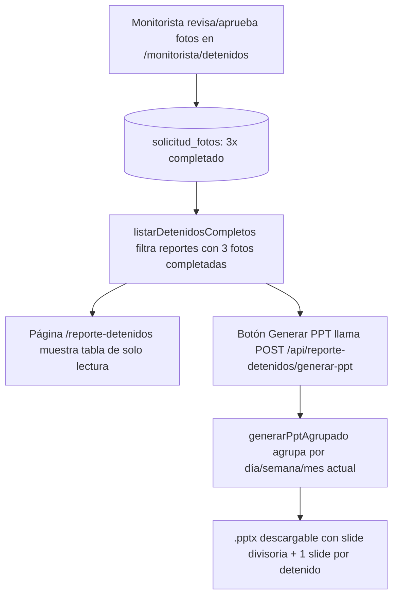

# Reporte de Detenidos — Consolidado diario/semanal/mensual

**Propósito**: Tabla de solo lectura con los detenidos cuyas 3 fotos (frontal/derecho/izquierdo) ya están completadas, más un botón que genera un `.pptx` con 3 secciones (diario, semanal y mensual). No verifica ni edita nada: consolida datos ya validados por Monitorista/Fiscalía/Juzgado.

---

## Flujo

## Quién lo usa

- Hub `/agente_reportes` (card "Reporte de Detenidos" en la sección "Estadísticas"). Dos roles distintos aterrizan en este mismo hub (`HUB_POR_ROL` en `lib/auth/helpers.ts`): el rol legacy **`Reportante`** (id 35) y el rol real en uso hoy **`agente_reportes`** (id 47, usuario "Agente Reportes"). Ambos están registrados en `lib/permisos/registro.ts` con la sección `reporte_detenidos` en su plantilla, para que se puedan gestionar desde `/admin/roles/[id]/plantilla-permisos` sin importar cuál de los dos tenga cada usuario.
- Permiso: sección `reporte_detenidos` (registrada en `lib/permisos/registro.ts` para ambos roles, y en `lib/permisos/mapa-secciones.ts` para el gate del proxy).
- Los datos se completan en `/monitorista/detenidos` (bandeja de revisión/aprobación que sigue existiendo); este módulo solo **lee** y reporta.

## Componentes involucrados

| Archivo | Rol |
|---------|-----|
| `lib/reporte-detenidos/types.ts` | Interfaz `DetenidoCompleto` |
| `lib/reporte-detenidos/repository.ts` | `listarDetenidosCompletos()` — query con filtro `COUNT(solicitud_fotos estado='completado') = 3` |
| `lib/reporte-detenidos/ppt-service.ts` | `generarPptAgrupado()` — genera un `.pptx` con secciones diario/semanal/mensual (pptxgenjs + descarga de fotos vía `lib/expediente/v2`) |
| `lib/reporte-detenidos/permisos.ts` | Wrapper tipado sobre `lib/permisos/core` (sección `reporte_detenidos`) |
| `app/reporte-detenidos/page.tsx` | Página de solo lectura (server component, sesión + permiso + tabla) |
| `app/api/reporte-detenidos/generar-ppt/route.ts` | POST → valida sesión/permiso → `generarPptAgrupado()` → binario `.pptx` + auditoría (`registrarAudit`) |
| `components/reporte-detenidos/BotonGenerarPpt.tsx` | Client component: POST y descarga del blob |

## BD

| Tabla | Columnas clave | Uso |
|-------|---------------|-----|
| `ofi_reportes_campo` | `id`, `folio_reporte_campo`, `ofi_tipo_incidente`, `ofi_detenidos` (JSONB), `delito`, `falta_administrativa`, `modus_operandi`, `marco_legal`, `created_at` | Datos del detenido; `created_at` se usa como proxy de fecha para el agrupamiento |
| `ofi_reporte_denuncia` | `delito`, `marco_legal` | Fallback cuando el reporte de campo no los tiene |
| `solicitud_fotos` | `reporte_campo_id`, `tipo_foto`, `estado` | Filtro: exactamente 3 filas en `completado` |
| `evidencias_detenido` | `reporte_campo_id`, `tipo_foto`, `url_archivo` | Fotos para el PPT (vía `lib/expediente/v2/client.ts`) |

## Vistas (UI)

| Ruta | Vista | Patrón |
|------|-------|-------|
| `/reporte-detenidos` | Tabla de detenidos completos | `DashboardHeader` + `PageHeader` (`← Panel de Reportes` + `GENERAR PPT`) + `.pad-pagina` |

## Reglas de negocio

1. Solo aparecen detenidos con exactamente **3 `solicitud_fotos` en `completado`** (frontal, derecho, izquierdo). Incompletos quedan fuera (solo en la bandeja de Monitorista).
2. La tabla y el PPT son de **solo lectura**: no hay acciones de aprobar/rechazar/editar/solicitar.
3. Un detenido puede aparecer en más de una sección del PPT (diario + semanal + mensual) — comportamiento acumulativo esperado.
4. Si un rango no tiene detenidos se omite su sección; si ningún rango tiene detenidos, la API responde 500 con el mensaje de `generarPptAgrupado()`.
5. El botón genera el mismo `.pptx` sin filtros: siempre las 3 secciones.
