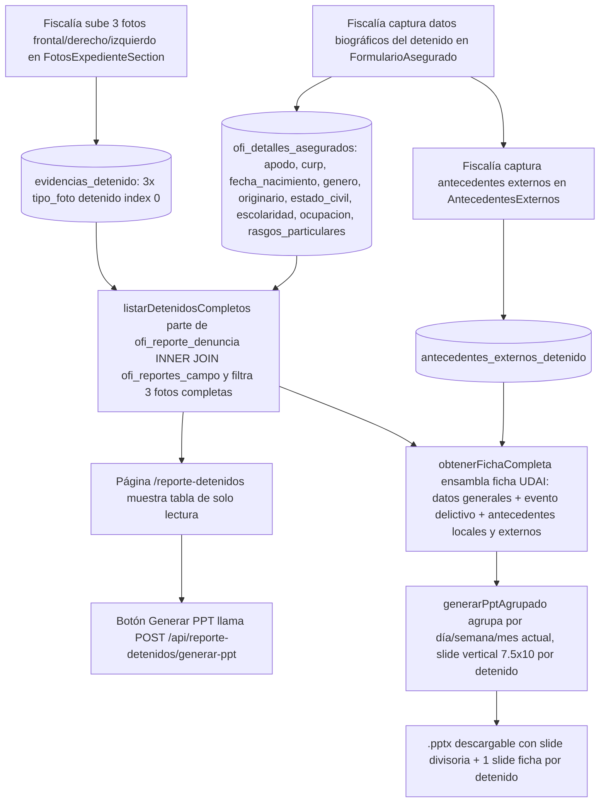

# Reporte de Detenidos — Consolidado diario/semanal/mensual + Ficha UDAI

**Propósito**: Tabla de solo lectura con los detenidos cuyas 3 fotos (frontal/derecho/izquierdo) ya están completadas en `evidencias_detenido` (subidas por Fiscalía), más un botón que genera un `.pptx` con 3 secciones (diario, semanal y mensual) y un slide por detenido en formato vertical que replica la estructura de la Ficha UDAI oficial (`FORMATO FICHA DE DETENIDOS.pptx`). No verifica ni edita nada: consolida datos ya validados por Fiscalía.

---

## Flujo

## Quién lo usa

- Hub `/agente_reportes` (card "Reporte de Detenidos" en la sección "Estadísticas"). Dos roles distintos aterrizan en este mismo hub (`HUB_POR_ROL` en `lib/auth/helpers.ts`): el rol legacy **`Reportante`** (id 35) y el rol real en uso hoy **`agente_reportes`** (id 47, usuario "Agente Reportes"). Ambos están registrados en `lib/permisos/registro.ts` con la sección `reporte_detenidos` en su plantilla, para que se puedan gestionar desde `/admin/roles/[id]/plantilla-permisos` sin importar cuál de los dos tenga cada usuario.
- Permiso: sección `reporte_detenidos` (registrada en `lib/permisos/registro.ts` para ambos roles, y en `lib/permisos/mapa-secciones.ts` para el gate del proxy).
- La captura de los datos que alimentan la ficha (biográficos, fotos, antecedentes externos) vive **en Fiscalía**; este módulo solo **lee** y reporta.

## Componentes involucrados

| Archivo | Rol |
|---------|-----|
| `lib/reporte-detenidos/types.ts` | Interfaz `DetenidoCompleto`, `FichaDetenidoCompleta`, `AntecedenteFicha` |
| `lib/reporte-detenidos/repository.ts` | `listarDetenidosCompletos()` (D1 + 3 fotos en `evidencias_detenido`), `obtenerAntecedentesLocales()` (CURP→nombre), `obtenerFichaCompleta()` (ensambla la ficha) |
| `lib/reporte-detenidos/ppt-service.ts` | `generarPptAgrupado()` — `.pptx` vertical 7.5×10in con ficha UDAI por detenido (pptxgenjs + descarga de fotos vía `lib/expediente/v2`) |
| `lib/reporte-detenidos/permisos.ts` | Wrapper tipado sobre `lib/permisos/core` (sección `reporte_detenidos`) |
| `app/reporte-detenidos/page.tsx` | Página de solo lectura (server component, sesión + permiso + tabla) |
| `app/api/reporte-detenidos/generar-ppt/route.ts` | POST → valida sesión/permiso → `generarPptAgrupado()` → binario `.pptx` + auditoría (`registrarAudit`) |
| `components/reporte-detenidos/BotonGenerarPpt.tsx` | Client component: POST y descarga del blob |
| `lib/fiscalia/` | Captura de datos biográficos (`FormularioAsegurado`), fotos (`evidencias_detenido`), antecedentes externos (`AntecedentesExternos` + CRUD) |

## BD

| Tabla | Columnas clave | Uso |
|-------|---------------|-----|
| `ofi_reporte_denuncia` | `id`, `folio_denuncia`, `iph`, `sector`, `num_carpeta_investigacion`, `lugar_hecho`, `colonia_hecho`, `fecha_reporte`, `hora_reporte`, `reporte_campo_id` | **Tabla base** del listado; identificación D1 (folio/IPH) y zona de operación (sector) |
| `ofi_reportes_campo` | `id`, `folio_reporte_campo`, `ofi_tipo_incidente`, `ofi_detenidos` (JSONB), `delito`, `falta_administrativa`, `modus_operandi`, `ofi_calle`/`ofi_colonia` (lugar de detención), `ofi_folio_cad` (RND), `expediente_ci`, `ofi_observaciones`, `created_at` | Datos del detenido y del evento; `created_at` para agrupamiento |
| `evidencias_detenido` | `reporte_campo_id`, `tipo_foto`, `tipo_contenido` ('detenido'/'objeto'), `detenido_index`, `url_archivo`, `creado_en` | **Fuente de verdad de las 3 fotos** (frontal/derecho/izquierdo, `tipo_contenido='detenido'`, `detenido_index=0`) y fotos de objetos para el PPT |
| `ofi_detalles_asegurados` | `id`, `reporte_campo_id`, `nombre_detenido`, `ap_paterno_detenido`, `ap_materno_detenido`, `calle`, `colonia`, `numero`, `cod_postal`, `latitud`, `longitud`, **`apodo`, `curp`, `fecha_nacimiento`, `genero`, `originario`, `estado_civil`, `escolaridad`, `ocupacion`, `rasgos_particulares`** | Datos biográficos del detenido (capturados por Fiscalía) |
| `antecedentes_externos_detenido` | `id`, `reporte_campo_id`, `tipo` ('DELITO'/'FALTA_ADMINISTRATIVA'), `descripcion`, `fecha`, `lugar`, `capturado_por`, `created_at` | Antecedentes capturados manualmente por Fiscalía desde fuentes externas (otro estado) |
| `ofi_puesta_disposicion` | `reporte_campo_id`, `gestion_interna`, `dependencia_externa` | Puesta a disposición (Gestión Interna / dependencia externa) |

## Vistas (UI)

| Ruta | Vista | Patrón |
|------|-------|-------|
| `/reporte-detenidos` | Tabla de detenidos completos (columnas: Nombre, **Folio D1**, **IPH**, Evento, Delitos, Falta Administrativa, Modus Operandi, Fecha — el folio mostrado es `folioDenuncia`, no el folio interno de reporte de campo) | `DashboardHeader` + `PageHeader` (`← Panel de Reportes` + `GENERAR PPT`) + `.pad-pagina` |

**UI mejorada (2026-08-10)** — `components/reporte-detenidos/TablaDetenidosReporte.tsx` (client component, patrón de `TablaIncidencias` de KPI): franja de 4 KPIs (total, con delito, con falta administrativa, este mes), toolbar de filtros (búsqueda por nombre/folio/IPH/delito, rango desde–hasta, tipo todos/delito/falta), columnas sortables con iconos `lucide-react`, chips de rubro (delito `#fee2e2`/`#b91c1c`, falta `#fef3c7`/`#b45309`), badge de IPH teal, export CSV, paginación, header sticky y empty state. `BotonGenerarPpt` se conserva en el `PageHeader`.
| `/fiscalia/asegurados/[reporteCampoId]` (o equivalente) | Captura de datos biográficos + antecedentes externos | `FormularioAsegurado` + `AntecedentesExternos` (acento `#7c3aed`) |

## Reglas de negocio

1. Solo aparecen detenidos con denuncia **D1** (`ofi_reporte_denuncia`) Y con las **3 fotos** en `evidencias_detenido` (`tipo_foto` frontal/derecho/izquierdo, `tipo_contenido='detenido'`, `detenido_index=0`). El conteo usa `COUNT(DISTINCT tipo_foto)` porque `insertarFotoFiscalia()` no hace upsert — puede haber filas duplicadas.
2. La tabla y el PPT son de **solo lectura**: no hay acciones de aprobar/rechazar/editar/solicitar.
3. Un detenido puede aparecer en más de una sección del PPT (diario + semanal + mensual) — comportamiento acumulativo esperado.
4. Si un rango no tiene detenidos se omite su sección; si ningún rango tiene detenidos, la API responde 500 con el mensaje de `generarPptAgrupado()`.
5. El botón genera el mismo `.pptx` sin filtros: siempre las 3 secciones.
6. El slide del PPT es una **página vertical 7.5×10in** que replica la Ficha UDAI: foto frontal del detenido (única, grande), fotos de objetos a un costado, tabla de nombre/apodo/folio, tabla "DATOS GENERALES DETENIDO", tabla "EVENTO DELICTIVO" (con lugar de la detención y zona de operación) y tabla "ANTECEDENTES" de dos columnas. Las fotos `derecho`/`izquierdo` no se dibujan en la ficha (siguen en el expediente).
7. Paleta del PPT alineada a `DESIGN.md`: acento institucional default `#1f355a` (`COLOR_PRIMARY`) y texto principal `#0F172A` (`COLOR_TITLE`) en `lib/reporte-detenidos/ppt-service.ts` — deliberadamente **no** se usa el morado `#7c3aed` (ese es exclusivo del acento de Fiscalía, no de este reporte).
8. El logo del encabezado de la ficha es `public/logo_ficha_udai.png` (la estrella/placa institucional extraída de `FORMATO FICHA DE DETENIDOS.pptx`, el formato oficial UDAI) — no el logo de producto Centinela. Si el archivo no existe, `imagenLogo()` omite el logo sin romper el PPT.

## Origen de los campos de la ficha

| Campo de la ficha | Fuente |
|---|---|
| Nombre, apellidos, domicilio | `ofi_detalles_asegurados` |
| Apodo, CURP, fecha nacimiento, género, originario, estado civil, escolaridad, ocupación, rasgos particulares | `ofi_detalles_asegurados` (nuevas columnas, captura en Fiscalía) |
| Foto frontal, foto(s) de objetos | `evidencias_detenido` |
| Fecha/hora, RND, IPH, expediente | `ofi_reporte_denuncia` / `ofi_reportes_campo` (`ofi_folio_cad`, `expediente_ci`/`num_carpeta_investigacion`) |
| Lugar del evento | `ofi_reporte_denuncia.lugar_hecho/colonia_hecho` |
| **Lugar de la detención** | `ofi_reportes_campo.ofi_calle/ofi_colonia` (ubicación de cierre del recorrido, capturada por el Oficial) |
| **Zona de operación** | `ofi_reporte_denuncia.sector` (prellenado del sector asignado al oficial, `obtenerSectorOficial`) |
| **Nexos delictivos** | Siempre vacío — sin captura implementada (decisión de negocio) |
| Puesta a disposición | `ofi_puesta_disposicion.gestion_interna/dependencia_externa` |
| Modus operandi, información adicional | `ofi_reportes_campo.modus_operandi/ofi_observaciones` |
| **Antecedentes** | Combinación de búsqueda local automática (CURP → nombre, excluyendo el reporte actual) + captura manual de Fiscalía para fuentes externas |

## Limitaciones conocidas (aceptadas, no bugs)

- Los antecedentes locales dependen de que el **nombre/CURP coincida exactamente** entre reportes — no hay fuzzy matching. Los antecedentes de otros estados dependen **100% de captura manual**, no hay integración con Plataforma México/RNPP.
- Soporte multi-detenido real por `ofi_reportes_campo`: solo se procesa el primer detenido (`detenido_index = 0`).
- No se cruza contra `via.v2_infracciones` (infracciones de tránsito) como antecedente.
