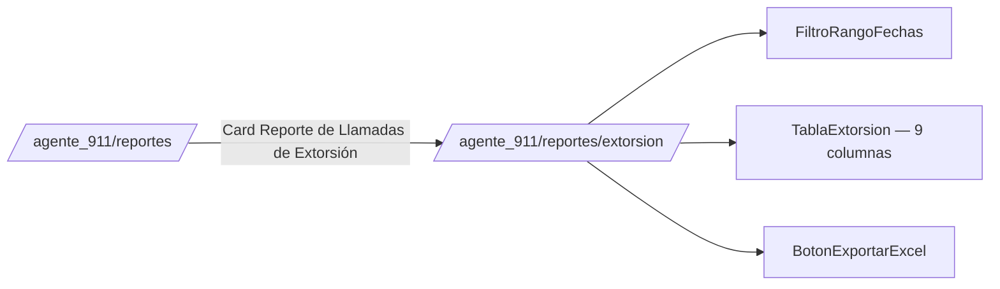

# Reporte de Llamadas de Extorsión 911 (formato C4)

**Propósito**: Concentrado de **llamadas de extorsión** (`incidentes.tipo_reporte = 'extorsion'`) del canal 911 ciudadano, con las 9 columnas del formato oficial que usa el C4 (`LLAMADAS DE EXTORSIÓN [MES].xlsx`): Fecha, Hora, Lugar, Teléfono de Extorsión, Grupo Delictivo, Modus Operandi, Unidad, Resultado, Folio de Reporte.

Se accede desde `/agente_911/reportes` → card "Reporte de Llamadas de Extorsión" (junto a "Reporte de Números Telefónicos" — ver [[Reporte Números Telefónicos]], reporte hermano con TODAS las llamadas 911 sin importar tipo, 4 columnas). Mismo módulo, mismo permiso de canal (`911_ciudadano`), mismo patrón de UI que su hermano.

**No vive en `/estadisticos`** — esa ruta y sus componentes (`app/estadisticos/`, `components/reportes/estadisticos/`, `app/api/reportes-telefonicos/`) se **eliminaron por completo** (2026-08-06): era una implementación vieja, desconectada del flujo real del sistema, y su card en `/agente_reportes` (sección Estadísticas, "Reportes Telefónicos") también se quitó. Decisión explícita del usuario.

---

## Flujo de acceso

## Captura del origen (Formulario911)

`app/agente_911/ciudadano/Formulario911.tsx`, Step 4 (bloque "Detalles de Extorsión", visible solo si `tipoReporte === 'extorsion'`): Teléfono de Extorsión, Grupo Delictivo, Modus Operandi, Resultado (texto libre).

**Canalización a Despacho (Step 5) ya NO se oculta para extorsión** — antes estaba bloqueada por completo (`tipoReporte !== 'extorsion'`), lo que hacía estructuralmente imposible asignar una patrulla real a una llamada de extorsión aunque en la operación real algunas SÍ terminan despachadas (evidencia: `LLAMADAS DE EXTORSIÓN 2026.xlsx`, columna UNIDAD con claves reales de patrulla en algunas filas, `C4` en la mayoría). La Clasificación Técnica (catálogo SEGOB-CNI tipo/subtipo/incidente) sigue oculta para extorsión — no aplica, y `resolverPrioridadId`/`esTipoImprocedente` toleran `tipoIncidenteId`/`tipoEmergenciaId` nulos sin romper el despacho.

## Origen de datos

| Columna del reporte | Fuente BD |
|---|---|
| Fecha / Hora | `incidentes.fecha_hora_inicio` |
| Lugar | `incidentes.calle` + `colonia` |
| Teléfono de Extorsión | `incidente_extorsion.telefono_extorsion` |
| Grupo Delictivo | `incidente_extorsion.grupo_delictivo` |
| Modus Operandi | `incidente_extorsion.modus_operandi` |
| Unidad | Derivada: `incidente_despacho_unidades.unidad_placa` (vía `incidente_despacho.incidente_id`) si hubo despacho real; si no, `'C4'` por default |
| Resultado | `incidente_extorsion.resultado` |
| Folio de Reporte | `incidentes.folio_cad` (folio CAD que captura el operador, distinto del folio interno `incidentes.folio`) |

- Consulta `incidentes JOIN incidente_extorsion`, filtrada por `fecha_hora_inicio::date BETWEEN $1 AND $2`. No filtra por canal — todo `tipo_reporte = 'extorsion'` implica el JOIN con `incidente_extorsion` (relación 1:1, índice único `incidente_extorsion_incidente_uq`).
- **UNIDAD no tiene columna ni input propio** — se deriva del pipeline de despacho ya existente (mismo que usa el Tablón de Despacho / `SeleccionarUnidadesModal` para el resto de incidentes), para no duplicar texto libre donde ya existe un catálogo/flujo real (`unidad_placa` es el snapshot de placa que ya usa `obtenerUnidadesDeDespacho`).
- Capa de negocio: `lib/reportes-operativos/repository.obtenerExtorsionesDetalle(desde, hasta)` → `lib/reportes-operativos/service.obtenerDatosExtorsion(desde, hasta)`. Tipo dedicado `ExtorsionDetalleRow` (no se reutiliza el `ExtorsionRow` de 4 columnas que usa `obtenerNumerosTelefonicos911`, para no acoplar ambos reportes).

## Archivos involucrados

| Archivo | Rol |
|---|---|
| `app/agente_911/reportes/page.tsx` | Card "Reporte de Llamadas de Extorsión" |
| `app/agente_911/reportes/extorsion/page.tsx` | Página del reporte — mismo layout que `reportes/numeros/page.tsx` |
| `components/911/reportes/FiltroRangoFechas.tsx` | Filtro por rango de fechas (compartido con el reporte de números; acepta prop `basePath` para redirigir a la ruta correcta) |
| `components/911/reportes/TablaExtorsion.tsx` | Tabla de 9 columnas, búsqueda cliente + paginación |
| `components/911/reportes/BotonExportarExcel.tsx` | Botón de exportación (compartido con el reporte de números) |
| `lib/reportes-operativos/repository.ts` | `obtenerExtorsionesDetalle()` |
| `lib/reportes-operativos/service.ts` | `obtenerDatosExtorsion()` |
| `app/api/reportes/extorsion/exportar/route.ts` | GET → ExcelJS → `.xlsx` con los mismos encabezados y layout del C4 (mismo patrón que `api/reportes/numeros-extorsion/exportar`) |
| `app/agente_911/ciudadano/Formulario911.tsx` | Captura (Step 4 detalles + Step 5 Canalización reactivada) |
| `lib/incidentes/actions.ts::createExtorsion` | INSERT en `incidente_extorsion` |
| `lib/db/manual-migrations/0044_extorsion_resultado.sql` | Agrega `resultado`; elimina `unidad_resultado`, `folio_reporte`, `fecha` (columnas muertas, 0 filas con valor en producción) |

## Seguridad

- Página y export validan sesión + `tieneAccesoSeccion(usuarioId, '911_ciudadano')` — idéntico al resto del área 911 y a su reporte hermano.

## Notas de diseño

- `incidente_extorsion.fecha` y `folio_reporte` eran columnas muertas: ninguna UI las llenaba (INSERT las recibía de campos de formulario que nunca existieron), confirmado con `SELECT COUNT(*)` = 0 en producción antes de eliminarlas. `unidad_resultado` (columna combinada) tampoco se llenaba nunca.
- Primer intento de esta feature reusó `/estadisticos` (implementación vieja, 4 columnas, permisos `reportes_ciudadano` que el rol `agente_911` no tiene). Se descartó por completo y se reconstruyó como módulo propio de `/agente_911/reportes`, replicando el patrón ya validado de [[Reporte Números Telefónicos]] — decisión del usuario tras confirmar que `/estadisticos` no está contemplado en el flujo actual del sistema.
