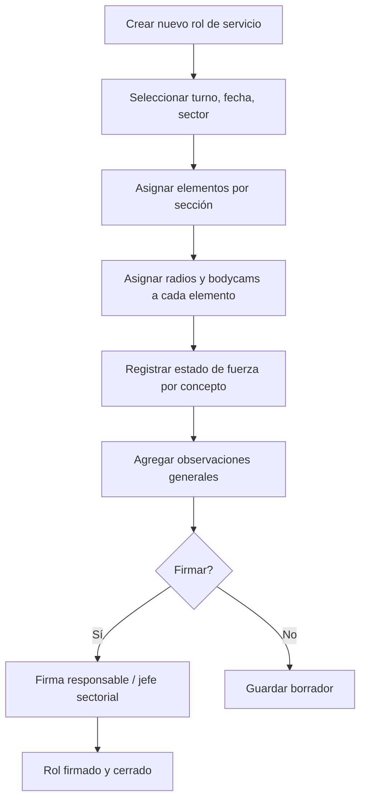

# Rol Servicios — Estado de Fuerza y Asignación de Recursos

**Propósito**: Creación del rol de servicios diario con asignación de sectores, unidades, radios, bodycams, estado de fuerza y observaciones.

---

## Flujo

## Componentes involucrados

| Archivo | Rol |
|---------|-----|
| `lib/rol-servicios/types.ts` | Interfaces `RolServicio`, `RolAsignacion`, `RolEstadoFuerza`, `RolObservacion`, `Sector`, `Radio`, `BodyCam`, `EstadoFuerzaConcepto`, `TipoObservacion` |
| `lib/rol-servicios/mapper.ts` | Mappers para todos los tipos |
| `lib/rol-servicios/repository.ts` | `getRolById`, `getAsignacionesByRolId`, `getEstadoFuerzaByRolId`, `getObservacionesByRolId`, `getSectores`, `getRadios`, `getBodyCams`, `getEstadoFuerzaConceptos`, `getTiposObservacion`, `getTiposEmergencia`, `getMediosCanalizacion`, `getUserRoleName` |
| `lib/rol-servicios/service.ts` | Orquestación de lógica de roles |
| `lib/rol-servicios/actions.ts` | Server actions para CRUD de roles y asignaciones |
| `lib/rol-servicios/catalogos-actions.ts` | Server actions para catálogos locales |

## BD

| Tabla | Columnas clave | Uso |
|-------|---------------|-----|
| `roles_servicio` | `id`, `folio`, `folio_consecutivo`, `turno`, `fecha`, `sector_id`, `status`, `fundamento_legal`, `firma_responsable_url`, `firma_jefe_sectorial_url` | Rol de servicio diario |
| `rol_asignaciones` | `id`, `rol_id`, `seccion`, `unidad_ext_id`, `elemento_ext_id`, `elemento_nomina`, `elemento_nombre`, `zona`, `servicio`, `radio_id`, `body_cam_id`, `orden` | Asignación de personal y recursos |
| `rol_estado_fuerza` | `id`, `rol_id`, `concepto_id`, `cantidad` | Estado de fuerza numérico |
| `rol_observaciones` | `id`, `rol_id`, `tipo_id`, `descripcion` | Observaciones del rol |
| `cat_sectores` | `id`, `nombre`, `clave`, `activo` | Catálogo de sectores |
| `cat_radios` | `id`, `codigo`, `tipo`, `estado`, `activo` | Catálogo de radios |
| `cat_body_cams` | `id`, `codigo`, `estado`, `activo` | Catálogo de bodycams |
| `cat_estado_fuerza_conceptos` | `id`, `nombre`, `codigo`, `grupo`, `orden`, `activo` | Conceptos medibles de estado de fuerza |
| `cat_tipos_observacion` | `id`, `nombre`, `codigo`, `activo` | Tipos de observación |

## Reglas de negocio

1. Cada rol tiene un turno (`PRIMERO`, `SEGUNDO`, `TERCERO`) y una fecha
2. Las asignaciones se ordenan por `orden` y se agrupan por `seccion`
3. El estado de fuerza se compone de conceptos medibles (ej. "Comandantes", "Oficiales", "Patrullas")
4. Los roles pueden estar en estado borrador o firmados
5. La firma puede ser del responsable del turno y/o del jefe sectorial
6. Los catálogos (sectores, radios, bodycams) tienen flag `activo` para control
7. El folio se genera con consecutivo numérico
