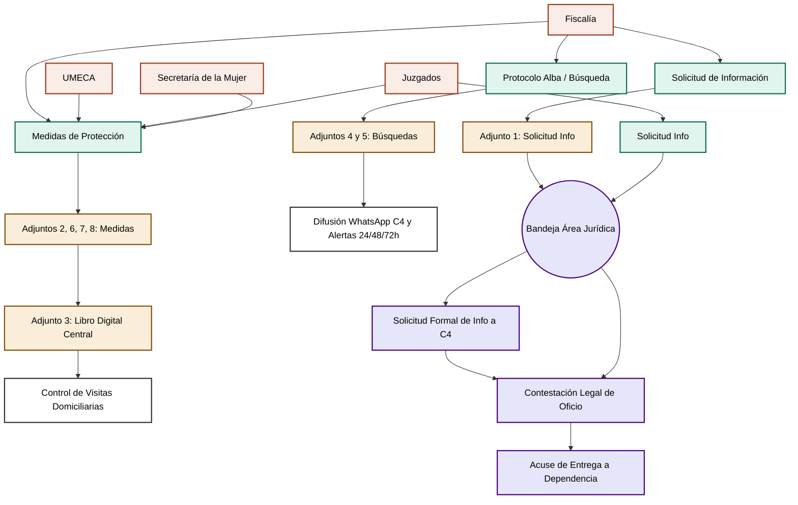

# Análisis y Diseño: Atención a Víctimas y Área Jurídica

Este documento consolida el flujo completo de Prevención del Delito (Atención a Víctimas) y su Área Jurídica, unificando los diagramas proporcionados y detallando las historias de usuario necesarias para digitalizar los 8 archivos Excel actuales.

## 1. Contexto Unificado del Flujo de Trabajo

El departamento se divide operativamente en dos grandes ramas que trabajan en conjunto:

1.  **Rama Operativa (Trabajo de Campo y Registro):** 
    Reciben las peticiones de Fiscalía, UMECA, Juzgados y Sec. de la Mujer. Su labor es abrir los expedientes (que hoy viven en los Excels 2, 4, 5, 6, 7 y 8) y realizar el trabajo de campo: llevar el control de múltiples visitas domiciliarias para asegurar las medidas de protección y detonar las búsquedas de Protocolo Alba por WhatsApp con C4.
2.  **Rama Jurídica (El filtro legal y contestación):**
    Una vez que la rama operativa recibe peticiones puramente legales (Solicitudes de Información), se las canaliza al Área Jurídica. Los abogados revisan el oficio y son ellos quienes tienen la autoridad de **pedirle formalmente información al C4** (videos, bitácoras). Con esa información, redactan la contestación legal y registran los "Acuses de entrega" para amparar a la dependencia de responsabilidades legales.

---

## 2. Diagrama de Arquitectura de Negocio (Integrado)

Este diagrama muestra cómo la recepción de oficios detona el trabajo operativo (Visitas/Difusión) y cómo fluye hacia el Área Jurídica para las contestaciones formales.

---

## 3. Historias de Usuario (Desglose Ágil)

Aquí se agrupan las historias con ultra-especificidad en los campos de captura basados en los Excel, estructuradas en Épicas, Historias y Tareas técnicas, valoradas en puntos de historia (Fibonacci).

### ÉPICA 1: Gestión Unificada de Medidas de Protección (Sustituye Adjuntos 2, 3, 6, 7 y 8)
*Consolidación del registro fragmentado en una sola base de datos operativa y un Dashboard directivo.*

*   **HU-1.1: Captura de Nuevo Oficio de Medida (Puntos: 5)**
    *   **Como:** Operador de Atención a Víctimas.
    *   **Quiero:** Registrar una nueva medida ingresando los campos: `Expediente`, `N° de oficio`, `Fecha de oficio`, `Fecha de Recepción`, `Persona que Recepciona`, `Autoridad Solicitante` (Select: Fiscalía, UMECA, Juzgados, Sec. Mujer), `Nombre de la Autoridad`, `Delito (s) y/o Juicio`, `Víctima y/o Beneficiario`, `Demandado / Imputado`, `Tipo de Medida / Obligación Cautelar`, `Domicilio de Protección`, `Colonia`, `Teléfono`, `Tiempo de Medida y Fecha de Vencimiento`, `Tipo de Apercibimiento`, `Enlace` y `Observaciones`.
    *   **Para:** Centralizar el caso sin importar su dependencia de origen.
    *   **Tasks:**
        *   Crear esquema de BD para Medidas.
        *   Crear formulario UI reactivo con validaciones.
        *   Configurar campos requeridos y tipos de datos (fechas).

*   **HU-1.2: Control Dinámico de Visitas Domiciliarias (Puntos: 3)**
    *   **Como:** Oficial de campo.
    *   **Quiero:** Abrir un Expediente y tener un botón para "Agregar Visita" que guarde: `Fecha de visita`, `Hora de visita`, `Resultado (Observaciones)` y `¿Se aplicó Apercibimiento? (Sí/No)`.
    *   **Para:** Capturar un número infinito de visitas asociadas al folio, erradicando las 46 columnas fijas del Excel.
    *   **Tasks:**
        *   Crear tabla relacional 1 a muchos (Expediente -> Visitas).
        *   UI Modal para registrar la visita desde tablet/móvil.
        *   Historial cronológico visible en el perfil del expediente.

*   **HU-1.3: Dashboard de Libro Digital Automático (Puntos: 5)**
    *   **Como:** Supervisor.
    *   **Quiero:** Visualizar una tabla resumen que muestre automáticamente `Fecha`, `Domicilio`, `Expediente`, `Oficio`, `Delito`, `Víctima`, `Agresor`, `Teléfono` y `Vigencia`.
    *   **Para:** Reemplazar el "Adjunto 3", teniendo ordenamiento dinámico e identificadores visuales (color rojo) para medidas cuya `Vigencia` esté por expirar.
    *   **Tasks:**
        *   Desarrollar vista DataGrid/Tabla con filtros y ordenamiento.
        *   Crear lógica de semáforo de fechas (ej. expira en 3 días = amarillo, expirado = rojo).

### ÉPICA 2: Protocolo Alba y Búsqueda de Personas (Sustituye Adjuntos 4 y 5)
*Flujo crítico de desaparecidos con necesidad de notificaciones de tiempo estrictas.*

*   **HU-2.1: Alta de Ficha de Búsqueda (Puntos: 3)**
    *   **Como:** Operador.
    *   **Quiero:** Dar de alta capturando: `Folio`, `Enlace`, `Fecha/Hora de Activación`, `Carpeta de Investigación`, `Nombre de Desaparecida y Edad`, `Fecha/Hora de Aceptación`, `RT que Atiende` y `Elemento de Novedades`.
    *   **Para:** Generar el expediente digital y poder imprimir la ficha de difusión a C4.
    *   **Tasks:**
        *   Formulario UI para Búsquedas.
        *   Generación de vista imprimible o PDF de la ficha.

*   **HU-2.2: Alertas de Tiempos de Seguimiento (Puntos: 5)**
    *   **Como:** Operador.
    *   **Quiero:** Visualizar un timeline en el expediente con checkboxes para registrar la fecha/hora en que envié: `Contestación inicial`, `Informe de 24 hrs`, `48 hrs`, `72 hrs` y los `Informes Mensuales` (del 1 al 20).
    *   **Para:** Que el sistema me lance una notificación visual cuando el plazo para el siguiente informe esté próximo a vencer.
    *   **Tasks:**
        *   Cálculo de fechas esperadas basadas en la Fecha de Activación.
        *   UI de Timeline / Checklist.
        *   Badge o notificación en el menú lateral.

*   **HU-2.3: Módulo de Cancelación (Puntos: 2)**
    *   **Como:** Operador.
    *   **Quiero:** Cerrar el caso ingresando `Fecha de Cancelación`, `Fiscal que Cancela` y `Observaciones` (motivo de hallazgo).
    *   **Para:** Detener todas las alertas de tiempos y archivar el expediente.
    *   **Tasks:**
        *   Modal de cancelación con update de status.
        *   Condicional en alertas para ignorar expedientes cerrados.

### ÉPICA 3: Módulo de Solicitudes y Flujo Jurídico (Sustituye Adjunto 1)
*Digitaliza el flujo administrativo legal entre operadores y abogados.*

*   **HU-3.1: Captura de Peticiones y Turnado a Jurídico (Puntos: 3)**
    *   **Como:** Operador de Área de Recepción.
    *   **Quiero:** Capturar la solicitud con: `Enlace`, `Oficio`, `Fecha/Hora de Activación`, `Fiscal que Solicita`, `Delito`, `Carpeta de Investigación`, `Solicitud (texto)`, `Fecha/Hora de Aceptación` y marcarla como "Enviado a Jurídico".
    *   **Para:** Ingresarla al sistema y pasarle la estafeta legal a los abogados.
    *   **Tasks:**
        *   Formulario de Solicitudes.
        *   Manejo de estado (Nuevo -> En Jurídico).

*   **HU-3.2: Bandeja Jurídica y Solicitud Interna a C4 (Puntos: 5)**
    *   **Como:** Abogado del Área Jurídica.
    *   **Quiero:** Tener una bandeja de oficios pendientes y, al abrir uno, tener un botón "Solicitar info a C4" donde pueda describir qué evidencias necesito (videos, audios).
    *   **Para:** Dejar un rastro auditable en el sistema de que la información legal ya se le pidió a la central operativa.
    *   **Tasks:**
        *   Filtro de vista exclusivo para rol "Jurídico".
        *   Sub-formulario de petición interna vinculada al oficio.

*   **HU-3.3: Registro de Contestación y Acuse de Recibo (Puntos: 3)**
    *   **Como:** Abogado del Área Jurídica.
    *   **Quiero:** Actualizar el oficio capturando la `Fecha de Contestación`, adjuntando el documento PDF de respuesta final y capturando el `Registro de que se entregó a la Dependencia` (fecha, hora y nombre de quien recibió en Fiscalía/Juzgados).
    *   **Para:** Cerrar formalmente el ciclo y protegernos de responsabilidades legales por incumplimiento.
    *   **Tasks:**
        *   Upload de archivos adjuntos (PDFs).
        *   Formulario de cierre de Acuse.
        *   Cambio de estado a "Completado".
