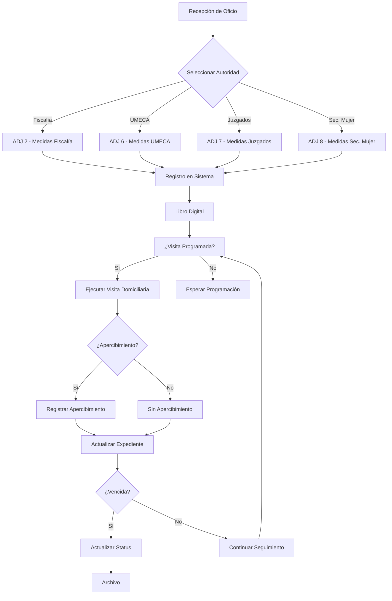
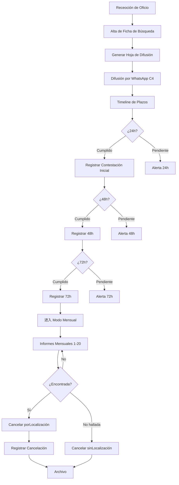
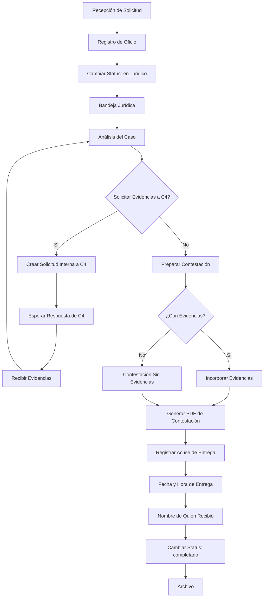

# Prevención del Delito — Sistema de Atención a Víctimas y Área Jurídica

> **Estado de implementación:** ✅ COMPLETADO — 34/34 pts de historia entregados (Sprints 0–3)

Sistema integral para la gestión de medidas de protección, búsquedas de personas (Protocolo Alba), y flujo jurídico para el área de Prevención del Delito.

---

## Descripción General

El sistema gestiona dos ramas operativas principales:

1. **Atenta a Víctimas** — Recepción y seguimiento de medidas de protección provenientes de autoridades externas (Fiscalía, UMECA, Juzgados, Secretaría de la Mujer).
2. **Área Jurídica** — Gestión del ciclo legal completo para solicitudes de información: recepción, solicitudes internas a C4, contestaciones y acuses de entrega.

### Autoridades Externas Soportadas

| Código | Autoridad |
|--------|------------|
| FISCALIA | Fiscalía |
| UMECA | UMECA |
| JUZGADOS | Juzgados |
| SEC_MUJER | Secretaría de la Mujer |

---

## Módulos del Sistema

```
prevencion/
├── medidas/        → Gestión de medidas de protección
├── busquedas/     → Protocolo Alba y búsquedas de personas
└── juridico/      → Solicitudes y flujo jurídico
```

---

## Diagramas de Flujo

### 1. Flujo de Medidas de Protección



### 2. Flujo de Protocolo Alba / Búsqueda de Personas



### 3. Flujo Jurídico



### 4. Diagrama de Relaciones de Entidades

```mermaid
erDiagram
    USERS ||--o{ MEDIDAS_PROTECCION : "creadoPor"
    USERS ||--o{ VISITAS_DOMICILIARIAS : "registradoPor"
    USERS ||--o{ FICHAS_BUSQUEDA : "creadoPor"
    USERS ||--o{ SEGUIMIENTOS_BUSQUEDA : "registradoPor"
    USERS ||--o{ SOLICITUDES_INFORMACION : "creadoPor"
    USERS ||--o{ CONTESTACIONES : "creadoPor"
    
    MEDIDAS_PROTECCION ||--o{ VISITAS_DOMICILIARIAS : "tiene"
    FICHAS_BUSQUEDA ||--o{ SEGUIMIENTOS_BUSQUEDA : "tiene"
    
    SOLICITUDES_INFORMACION ||--o{ SOLICITUDES_C4_INTERNAS : "tiene"
    SOLICITUDES_INFORMACION ||--o|{ CONTESTACIONES : "tiene"
```

---

## Roles de Usuario

| Rol | Descripción | Accesos |
|-----|--------------|---------|
| **Operador Víctimas** | Captura y seguimiento de medidas y búsquedas | Medidas, Búsquedas, Captura de solicitudes |
| **Jurídico** | Bandeja legal, solicitudes a C4 y contestaciones | Bandeja jurídica, Solicitudes a C4, Contestaciones |

---

## Estructura de Rutas

```
app/
├── prevencion/
│   ├── layout.tsx              # Layout compartido
│   ├── medidas/
│   │   ├── page.tsx           # HU-1.3 - Libro Digital
│   │   ├── nueva/
│   │   │   └── page.tsx        # HU-1.1 - Nueva medida
│   │   └── [id]/
│   │       └── page.tsx         # HU-1.2 - Expediente + visitas
│   ├── busquedas/
│   │   ├── page.tsx            # Lista de búsquedas
│   │   ├── nueva/
│   │   │   └── page.tsx         # HU-2.1 - Alta de ficha
│   │   └── [id]/
│   │       ├── page.tsx        # HU-2.2 + HU-2.3 - Timeline
│   │       └── imprimir/
│   │           └── page.tsx    # HU-2.1 - Hoja de difusión
│   └── juridico/
│       ├── page.tsx             # HU-3.2 - Bandeja jurídica
│       └── solicitudes/
│           ├── nueva/
│           │   └── page.tsx    # HU-3.1 - Nueva solicitud
│           └── [id]/
│               └── page.tsx   # HU-3.2 + HU-3.3 - Detalle
```

---

## Schema de Base de Datos

### Tablas Principales

| Tabla | Descripción | Replacement |
|-------|--------------|--------------|
| `medidas_proteccion` | Expedientes de medidas de protección | ADJ 2, 6, 7, 8 |
| `visitas_domiciliarias` | Historial de visitas por expediente | 46 columnas del Excel |
| `fichas_busqueda` | Fichas de búsqueda de personas | ADJ 4, 5 |
| `seguimientos_busqueda` | Timeline de plazos 24/48/72h + mensuales |tracking de ADJ 4 |
| `solicitudes_informacion` | Oficios de solicitud de información | ADJ 1 |
| `solicitudes_c4_internas` |bitácora de solicitudes internas a C4 | tracking interno |
| `contestaciones` | Registro de contestaciones + acuse | cierre legal |

### Campos Clave

#### medidas_proteccion

- `expediente`, `n_oficio`, `fecha_oficio`, `fecha_recepcion`
- `autoridad` (FISCALIA | UMECA | JUZGADOS | SEC_MUJER)
- `victima`, `demandado`, `domicilio_proteccion`
- `fecha_vencimiento`, `status` (activa | por_vencer | vencida | cerrada)

#### fichas_busqueda

- `tipo` (PROTOCOLO_ALBA | BUSQUEDA_PERSONA)
- `nombre_desaparecida`, `edad`
- `fecha_activacion`, `status` (activa | cancelada)
- `fecha_cancelacion`, `motivo_cancelacion`

#### solicitudes_informacion

- `oficio`, `autoridad`, `delito`, `carpeta_investigacion`
- `status` (nuevo | en_juridico | completado)

---

## Endpoints de API

```
/api/prevencion/
├── medidas/
│   ├── GET, POST
│   └── [id]/
│       ├── GET, PUT, PATCH
│       └── visitas/
│           ├── GET
│           └── POST
├── busquedas/
│   ├── GET, POST
│   ├── [id]/
│   │   ├── GET, PUT
│   │   ├── seguimientos/
│   │   │   └── POST
│   │   └── cancelar/
│   │       └── POST
└── solicitudes/
    ├── GET, POST
    └── [id]/
        ├── GET, PUT
        ├── c4/
        │   └── POST
        └── contestacion/
            └── POST
```

---

## Reglas de Negocio

### Medidas de Protección

1. El semáforo de vigencia se calcula así:
   - **Verde:** > 7 días para vencer
   - **Amarillo:** ≤ 7 días para vencer
   - **Rojo:** vencida

2. Las visitas domiciliarias no tienen límite por expediente.
3. Una medida puede tener múltiples apercibimientos.

### Búsquedas de Personas

1. El timeline genera automáticamente las fechas esperadas:
   - Contestación inicial
   - 24h, 48h, 72h
   - Informes mensuales del 1 al 20

2. Solo se puede cancelar una búsqueda activa.
3. La hoja de difusión se imprime mediante CSS `@media print`.

### Flujo Jurídico

1. Las solicitudes se crean con status `nuevo`.
2. Al turnar a jurídico, el status cambia a `en_juridico`.
3. Al registrar contestación, el status cambia a `completado`.
4. Solo usuarios con rol "Jurídico" pueden acceder a la bandeja jurídica.

---

## Tecnologías

| Paquete | Propósito |
|---------|------------|
| `date-fns` | Cálculo de plazos (24h, 48h, 72h, mensual) |

> No se requiere librería de PDF externa. La hoja de difusión se genera con rutas de impresión CSS (`@media print`).

---

## Estado de Implementación

| HU | Descripción | Ruta | Estado |
|----|-------------|------|--------|
| HU-1.1 | Nueva Medida de Protección | `/prevencion/medidas/nueva` | ✅ |
| HU-1.2 | Visitas Domiciliarias | `/prevencion/medidas/[id]` | ✅ |
| HU-1.3 | Libro Digital (listado + semáforo) | `/prevencion/medidas` | ✅ |
| HU-2.1 | Alta de Ficha + Hoja de Difusión | `/prevencion/busquedas/nueva` | ✅ |
| HU-2.2 | Timeline 24/48/72h + mensuales | `/prevencion/busquedas/[id]` | ✅ |
| HU-2.3 | Cancelación de búsqueda | `/prevencion/busquedas/[id]` | ✅ |
| HU-3.1 | Nueva Solicitud → en_juridico | `/prevencion/juridico/solicitudes/nueva` | ✅ |
| HU-3.2 | Bandeja Jurídica + Solicitudes C4 | `/prevencion/juridico` | ✅ |
| HU-3.3 | Contestación + Acuse de Entrega | `/prevencion/juridico/solicitudes/[id]` | ✅ |

---

## Arquitectura de Implementación

- **Server Actions** en `lib/prevencion/actions.ts` — todas las mutaciones con `'use server'`
- **Server Components** para todas las páginas de listado y detalle (queries directas a DB)
- **Client Components** solo para interactividad: `VisitaModal`, `SeguimientoTimeline`, `CancelacionModal`, `SolicitudC4Form`, `ContestacionForm`, `PrintButton`
- **`params` es Promise** en Next.js 16 — siempre `const { id } = await params`
- **Timestamps** de DB → convertir a ISO string antes de pasar a Client Components
- **Sin Tailwind** — todo en inline styles con el design system definido

Consultar `plan_trabajo/PLAN_PREVENCION_VICTIMAS.md` para la arquitectura completa y detalles de implementación.